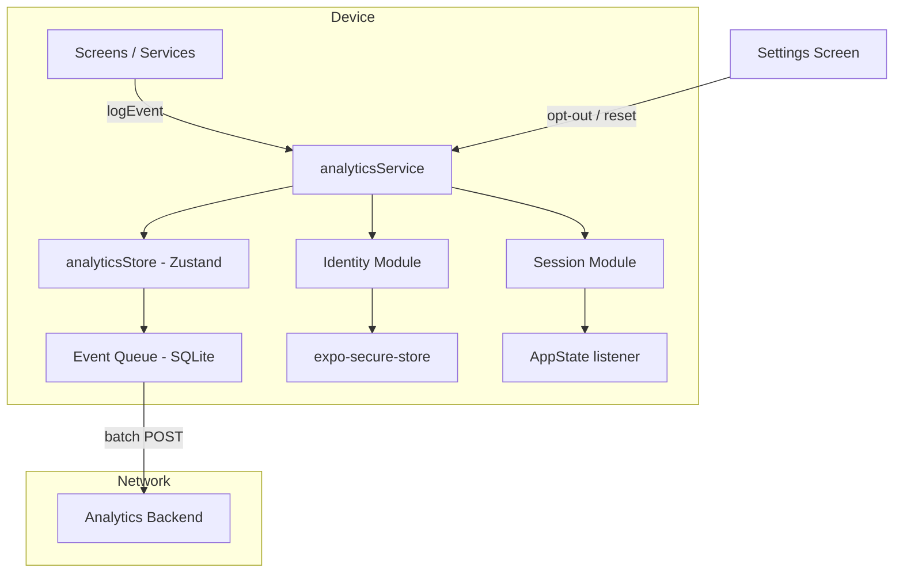

# Design Document: Anonymous Analytics

## Overview

This design describes a privacy-first, offline-resilient analytics system for Mental Health Wallet. The system generates anonymous identifiers locally, logs structured events to a local SQLite queue, and transmits them in batches to a configurable backend. Users retain full control via opt-out and data-reset controls accessible from Settings.

Key design goals:
- **Zero PII**: No personal identifiers ever leave the device
- **Offline-first**: Events queue locally and flush when connectivity returns
- **Non-blocking**: Analytics never delays or disrupts the user's interaction with coping tools
- **User control**: Opt-out stops collection immediately; data reset severs all history linkage

The system integrates into the existing architecture as a new service (`analyticsService`), a Zustand store (`analyticsStore`), a database migration for the event queue table, and lightweight instrumentation points in existing screens/services.

## Architecture



### Layered Responsibilities

| Layer | Responsibility |
|-------|---------------|
| **Identity Module** | Generate/retrieve Anonymous_User_ID via expo-crypto + expo-secure-store |
| **Session Module** | Manage Session_ID lifecycle based on AppState transitions and 30-min timeout |
| **Event Logger** | Validate events against schema, insert into SQLite queue |
| **Batch Transmitter** | Flush queue in batches of up to 50, with exponential backoff on failure |
| **Analytics Store** | Expose reactive state (opt-in status, queue size) and actions to UI |
| **Settings UI** | Toggle opt-in, trigger data reset with confirmation |

### Integration Points

- **App.tsx**: Initialize identity + session on mount; register AppState listener
- **Onboarding screens**: Log `onboarding_step_viewed`, `onboarding_completed`
- **Wallet/Session screens**: Log `start_mode_selected`, `session_started`, `session_ended` (with optional emotion, contexts, and time)
- **Card interactions**: Log `tool_added`, `tool_archived`, `tool_unarchived`, `tool_copied`, `tool_opened`, `tool_completed`, `tool_created`, `tool_history_viewed`
- **Reminders**: Log `reminder_set`, `reminder_deleted`
- **Outcome prompt**: Log `outcome_response` (note: OutcomePrompt UI is currently disabled/commented out in ExpandedContent.tsx, but the event logging infrastructure is in place for future use)
- **External links**: Log `external_resource_opened`
- **Settings screen**: Host opt-out toggle + data reset control

## Components and Interfaces

### 1. Identity Module (`src/services/analyticsIdentity.ts`)

```typescript
export interface IdentityState {
  anonymousUserId: string;
  isReady: boolean;
}

/**
 * Resolves or creates the Anonymous_User_ID.
 * Must complete before any event dispatch.
 */
export async function resolveAnonymousUserId(): Promise<string>;

/**
 * Deletes existing ID and generates a fresh one (for data reset).
 */
export async function resetAnonymousUserId(): Promise<string>;
```

Implementation notes:
- Uses `expo-crypto.randomUUID()` for UUID v4 generation
- Stores under key `anonymous_user_id` in expo-secure-store
- On SecureStore failure: generates a new UUID, attempts one persist, uses generated ID regardless
- On invalid UUID format from generation: retries once, then blocks analytics dispatch until valid

### 2. Session Module (`src/services/analyticsSession.ts`)

```typescript
export interface SessionState {
  sessionId: string;
  sessionStartTime: string; // ISO 8601
  backgroundEntryTime: string | null;
}

/**
 * Creates a new session (cold start or 30-min timeout).
 */
export function startNewSession(): SessionState;

/**
 * Records background entry timestamp.
 */
export function recordBackgroundEntry(): void;

/**
 * Evaluates foreground return — either continues or starts new session.
 */
export function handleForegroundReturn(): SessionState;
```

Implementation notes:
- Session_ID is memory-only (never persisted to disk)
- 30-minute threshold: 1,800,000 ms
- Fallback on crypto failure: generate UUID via `Math.random`-based approach
- Listens to React Native `AppState` change events

### 3. Event Logger (`src/services/analyticsEventLogger.ts`)

```typescript
export type AnalyticsEventType =
  | 'app_opened'
  | 'onboarding_step_viewed'
  | 'onboarding_completed'
  | 'start_mode_selected'
  | 'session_started'
  | 'tool_added'
  | 'tool_archived'
  | 'tool_unarchived'
  | 'tool_created'
  | 'tool_copied'
  | 'tool_opened'
  | 'tool_completed'
  | 'tool_history_viewed'
  | 'reminder_set'
  | 'reminder_deleted'
  | 'outcome_response'
  | 'external_resource_opened'
  | 'session_ended';

export interface AnalyticsEventBase {
  anonymous_user_id: string;
  session_id: string;
  event_type: AnalyticsEventType;
  timestamp: string; // ISO 8601 with ms precision
}

export interface AnalyticsEvent extends AnalyticsEventBase {
  properties?: Record<string, string | number>;
}

/**
 * Validates and enqueues an analytics event.
 * Silently discards if base fields are missing/invalid or opt-out applies.
 */
export async function logEvent(
  eventType: AnalyticsEventType,
  properties?: Record<string, string | number>
): Promise<void>;
```

Validation rules:
- All base fields must be present and valid UUIDs / ISO timestamps
- Event type must be in the enumerated list
- If opt-out is active, only `app_opened` and `session_ended` are allowed (with no contextual properties)
- Invalid events are silently discarded (no crash, no user notification)
- `session_started` is logged only on the first emotion selection; subsequent emotion changes within the same session do not trigger additional `session_started` events

### 4. Batch Transmitter (`src/services/analyticsBatchTransmitter.ts`)

```typescript
export interface TransmitterConfig {
  baseUrl: string;
  batchSize: number;       // default 50
  flushThreshold: number;  // default 10
  flushIntervalMs: number; // default 60_000
  retryBaseMs: number;     // default 120_000
  retryCapMs: number;      // default 900_000 (15 min)
}

/**
 * Starts the periodic flush timer and connectivity listener.
 */
export function startTransmitter(config: TransmitterConfig): void;

/**
 * Stops the transmitter (for data reset or app shutdown).
 */
export function stopTransmitter(): void;

/**
 * Forces an immediate flush attempt (e.g., on connectivity restore).
 */
export async function flushNow(): Promise<void>;
```

Transmission flow:
1. Select up to 50 oldest `pending` events, mark as `sending`
2. POST JSON array to `{baseUrl}/events`
3. On 2xx: delete those events from queue
4. On failure: mark back to `pending`, schedule retry with exponential backoff (120s → 240s → 480s → ... → cap 15min)

### 5. Analytics Store (`src/stores/analyticsStore.ts`)

```typescript
export interface AnalyticsStoreState {
  optIn: boolean;
  isIdentityReady: boolean;
  anonymousUserId: string | null;

  // Actions
  initialize: () => Promise<void>;
  setOptIn: (value: boolean) => Promise<void>;
  resetData: () => Promise<void>;
}
```

### 6. Event Queue Repository (`src/data/analyticsEventQueue.ts`)

Implementation note: The `getDatabase()` function uses a promise-based singleton pattern to prevent concurrent initialization races — multiple callers awaiting the database at startup will share the same initialization promise rather than triggering parallel SQLite opens.

```typescript
export interface QueuedEvent {
  id: string;
  payload: string; // JSON-serialized AnalyticsEvent
  created_at: string;
  status: 'pending' | 'sending' | 'failed';
}

export async function insertEvent(event: AnalyticsEvent): Promise<void>;
export async function getPendingEvents(limit: number): Promise<QueuedEvent[]>;
export async function markAsSending(ids: string[]): Promise<void>;
export async function markAsPending(ids: string[]): Promise<void>;
export async function deleteEvents(ids: string[]): Promise<void>;
export async function deleteAllEvents(): Promise<void>;
export async function deleteBehavioralPendingEvents(): Promise<void>;
export async function resetSendingToPending(): Promise<void>;
export async function getQueueSize(): Promise<number>;
export async function evictOldestIfFull(maxSize: number): Promise<void>;
```

### 7. Settings UI Additions

- **Analytics toggle**: in "Privacy & Data" section of SettingsScreen
- **Data reset button**: separate section, 44×44 minimum tap target, confirmation dialog
- **Privacy notice**: non-blocking onboarding screen
- **Privacy Policy**: local asset, scrollable, Dynamic Type support

## Data Models

### Event Queue Table (SQLite Migration)

```sql
CREATE TABLE IF NOT EXISTS analytics_event_queue (
  id TEXT PRIMARY KEY,
  payload TEXT NOT NULL,
  created_at TEXT NOT NULL,
  status TEXT NOT NULL DEFAULT 'pending'
    CHECK(status IN ('pending', 'sending', 'failed'))
);

CREATE INDEX IF NOT EXISTS idx_analytics_queue_status_created
  ON analytics_event_queue(status, created_at);
```

### Analytics Settings (in existing `settings` table)

| Key | Value | Description |
|-----|-------|-------------|
| `analytics_opt_in` | `'true'` / `'false'` | Opt-in preference (default: `'true'`) |
| `first_open_date` | `'YYYY-MM-DD'` | UTC calendar date of first app_opened |

### Secure Store Keys

| Key | Value | Description |
|-----|-------|-------------|
| `anonymous_user_id` | UUID v4 string | Persistent anonymous identifier |
| `identity_link_consent` | `'granted'` / `'declined'` | Account linking decision |

### TypeScript Types (`src/types/analytics.ts`)

```typescript
export type AnalyticsEventType =
  | 'app_opened'
  | 'onboarding_step_viewed'
  | 'onboarding_completed'
  | 'start_mode_selected'
  | 'session_started'
  | 'tool_added'
  | 'tool_archived'
  | 'tool_unarchived'
  | 'tool_created'
  | 'tool_copied'
  | 'tool_opened'
  | 'tool_completed'
  | 'tool_history_viewed'
  | 'reminder_set'
  | 'reminder_deleted'
  | 'outcome_response'
  | 'external_resource_opened'
  | 'session_ended';

export interface AnalyticsEventBase {
  anonymous_user_id: string;
  session_id: string;
  event_type: AnalyticsEventType;
  timestamp: string;
}

export type AppOpenedEvent = AnalyticsEventBase & {
  event_type: 'app_opened';
  properties: { days_since_install: number };
};

export type OnboardingStepViewedEvent = AnalyticsEventBase & {
  event_type: 'onboarding_step_viewed';
  properties: { step_name: string };
};

export type OnboardingCompletedEvent = AnalyticsEventBase & {
  event_type: 'onboarding_completed';
};

export type StartModeSelectedEvent = AnalyticsEventBase & {
  event_type: 'start_mode_selected';
  properties: { mode: 'wallet_first' | 'emotion_first' };
};

export type SessionStartedEvent = AnalyticsEventBase & {
  event_type: 'session_started';
};

export type ToolAddedEvent = AnalyticsEventBase & {
  event_type: 'tool_added';
  properties: { card_id: string; card_category: string; origin_badge: string };
};

export type ToolArchivedEvent = AnalyticsEventBase & {
  event_type: 'tool_archived';
  properties: { card_id: string; card_category: string; origin_badge: string };
};

export type ToolUnarchivedEvent = AnalyticsEventBase & {
  event_type: 'tool_unarchived';
  properties: { card_id: string; card_category: string; origin_badge: string };
};

export type ToolCreatedEvent = AnalyticsEventBase & {
  event_type: 'tool_created';
  properties: { card_id: string; card_category: string; origin_badge: 'my_tool' };
};

export type ToolCopiedEvent = AnalyticsEventBase & {
  event_type: 'tool_copied';
  properties: { card_id: string; card_category: string; origin_badge: string };
};

export type ToolOpenedEvent = AnalyticsEventBase & {
  event_type: 'tool_opened';
  properties: { card_id: string; card_category: string; origin_badge: string };
};

export type ToolCompletedEvent = AnalyticsEventBase & {
  event_type: 'tool_completed';
  properties: { card_id: string; card_category: string; origin_badge: string; duration_ms: number };
};

export type ToolHistoryViewedEvent = AnalyticsEventBase & {
  event_type: 'tool_history_viewed';
  properties: { card_id: string; card_category: string; origin_badge: string };
};

export type ReminderSetEvent = AnalyticsEventBase & {
  event_type: 'reminder_set';
  properties: { card_id: string; frequency: string };
};

export type ReminderDeletedEvent = AnalyticsEventBase & {
  event_type: 'reminder_deleted';
  properties: { card_id: string };
};

export type OutcomeResponseEvent = AnalyticsEventBase & {
  event_type: 'outcome_response';
  properties: { response: 'calmer' | 'clearer' | 'hopeful' | 'same' | 'worse' };
};

export type ExternalResourceOpenedEvent = AnalyticsEventBase & {
  event_type: 'external_resource_opened';
  properties: { resource_url: string; resource_name: string };
};

export type SessionEndedEvent = AnalyticsEventBase & {
  event_type: 'session_ended';
  properties: {
    session_duration_ms: number;
    emotion?: string;
    contexts?: string;
    time?: string;
  };
};

export type AnalyticsEvent =
  | AppOpenedEvent
  | OnboardingStepViewedEvent
  | OnboardingCompletedEvent
  | StartModeSelectedEvent
  | SessionStartedEvent
  | ToolAddedEvent
  | ToolArchivedEvent
  | ToolUnarchivedEvent
  | ToolCreatedEvent
  | ToolCopiedEvent
  | ToolOpenedEvent
  | ToolCompletedEvent
  | ToolHistoryViewedEvent
  | ReminderSetEvent
  | ReminderDeletedEvent
  | OutcomeResponseEvent
  | ExternalResourceOpenedEvent
  | SessionEndedEvent;

export interface QueuedEvent {
  id: string;
  payload: string;
  created_at: string;
  status: 'pending' | 'sending' | 'failed';
}

export interface TransmitterConfig {
  baseUrl: string;
  batchSize: number;
  flushThreshold: number;
  flushIntervalMs: number;
  retryBaseMs: number;
  retryCapMs: number;
}
```

### Batch Payload Format (HTTPS POST body)

```json
{
  "events": [
    {
      "anonymous_user_id": "550e8400-e29b-41d4-a716-446655440000",
      "session_id": "6ba7b810-9dad-11d1-80b4-00c04fd430c8",
      "event_type": "tool_completed",
      "timestamp": "2025-01-15T14:30:00.123Z",
      "properties": {
        "card_id": "abc123",
        "card_category": "grounding-calming",
        "origin_badge": "library",
        "duration_ms": 45000
      }
    }
  ]
}
```

## Developer Tools (Dev Builds Only)

### 8. Developer Event Viewer (`src/screens/DevEventViewerScreen.tsx`)

```typescript
/**
 * Hidden dev screen accessible via triple-tap on Settings header.
 * Only included when __DEV__ === true.
 */
export interface DevEventViewerProps {}

// Displays:
// - Current Anonymous_User_ID, Session_ID, opt-in status
// - Queue contents: reverse-chronological event feed loaded from Event_Queue on mount (updates in real-time)
// - Queue status: total count + breakdown by status (pending/sending/failed)
// - Actions: "Export Queue" (share sheet), "Clear Queue" (with confirmation)
// - "Stress Test" button navigating to the stress test configuration
```

Integration notes:
- Uses a Zustand subscription to `analyticsStore` for live updates
- Loads recent events from the Event_Queue on mount (not limited to current session)
- Subscribes to a simple in-memory event emitter in the event logger for real-time feed
- Conditionally registered in navigation only when `__DEV__` is true
- Triple-tap gesture handler on Settings screen header triggers navigation

### 9. Stress Test Generator (`src/services/analyticsStressTest.ts`)

```typescript
export interface StressTestConfig {
  userCount: number;        // 1–100, default 20
  eventsPerUser: number;    // 10–500, default 50
  timeSpanDays: number;     // 1–90, default 30
}

export interface StressTestResult {
  totalEvents: number;
  simulatedUsers: number;
  queueSize: number;
}

/**
 * Generates synthetic multi-user analytics events and inserts them
 * into the Event_Queue for end-to-end pipeline validation.
 * Only available in __DEV__ builds.
 */
export async function runStressTest(
  config: StressTestConfig,
  onProgress?: (percent: number) => void
): Promise<StressTestResult>;
```

Implementation notes:
- Generates unique Anonymous_User_IDs for each simulated user
- Distributes events across the configured time span with realistic patterns:
  - Each user starts with `app_opened` (days_since_install = 0) and onboarding events
  - Subsequent sessions spread over the time span with decreasing frequency (mimicking natural retention drop-off)
  - Tool events use real card_ids from the curated library seeds
  - Outcome responses follow a realistic distribution (~60% positive, ~25% same, ~15% worse)
- All events get `pending` status so they flow through the normal batch transmitter
- Progress callback enables UI progress indicator

### 10. Mock Analytics Backend (`tools/mock-analytics-server/`)

```
tools/mock-analytics-server/
├── index.js          # Express server entry point
├── package.json      # Minimal dependencies (express, cors)
├── dashboard.html    # KPI dashboard template
└── README.md         # Setup and usage instructions
```

```typescript
// Endpoints:
// POST /events        — Receives Batch_Payload, validates, persists to received_events.json
// GET  /events        — Returns all received events as JSON array
// GET  /dashboard     — HTML page with computed KPIs
// DELETE /events      — Clears all stored events

// KPIs computed on /dashboard:
// - Total events received
// - Unique anonymous users
// - Onboarding completion rate
// - Mode split (wallet_first vs emotion_first %)
// - Tool completion rate per card_id
// - Outcome positivity rate (calmer+clearer+hopeful / total)
// - Retention by days_since_install buckets (D0, D1, D7, D30)

// Configurable:
// - PORT (env var, default 3001)
// - ERROR_RATE (env var, 0–100, simulates random 500s for testing retry logic)
```

### Analytics Base URL Configuration

The transmitter's `baseUrl` is sourced from app config (`src/config/analytics.ts`):
- Development (`__DEV__`): defaults to `http://localhost:3001`
- Production: configured via environment variable / app config (deferred decision)

This allows automatic routing to the mock server during development with no code changes needed.

### Flush Interval Configuration (Dev Only)

The flush interval controls how often the batch transmitter sends queued events to the backend:
- **Development default**: 5 minutes (300,000 ms) — gives developers time to observe events in the Dev Event Viewer before they're transmitted and deleted
- **Production default**: 60 seconds (60,000 ms)
- **Dev flush threshold**: Disabled (set to 999) in dev builds so only the timer triggers flushes, not event count

A runtime-configurable control is available in the Settings → Developer section with preset options: 5s, 30s, 1m, 5m. Changing the interval restarts the transmitter immediately with the new timing. This setting is not persisted across app restarts.

### Mock Analytics Dashboard

The mock backend's `/dashboard` endpoint provides an interactive HTML dashboard with:
- Auto-refreshing KPI cards (every 5 seconds)
- Clickable cards that expand into detail panels showing underlying data (user lists, step breakdowns, tool completions, outcome distributions)
- Detail panels persist across auto-refreshes until explicitly closed
- "Total Events" links directly to the raw `/events` JSON endpoint

## Error Handling

| Scenario | Behavior |
|----------|----------|
| expo-secure-store read/write failure | Generate new UUID, attempt one persist, use in-memory regardless |
| UUID generation produces invalid format | Retry once; if still invalid, block analytics dispatch (not app) |
| expo-crypto.randomUUID() throws | Fall back to Math.random-based UUID v4 for session ID |
| Event validation fails (missing base fields) | Silently discard event — no crash, no user notification |
| Batch POST returns non-2xx | Mark events back to `pending`, exponential backoff (120s → 15min cap) |
| Network offline | Queue locally, flush within 10s on reconnect |
| App crashes during transmission (events stuck in `sending`) | Reset to `pending` on next launch |
| Event queue reaches 1000 limit | Evict oldest `pending` event to make room |
| Opt-in preference persistence fails | Apply in-memory for session, retry on next launch, show inline error |
| Data reset SecureStore deletion fails | Proceed with overwrite and complete remaining reset steps |

All error handling is non-blocking. Analytics failures never interrupt the user's coping tool experience.

## Testing Strategy

### Unit Tests
- **Identity Module**: First-launch generation, existing ID retrieval, SecureStore failure recovery, invalid UUID retry
- **Session Module**: Cold start creation, background/foreground transitions, 30-min timeout, crypto fallback
- **Event Logger**: Validation (missing fields discarded), opt-out filtering, duration_ms computation, serialization round-trip
- **Batch Transmitter**: Flush triggers, exponential backoff calculation, sending→pending recovery, queue size eviction
- **Analytics Store**: Initialization flow, opt-in/opt-out transitions, data reset sequence, first_open_date handling

### Integration Tests
- Full pipeline: log event → insert queue → batch flush → mock backend receives → verify payload format
- Opt-out mid-session: verify behavioral events stop, technical events continue
- Data reset: verify new identity, empty queue, fresh session

### End-to-End Validation (Developer Tools)
- Stress test generator: simulate 20–100 users, verify mock backend dashboard shows correct KPIs
- Event viewer: verify real-time feed matches logged events during manual QA

## Correctness Properties

### Property 1: Identity Stability
For any app session without a data reset, the Anonymous_User_ID attached to all events SHALL be identical (no mid-session identity change).

**Validates: Requirements 1.2, 1.6**

### Property 2: Session Isolation
Events within a single session SHALL share the same Session_ID; events in different sessions SHALL have different Session_IDs.

**Validates: Requirements 2.1, 2.3**

### Property 3: Event Completeness (Opt-In)
While opted in, every user action that maps to a defined event type SHALL produce exactly one event in the queue (no duplicates, no drops).

**Validates: Requirements 3.1, 4.1**

### Property 4: Opt-Out Enforcement
While opted out, the event queue SHALL contain only `app_opened` and `session_ended` events with no contextual properties beyond base fields.

**Validates: Requirements 5.3, 5.4**

### Property 5: Queue Monotonicity
Events in the queue SHALL be ordered by `created_at` ascending. Batch transmission SHALL select the oldest pending events first (FIFO).

**Validates: Requirements 4.5, 4.9**

### Property 6: Serialization Round-Trip
For any AnalyticsEvent E, `JSON.parse(JSON.stringify(E))` SHALL be deeply equal to E (key/value/type preservation).

**Validates: Requirements 3.13**

### Property 7: Reset Unlinkability
After a data reset, no event logged with the new Anonymous_User_ID SHALL share any identifier with events logged under the previous Anonymous_User_ID.

**Validates: Requirements 6.3, 6.4**

### Property 8: Retention Metric Non-Negativity
The `days_since_install` property on any `app_opened` event SHALL always be ≥ 0.

**Validates: Requirements 9.1, 9.4**
