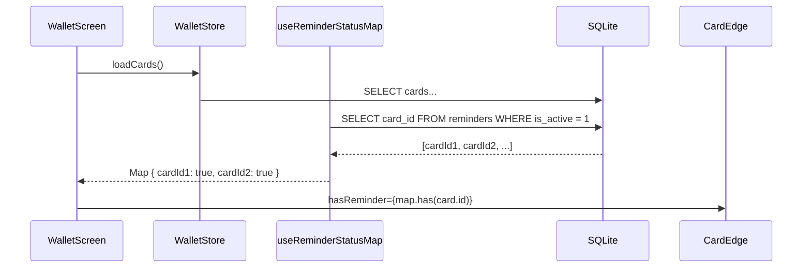

# Design Document: Card UX Enhancements

## Overview

This design covers four independent UX enhancements to the Mental Health Wallet card system:

1. **Library Card Preview** — A bottom-sheet modal showing a card's full visual appearance (shell + controls) in read-only mode before adding to the wallet.
2. **Reminder Display on Focused Card** — A formatted line showing reminder time and frequency on the focused card view.
3. **Reminder Icon on Stacked Cards** — A bell icon indicator on the `CardEdge` component for cards with active reminders.
4. **Third-Party App Card Branding** — Extending `IconType` and background handling to support brand logos and colors from external apps.

All four enhancements are additive — they extend existing components without breaking current behavior. They share no data model dependencies between them and can be implemented independently.

## Architecture

```mermaid
graph TB
    subgraph "Library Preview Flow"
        LBS[LibraryBrowserScreen] -->|"tap card item"| CPM[CardPreviewModal]
        CPM -->|"Add to wallet"| CS[CardService.create]
        CPM -->|"Restore"| CS2[CardService.restore]
        CPM -->|"uses readOnly=true"| CR[ControlRenderer]
    end

    subgraph "Reminder Display Flow"
        WS[WalletStore] -->|"card + reminders"| FCV[FocusedCardView]
        FCV --> RDR[ReminderDisplayRow]
        RDR -->|"formats"| RF[formatReminderLabel]
        RS[ReminderService] -->|"getReminder()"| RDR
    end

    subgraph "Reminder Icon Flow"
        WS2[WalletStore] -->|"cards"| CE[CardEdge]
        CE --> RI[ReminderIndicator]
        RStore[ReminderStore/Hook] -->|"hasActiveReminder"| CE
    end

    subgraph "Third-Party Branding Flow"
        TPCard[Card with iconType='third_party'] --> IRS[IconResolver]
        IRS -->|"HTTPS URI"| RNImage[Image component]
        IRS -->|"fallback on error"| Emoji[Emoji fallback]
        TPCard -->|"brand background"| BGR[Background renderer]
    end
```



## Components and Interfaces

### 1. Library Card Preview

**New Component: `CardPreviewSheet`**

A modal bottom sheet presenting a full-size card preview.

```typescript
interface CardPreviewSheetProps {
  card: CuratedCardDefinition;
  visible: boolean;
  onDismiss: () => void;
  /** Current state: 'add' | 'in_wallet' | 'restore' */
  buttonState: LibraryCardButtonState;
  onAddToWallet: (card: CuratedCardDefinition) => Promise<void>;
  onRestore: (card: CuratedCardDefinition) => Promise<void>;
}
```

Implementation approach:
- Renders as a React Native `Modal` with `presentationStyle="pageSheet"` (iOS) or a full-screen overlay (Android).
- Card shell rendered using the same background color/image logic as `CardEdge` and `FocusedCardView`.
- Controls rendered via `ControlRenderer` with `readOnly={true}` and empty values `{}`.
- Footer contains the action button (Add to wallet / In wallet / Restore from archive) and a dismiss handle/button.
- Uses `useState` for loading state during add/restore operations.

**Integration Point:** `LibraryBrowserScreen` adds an `onPress` handler to each card row that opens the sheet, passing the tapped `CuratedCardDefinition`.

### 2. Reminder Display on Focused Card

**New Component: `ReminderDisplayRow`**

A single-line row showing bell icon + formatted reminder info.

```typescript
interface ReminderDisplayRowProps {
  reminder: Reminder | null;
  textColor: string;
}
```

**New Utility: `formatReminderLabel`**

```typescript
/**
 * Formats reminder time + frequency into display string.
 * Examples: "09:00 · Daily", "09:00 · Mon, Wed, Fri"
 */
function formatReminderLabel(reminder: Reminder): string;
```

Logic:
- Time is displayed as-is (already stored in HH:mm format).
- Frequency formatting:
  - `daily` → `"Daily"`
  - `3x_week` / `custom` → selected days as three-letter abbreviations in Mon–Sun order, comma-separated.
- Day ordering: Mon(1), Tue(2), Wed(3), Thu(4), Fri(5), Sat(6), Sun(0) — mapped from 0-indexed Sunday-first to calendar order.

Day abbreviation map: `[0: 'Sun', 1: 'Mon', 2: 'Tue', 3: 'Wed', 4: 'Thu', 5: 'Fri', 6: 'Sat']`

Calendar ordering uses index weights: `{ 1: 0, 2: 1, 3: 2, 4: 3, 5: 4, 6: 5, 0: 6 }` (Monday=0 weight through Sunday=6 weight).

**Integration Point:** `FocusedCardView` fetches the active reminder for the focused card (via a `useCardReminder(cardId)` hook) and renders `ReminderDisplayRow` between the `StatsRow` and the expand arrow.

### 3. Reminder Icon on Stacked Cards

**New Component: `ReminderIndicator`**

A small bell icon badge.

```typescript
interface ReminderIndicatorProps {
  isLight: boolean; // adapts color for contrast
}
```

- Renders a 🔔 emoji or SVG bell icon at 16×16pt minimum.
- Color adapts based on `isLight` prop: dark icon on light backgrounds, light icon on dark backgrounds (ensures ≥3:1 contrast).
- Includes `accessibilityLabel="Reminder set"`.
- Non-interactive (no `onPress`).

**Data Fetching:** A new `useCardReminders` hook (or extending the existing wallet loading) that loads active reminder status for all cards in the wallet. This avoids N+1 queries — a single query `SELECT card_id FROM reminders WHERE is_active = 1` returns a `Set<string>` of card IDs with active reminders.

**Integration Point:** `CardEdge` receives a `hasReminder: boolean` prop. When true, renders `ReminderIndicator` in the top row between the title and category dot.

### 4. Third-Party App Card Branding

**Type Extension:**

```typescript
// Extended IconType
export type IconType = 'library' | 'emoji' | 'custom_image' | 'third_party';

// New branding metadata on Card
export interface ThirdPartyBranding {
  logoUri: string;        // HTTPS URL or local asset path
  backgroundColor?: string; // hex color override
  backgroundImageUri?: string; // HTTPS URL for background image
}
```

The `iconValue` field for `third_party` type stores the logo URI (HTTPS or local asset path). Additional branding metadata (background color/image overrides) is stored in a new `third_party_branding` JSON column or in the existing `backgroundValue` field based on `backgroundType`.

**New Utility: `validateThirdPartyUri`**

```typescript
function validateThirdPartyUri(uri: string): { valid: boolean; error?: string };
```

- Accepts URIs starting with `https://` or local asset paths (relative paths or `file://`).
- Rejects `http://`, data URIs, and other schemes.

**Icon Resolution Enhancement:**

The icon rendering in `CardEdge` and `FocusedCardView` currently handles `emoji` and falls back to 📋. This will be extended:

```typescript
function renderCardIcon(iconType: IconType, iconValue: string): React.ReactNode {
  switch (iconType) {
    case 'emoji':
      return <Text style={styles.icon}>{iconValue}</Text>;
    case 'third_party':
      return (
        <ThirdPartyIcon
          uri={iconValue}
          fallbackEmoji={iconValue}
          size={ICON_SIZE}
        />
      );
    default:
      return <Text style={styles.icon}>📋</Text>;
  }
}
```

**New Component: `ThirdPartyIcon`**

```typescript
interface ThirdPartyIconProps {
  uri: string;
  fallbackEmoji: string;
  size: number;
  timeoutMs?: number; // default 10000
}
```

- Uses React Native `Image` with an `onError` handler that switches to emoji fallback.
- Implements a loading timeout (10s) that triggers fallback if the image hasn't loaded.
- `resizeMode="contain"` to preserve aspect ratio.

## Data Models

### Existing Models (unchanged)

- **Card** — core entity with `iconType`, `iconValue`, `backgroundType`, `backgroundValue`
- **Reminder** — `id`, `cardId`, `time` (HH:mm), `frequency` ({ type, days[] }), `isActive`
- **CuratedCardDefinition** — static library card definition

### Model Extensions

**IconType Extension:**
```typescript
export type IconType = 'library' | 'emoji' | 'custom_image' | 'third_party';
```

**Database Migration (for third-party support):**
- No new tables required. The `icon_type` column accepts the new `'third_party'` value.
- `icon_value` stores the brand logo URI for `third_party` type.
- Background branding uses existing `background_type` ('color' | 'image') and `background_value` fields — no schema change needed.
- URI validation happens at the service layer before persistence.

**Reminder Lookup Cache (new in-memory state):**

For efficient stacked-card rendering, a `reminderStatusMap: Map<string, boolean>` is loaded once on wallet load and refreshed when reminders change.

```typescript
// Hook interface
function useReminderStatusMap(): Map<string, boolean>;
```

### Data Flow for Reminder Indicators




## Correctness Properties

*A property is a characteristic or behavior that should hold true across all valid executions of a system — essentially, a formal statement about what the system should do. Properties serve as the bridge between human-readable specifications and machine-verifiable correctness guarantees.*

### Property 1: Reminder time preservation in formatted label

*For any* valid Reminder with `isActive = true` and a `time` field in HH:mm format, calling `formatReminderLabel(reminder)` SHALL produce a string that contains the exact time value as a substring.

**Validates: Requirements 2.6**

### Property 2: Reminder day abbreviations are in Monday-to-Sunday calendar order

*For any* Reminder with frequency type `3x_week` or `custom` and any non-empty subset of days (0–6), calling `formatReminderLabel(reminder)` SHALL produce day abbreviations in strict Monday-through-Sunday calendar order (Mon, Tue, Wed, Thu, Fri, Sat, Sun), using only the three-letter abbreviations from the set {Mon, Tue, Wed, Thu, Fri, Sat, Sun}, separated by commas.

**Validates: Requirements 2.4, 2.5, 2.8**

### Property 3: Reminder indicator contrast ratio against any card background

*For any* valid hex background color, the `ReminderIndicator` color chosen based on the `isLight` classification of that background SHALL achieve a contrast ratio of at least 3:1 as defined by WCAG 2.1.

**Validates: Requirements 3.4**

### Property 4: Third-party URI validation accepts only HTTPS or local asset paths

*For any* string input, `validateThirdPartyUri(uri)` SHALL return `valid: true` if and only if the string starts with `https://` or is a valid local asset path (starts with `./`, `../`, or matches a bundled asset reference). All other inputs SHALL return `valid: false` with an error message.

**Validates: Requirements 4.7, 4.8**

## Error Handling

### Library Card Preview Errors

| Scenario | Behavior |
|----------|----------|
| `CardService.create` fails | Show inline error message in the preview sheet; keep "Add to wallet" button enabled for retry |
| `CardService.restore` fails | Show inline error message; keep "Restore from archive" button enabled for retry |
| Network timeout during add | Same as create failure — the service layer throws, preview catches and displays error |

### Reminder Display Errors

| Scenario | Behavior |
|----------|----------|
| `getReminder()` returns null | No reminder row rendered (graceful absence) |
| Reminder has malformed frequency data | `formatReminderLabel` returns time-only string (no day labels) as a safe fallback |

### Third-Party Branding Errors

| Scenario | Behavior |
|----------|----------|
| Logo URI fails to load (network error or timeout >10s) | Fall back to emoji icon from `iconValue` |
| Background image URI fails to load (network error or timeout >10s) | Fall back to `backgroundValue` color |
| Logo URI uses non-HTTPS scheme | Validation rejects at save time; existing cards with invalid URIs show emoji fallback |
| Logo URI is empty string | Treat as validation failure; render emoji fallback |

### General Error Strategy

- All errors in preview/add operations are caught and displayed inline — never crash the app.
- Reminder data loading failures are non-fatal; the UI simply omits the reminder row.
- Third-party image loading uses timeout + error callbacks for graceful degradation.
- No new error types needed — existing `AppError` codes cover all persistence and validation cases.

## Testing Strategy

### Unit Tests (Example-Based)

| Area | Test Cases |
|------|------------|
| CardPreviewSheet rendering | Verify shell fields, controls in position order, readOnly state, button states (add/in_wallet/restore) |
| CardPreviewSheet interactions | Add to wallet flow, restore flow, dismiss, error display, loading state |
| State preservation | Open/close preview preserves LibraryBrowser filter, search, scroll |
| ReminderDisplayRow | Renders when active reminder exists, hidden when no reminder |
| formatReminderLabel — daily | Returns "HH:mm · Daily" |
| ReminderIndicator visibility | Present when hasReminder=true, absent when false |
| ReminderIndicator accessibility | accessibilityLabel="Reminder set", non-interactive |
| ThirdPartyIcon rendering | Image renders with HTTPS URI, fallback on error, fallback on timeout |
| Background image fallback | Falls back to color on image load failure |

### Property-Based Tests (fast-check 3)

Each property test runs a minimum of 100 iterations.

| Property | Generator Strategy |
|----------|-------------------|
| Property 1: Time preservation | Generate random valid HH:mm strings (hours 00–23, minutes 00–59), create Reminder objects, verify time appears in output |
| Property 2: Day ordering | Generate random subsets of [0,1,2,3,4,5,6], create Reminder with 3x_week or custom frequency, verify output days are in Mon–Sun order |
| Property 3: Contrast ratio | Generate random hex colors (#000000–#FFFFFF), compute isLight, determine indicator color, compute WCAG contrast ratio, verify ≥3:1 |
| Property 4: URI validation | Generate random strings including valid HTTPS URLs, local paths, http URLs, data URIs, empty strings, verify classification matches spec |

### Integration Tests

| Area | Test Cases |
|------|------------|
| Reminder indicator reactivity | Add/remove reminder, verify CardEdge updates without manual reload |
| Preview → Add → Wallet | Full flow: open preview, add card, verify wallet state updated |
| Third-party card persistence | Create card with third_party iconType, reload, verify iconType and iconValue preserved |

### Test Configuration

- **Library**: fast-check 3 (already in project)
- **Runner**: Jest via jest-expo preset
- **Iterations**: Minimum 100 per property test
- **Tag format**: `Feature: card-ux-enhancements, Property {N}: {title}`
