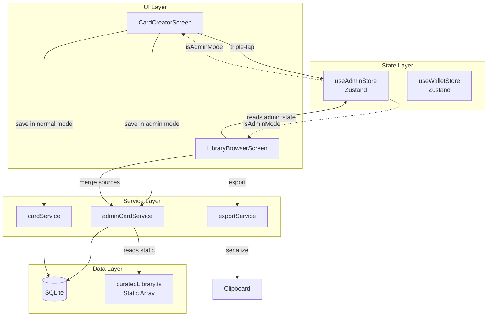
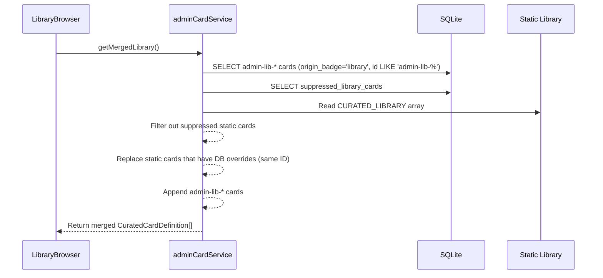

# Design Document: Curator Admin Panel

## Overview

The Curator Admin Panel adds a hidden developer-only mode to the existing Card Creator and Library Browser screens, enabling the sole admin to create, edit, delete, and export library-grade cards without editing code. The design reuses the existing card infrastructure (SQLite `cards` table, `cardService`, Zustand wallet store) and introduces minimal new surface area: a Zustand admin store, a new `adminCardService`, a `suppressed_library_cards` migration, and export serialization logic.

**Key Design Decisions:**

1. **No new screens** — Admin mode augments existing screens (Card Creator, Library Browser) via conditional UI based on a shared `useAdminStore` state. Both screens support triple-tap activation.
2. **Same table, different conventions** — Admin library cards live in the existing `cards` table distinguished by `origin_badge = 'library'`, `stack_position = -1`, and the `admin-lib-` ID prefix. This avoids schema duplication while keeping admin cards out of the wallet stack.
3. **Static overrides reuse the original ID** — When editing a static card, the override is stored with the same ID as the original, making suppression implicit (the DB version takes precedence).
4. **Clipboard export** — The simplest distribution path: serialize to a `CuratedCardDefinition` TypeScript literal, copy to clipboard, paste into `curatedLibrary.ts` before release.
5. **Auto-cleanup of stale overrides** — When the admin exports a card and pastes it into `curatedLibrary.ts`, the system automatically detects matching overrides on next load and deletes them, making the updated static version take effect without manual intervention.
6. **Library independence from wallet** — Admin library cards (`stack_position = -1`) are completely independent of wallet operations. Adding to wallet creates a separate copy; archiving/deleting wallet copies never affects the library source. Wallet position-shifting operations explicitly exclude `stack_position = -1` cards.
7. **Icon caching** — Third-party URL icons are downloaded once and cached locally via `expo-file-system` (SDK 54 `File`/`Directory` classes). Subsequent renders use the local cache with no network requests.
8. **Promote personal to library** — When editing a personal tool with admin mode active, the system offers to promote it to a library card (creates admin-lib copy, deletes personal card).

## Architecture



### Data Flow: Library Browser Merge



## Components and Interfaces

### 1. `useAdminStore` (Zustand Store)

```typescript
// src/stores/adminStore.ts
interface AdminStore {
  isAdminMode: boolean;
  activateAdmin: () => void;
  deactivateAdmin: () => void;
  toggleAdmin: () => void;
  resetAdmin: () => void; // called on screen blur
}
```

Persists nothing — admin mode is ephemeral and resets on navigation away.

### 2. `adminCardService` (Service)

```typescript
// src/services/adminCardService.ts
interface AdminCardService {
  /** Create a new admin library card with admin-lib- prefix */
  createLibraryCard(
    shell: CardShell,
    controls: Omit<Control, 'id' | 'cardId'>[],
    categoryId: string,
    emotionTags?: EmotionType[],
    contextTags?: ContextType[],
    timeTags?: TimeType[]
  ): Promise<Card>;

  /** Get all admin library cards (admin-lib-* prefix, not archived) */
  getAdminLibraryCards(): Promise<Card[]>;

  /** Get all static overrides (origin_badge='library', stack_position=-1, not admin-lib-*) */
  getStaticOverrides(): Promise<Card[]>;

  /** Get suppressed static card IDs */
  getSuppressedIds(): Promise<string[]>;

  /** Returns the merged library: static (minus suppressed, plus overrides) + admin cards */
  getMergedLibrary(): Promise<CuratedCardDefinition[]>;

  /** Create a static override by cloning a CuratedCardDefinition into the DB */
  createStaticOverride(staticCard: CuratedCardDefinition): Promise<Card>;

  /** Delete an admin library card */
  deleteAdminCard(id: string): Promise<void>;

  /** Delete a static override (restores the original static version) */
  deleteStaticOverride(id: string): Promise<void>;

  /** Suppress a static card (no override exists — just hide it) */
  suppressStaticCard(id: string): Promise<void>;

  /** Unsuppress a previously suppressed static card */
  unsuppressStaticCard(id: string): Promise<void>;
}
```

### 3. `exportService` — Card Export

```typescript
// src/services/exportService.ts (extended)
interface ExportService {
  /** Serialize a card (from DB) to CuratedCardDefinition TypeScript literal string */
  serializeToCuratedDefinition(card: Card): string;

  /** Copy the serialized string to device clipboard */
  exportToClipboard(card: Card): Promise<void>;
}
```

### 4. UI Enhancements

#### CardCreatorScreen Changes

- **Triple-tap gesture** on the header title text activates/deactivates admin mode.
- **Admin indicator** banner below header when `isAdminMode === true`.
- **Modified save logic**: when admin mode is active, calls `adminCardService.createLibraryCard()` instead of `cardService.create()`, sets `stack_position = -1` and `allow_background_customization = true`.
- **Promote-to-library flow**: when editing a personal tool with admin mode active, prompts to save as library card (creates admin-lib copy, deletes personal card).
- **Navigation params extension**: `CardCreator` receives optional `adminEditCardId` and `adminEditSource: 'admin' | 'static'` to open in admin edit mode.
- **Emotion tag loading**: when opening in admin edit mode, loads emotion tags from DB or falls back to static CuratedCardDefinition tags.
- **Cancel on all steps**: red "Cancel" button on the right side of the header on all 3 steps; "← Back" on the left for steps 2 and 3; step 1 has empty left side.
- **Icon URL helper text**: shows recommended image size (128×128 or 256×256 PNG) below the URL input field.

#### LibraryBrowserScreen Changes

- **Triple-tap gesture** on the "Library" header title text activates/deactivates admin mode (same as Card Creator).
- **Data source**: switches from reading `CURATED_LIBRARY` directly to calling `adminCardService.getMergedLibrary()`.
- **Admin affordances** (visible only when `isAdminMode`):
  - "Edit" button on each card row
  - "Delete" button on each card row
  - "Export" button on admin-lib and static-override cards
  - "Draft" badge on cards with unpublished local changes
- **Delete confirmation dialog** with different messaging for admin cards vs. static cards.
- **Icon rendering**: uses `renderCardIcon` for proper third-party URL icon display with caching.

### 5. Navigation Param Updates

```typescript
// Updated RootStackParamList
export type RootStackParamList = {
  // ... existing params
  CardCreator: {
    cardId?: string;
    adminEditCardId?: string;
    adminEditSource?: 'admin' | 'static';
  } | undefined;
};
```

## Data Models

### Database Schema Changes

#### 1. `suppressed_library_cards` Table (New)

```sql
CREATE TABLE IF NOT EXISTS suppressed_library_cards (
  id TEXT PRIMARY KEY,           -- same ID as the suppressed static card
  suppressed_at TEXT NOT NULL DEFAULT (datetime('now'))
);
```

#### 2. `icon_type` CHECK Constraint Update

The existing `cards.icon_type` CHECK constraint needs updating to include `'third_party'`:

```sql
-- Current: CHECK(icon_type IN ('library', 'emoji', 'custom_image'))
-- Updated: CHECK(icon_type IN ('library', 'emoji', 'custom_image', 'third_party'))
```

This is applied via a table rebuild migration (`runIconTypeCheckMigration`): the migration tests if `'third_party'` is accepted, and if not, rebuilds the cards table with the updated CHECK constraint. Foreign keys are disabled during the rebuild to prevent `ON DELETE CASCADE` from wiping controls and completions.

> **Important:** The migration disables `PRAGMA foreign_keys` before `DROP TABLE cards` to prevent cascade deletion of controls, completions, reminders, and other referencing tables.

### Admin Library Card Conventions (within existing `cards` table)

| Field | Admin Library Card | Static Override |
|-------|-------------------|-----------------|
| `id` | `admin-lib-{uuid}` | Same as original static card ID (e.g., `lib-grounding-54321`) |
| `origin_badge` | `'library'` | `'library'` |
| `stack_position` | `-1` | `-1` |
| `is_archived` | `0` | `0` |
| `allow_background_customization` | `1` | `1` |
| `source_library_id` | `null` | `null` |

### CuratedCardDefinition (existing — no changes needed)

```typescript
interface CuratedCardDefinition {
  id: string;
  title: string;
  description: string;
  iconType: 'emoji' | 'third_party';
  iconValue: string;
  backgroundType: 'color' | 'image';
  backgroundValue: string;
  categoryId: string;
  allowBackgroundCustomization: boolean;
  controls: CuratedControlDefinition[];
  emotionTags?: EmotionType[];
  contextTags?: ContextType[];
  timeTags?: TimeType[];
}
```

### Card ↔ CuratedCardDefinition Mapping

The `adminCardService.getMergedLibrary()` method maps DB `Card` objects to `CuratedCardDefinition` format for uniform consumption by the Library Browser:

```typescript
function cardToCuratedDefinition(card: Card): CuratedCardDefinition {
  return {
    id: card.id,
    title: card.title,
    description: card.description,
    iconType: card.iconType as 'emoji' | 'third_party',
    iconValue: card.iconValue,
    backgroundType: card.backgroundType as 'color' | 'image',
    backgroundValue: card.backgroundValue,
    categoryId: card.categoryId,
    allowBackgroundCustomization: card.allowBackgroundCustomization,
    controls: card.controls.map((ctrl) => ({
      type: ctrl.type,
      position: ctrl.position,
      config: ctrl.config,
      isRequired: ctrl.isRequired,
    })),
    // Tags loaded separately if needed
  };
}
```


## Correctness Properties

*A property is a characteristic or behavior that should hold true across all valid executions of a system — essentially, a formal statement about what the system should do. Properties serve as the bridge between human-readable specifications and machine-verifiable correctness guarantees.*

### Property 1: Admin card creation preserves all fields with correct conventions

*For any* valid CardShell and control array, creating an admin library card via `adminCardService.createLibraryCard()` SHALL produce a persisted card where:
- The ID matches the pattern `/^admin-lib-[0-9a-f-]{36}$/`
- `origin_badge` equals `'library'`
- `stack_position` equals `-1`
- `is_archived` equals `0`
- `allow_background_customization` equals `1`
- All shell fields (title, description, iconType, iconValue, backgroundType, backgroundValue, categoryId) match the input
- All controls are persisted with correct type, position, config, and isRequired values

**Validates: Requirements 2.2, 2.3, 2.4, 7.1, 7.2, 7.3**

### Property 2: Merged library includes all non-suppressed sources

*For any* combination of static library cards, admin library cards in the DB, static overrides, and suppression records, `getMergedLibrary()` SHALL return a list that contains:
- Every admin library card (admin-lib-* prefix, non-archived)
- Every static library card that is neither suppressed nor overridden
- Every static override in place of its corresponding original

The total count SHALL equal: (static cards − suppressed − overridden) + overrides + admin cards.

**Validates: Requirements 3.1, 3.2**

### Property 3: Static override replaces original in merged library

*For any* static library card that has a corresponding DB override (same ID, stack_position=-1), `getMergedLibrary()` SHALL return the override version's data (title, description, controls, etc.) and SHALL NOT include the original static version's data for that ID.

**Validates: Requirements 3.3, 4.3, 7.6**

### Property 4: Suppressed cards are excluded from merged library

*For any* static library card ID present in the `suppressed_library_cards` table, `getMergedLibrary()` SHALL NOT include a card with that ID in its output.

**Validates: Requirements 3.4, 5.5**

### Property 5: Search filter applies uniformly across all library card sources

*For any* search query string and merged library, the filtered results SHALL include all cards (regardless of source — static, admin, or override) whose title, description, or category name contains the query as a case-insensitive substring, and SHALL exclude all cards that do not match.

**Validates: Requirements 3.5, 3.6**

### Property 6: Add-to-wallet preserves library provenance

*For any* admin library card or static override added to the wallet, the resulting wallet card SHALL have `origin_badge = 'library'` and `source_library_id` equal to the library card's ID.

**Validates: Requirements 3.8**

### Property 7: Update persistence round-trip

*For any* admin library card and any valid set of field updates (title, description, icon, background, category, controls), saving the edits and then reading the card back SHALL return the updated values for all modified fields, with unmodified fields unchanged.

**Validates: Requirements 4.4, 4.5**

### Property 8: Wallet copies are independent of library card mutations

*For any* library card that has been added to a user's wallet, subsequent edits to or deletion of the source library card SHALL NOT modify any field of the wallet copy (the wallet copy retains its original title, description, controls, etc.).

**Validates: Requirements 4.6, 5.6**

### Property 9: Override deletion restores original static version

*For any* static library card that has a DB override, deleting the override SHALL cause `getMergedLibrary()` to return the original static version of that card (with its original title, description, controls, etc.).

**Validates: Requirements 5.4**

### Property 10: Export serialization includes all required CuratedCardDefinition fields

*For any* admin library card or static override with varied field values and control types, `serializeToCuratedDefinition()` SHALL produce a string that, when evaluated, yields an object containing all required `CuratedCardDefinition` fields: id, title, description, iconType, iconValue, backgroundType, backgroundValue, categoryId, allowBackgroundCustomization, and a controls array where each element has type, position, config, and isRequired.

**Validates: Requirements 6.2, 6.5**

### Property 11: Admin card query returns only non-archived admin cards

*For any* mix of admin library cards in the database (some with `is_archived=0`, some with `is_archived=1`), `getAdminLibraryCards()` SHALL return only those cards whose ID starts with `admin-lib-` AND `is_archived = 0`.

**Validates: Requirements 7.4**

## Error Handling

### Service Layer Errors

| Scenario | Handling | User Feedback |
|----------|----------|---------------|
| Shell validation fails (empty title, too-long description, invalid icon URI) | `validateShell()` returns `ValidationResult` with field-level errors | Inline error messages on Step 1 form fields |
| Controls validation fails (0 or >10 controls, invalid link URLs) | `validateControls()` returns errors | Inline error on Step 2 |
| DB write failure during card creation | Transaction rolled back, `AppError.persistence` thrown | Alert: "Failed to create library tool. Please try again." |
| DB write failure during card update | Transaction rolled back, `AppError.persistence` thrown | Alert: "Failed to update library tool. Please try again." |
| DB write failure during deletion | Transaction rolled back, `AppError.persistence` thrown | Alert: "Failed to delete card. Please try again." |
| Clipboard copy failure | `Clipboard.setStringAsync` rejection caught | Alert: "Failed to copy to clipboard." |
| Card not found for edit (race condition) | `null` returned from `getById` | Alert: "Card not found. It may have been deleted." |
| Static card already overridden (double-edit) | `createStaticOverride` detects existing override → opens existing override for edit | Transparent to user — opens existing override |
| Invalid icon_type for DB constraint | Application-layer validation prevents write | Validation error: "Icon type not supported" |

### State Recovery

- **Admin mode is ephemeral** — no persistence means no corrupt state to recover from. If the app crashes mid-admin-operation, the admin simply re-enters admin mode.
- **Partial writes are impossible** — all multi-step operations (create card + insert controls) use SQLite transactions with ROLLBACK on failure.
- **Orphaned overrides** — if a static card is removed from `curatedLibrary.ts` in a future release but an override exists in the DB, the override still shows in the library (it's just a card with `stack_position=-1`). This is acceptable since the admin can delete it.

### Edge Cases

- **Triple-tap timing**: Use a 500ms window. Three taps within 500ms → toggle. Taps spaced further apart reset the counter.
- **Rapid save double-tap**: `isSaving` flag prevents duplicate submissions (already exists in `CardCreatorScreen`).
- **Empty library (all cards suppressed/deleted)**: The Library Browser already handles empty state with a "No matching cards" message.

## Testing Strategy

### Property-Based Tests (fast-check 3)

Each correctness property maps to a dedicated property-based test with minimum 100 iterations. Tests are tagged with the property they validate.

**Library:** `fast-check` 3 (already in project dependencies per tech stack steering)

**Test file:** `src/services/__tests__/adminCardService.property.test.ts`

| Property | Test Description | Generator Strategy |
|----------|-----------------|-------------------|
| 1 | Admin card creation round-trip | Random CardShell (non-empty trimmed strings ≤80/300 chars, valid iconType/backgroundType, valid categoryId), random controls array (1–10 items with valid type + config) |
| 2 | Merge inclusion | Random subsets of static cards (from fixture), random admin cards in DB, random suppression sets |
| 3 | Override replaces original | Random static card, create override with modified fields, verify merge |
| 4 | Suppression exclusion | Random subset of static card IDs suppressed |
| 5 | Search uniformity | Random search strings, random card collections from mixed sources |
| 6 | Add-to-wallet provenance | Random admin/override cards, add to wallet, check fields |
| 7 | Update round-trip | Random field subsets updated with random valid values |
| 8 | Wallet independence | Create library card, add to wallet, mutate library card, check wallet unchanged |
| 9 | Override delete restores original | Create override, delete, verify original returns |
| 10 | Export completeness | Random cards with varied controls and field values |
| 11 | Query filter correctness | Mix of archived/non-archived admin cards |

**Configuration:**
- Minimum 100 iterations per test (`fc.assert(..., { numRuns: 100 })`)
- Tag format: `// Feature: curator-admin-panel, Property {N}: {title}`

### Unit Tests (Jest)

Focused on specific examples, edge cases, and UI behavior:

- Triple-tap gesture detection (timing edge cases)
- Admin mode toggle on/off
- Admin mode reset on navigation blur
- Confirmation dialog before delete
- Clipboard export mock verification
- Empty state handling
- Static card that no longer exists in `curatedLibrary.ts` but has an override
- Controls with every ControlType to verify serialization

### Integration Tests

- Full create → merge → display flow with a real SQLite database
- Create override → edit → delete → verify original restored
- Export → clipboard content matches expected TypeScript format
- Suppression persists across database reconnects (app restart simulation)
