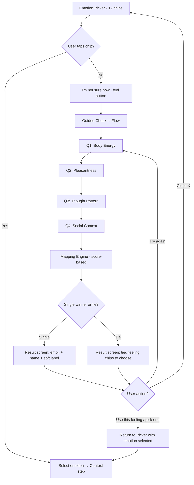
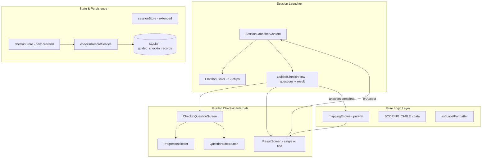
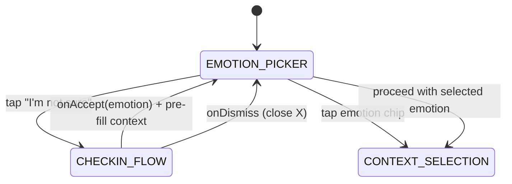
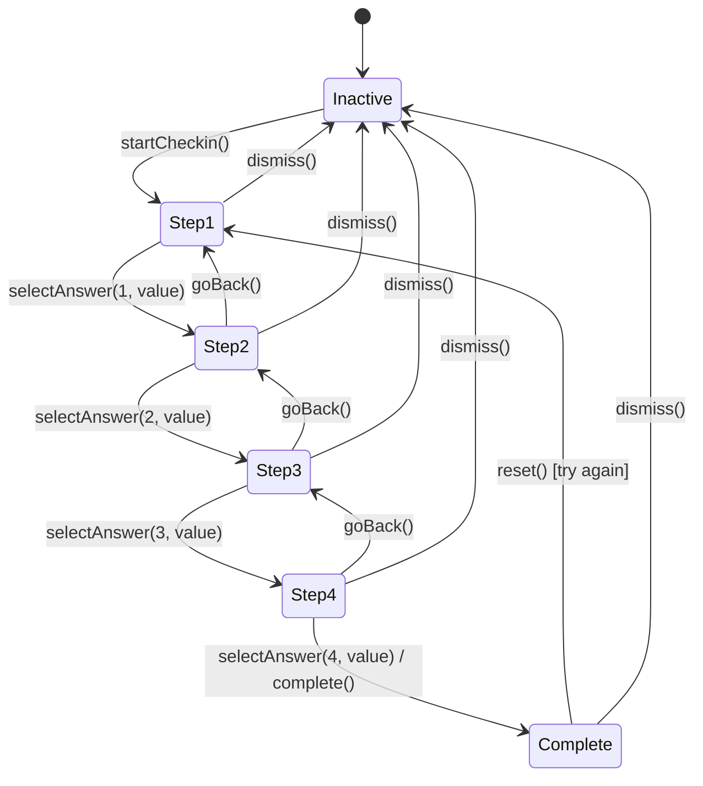

# Design Document: Guided Emotion Check-in

## Overview

This feature extends the Mental Health Wallet's emotion session flow with two capabilities:

1. **Expanded Emotion Picker** — Replaces the existing 6-chip picker with a 12-chip picker adding: lonely, ashamed, guilty, hopeless, calm, curious.
2. **Guided Check-in** — A 4-question "I'm not sure how I feel" path that uses body-energy, pleasantness, thought-pattern, and social-context responses to derive a feeling from the full 12-emotion set via a pure scoring-based mapping engine.

The mapping engine is the core computational unit: a deterministic, side-effect-free function backed by a declarative scoring table. For each of the 12 feelings, it sums weights from 4 input dimensions and picks the highest-scoring feeling(s). All 420 valid input combinations (5 × 3 × 7 × 4) produce one or more top-scoring emotions. The guided flow takes 30–60 seconds and presents the result as a final step within the flow before returning the user to the picker.

### Design Goals

- **Testability** — The mapping engine is a pure function, enabling exhaustive property-based testing of all 420 input combinations.
- **Tunability** — Weights live in a declarative scoring table; changing scores requires no logic changes.
- **Accessibility** — Full screen-reader support, 44pt tap targets, live-region announcements.
- **Tone safety** — No clinical language, no numeric scores exposed to users.
- **Backward compatibility** — Existing 6-emotion sessions continue working unchanged.

## Architecture

### High-Level Flow



### Component Architecture



### Layer Separation

| Layer | Responsibility | Side Effects |
|-------|---------------|--------------|
| **UI Components** | Render questions, chips, result screen, progress, animations | None (read store state) |
| **Store (Zustand)** | Manage check-in step state, answers, top feelings | None (in-memory) |
| **Mapping Engine** | Compute top-scoring feeling(s) from 4 answers | None (pure function) |
| **Record Service** | Persist `Checkin_Record` to SQLite | DB writes |
| **Analytics Logger** | Fire `guided_checkin_started/completed` events | Event queue writes |

### Navigation Integration

The guided check-in does NOT use React Navigation screens. It renders as an inline paginated view within `SessionLauncherContent`, managed by the `checkinStore` step counter. This keeps the emotion picker in the back stack implicitly (same component, different render state). The result screen (single winner or tied feelings) is the 5th step rendered within `GuidedCheckinFlow` itself.

**State machine for SessionLauncherContent:**

```
EMOTION_PICKER (12 chips + "not sure" button)
  → CHECKIN_FLOW (Q1 → Q2 → Q3 → Q4 → Result)
  → (user picks feeling via onAccept callback)
  → EMOTION_PICKER (with emotion selected + context pre-filled from Q4)
  → CONTEXT_SELECTION (existing flow continues, Q4 answer pre-selected)
```



**Context pre-fill from Guided Check-in:**

When the user accepts a feeling from the guided check-in, `handleCheckinAccept` captures the Q4 (Social Context) answer before resetting the checkin store, then replaces the session's `selectedContexts` with that single value. This avoids asking "Where are you right now?" twice. The replacement (not append) ensures repeated check-in attempts don't stack multiple contexts. The user can still modify the pre-filled selection manually.

The ContextChips component displays 4 options only (no "I'm not sure" escape hatch) since the context step is optional and the values align directly with the guided check-in's Social Context enum.

## Components and Interfaces

### New Files

| File | Purpose |
|------|---------|
| `src/services/mappingEngine.ts` | Pure mapping function + scoring table |
| `src/services/__tests__/mappingEngine.test.ts` | Property-based tests (fast-check) |
| `src/services/checkinRecordService.ts` | CRUD for `guided_checkin_records` table |
| `src/stores/checkinStore.ts` | Zustand store for check-in flow state |
| `src/components/session/GuidedCheckinFlow.tsx` | Container for the 4 questions + result screen |
| `src/components/session/CheckinQuestionScreen.tsx` | Single question renderer |
| `src/components/session/CheckinProgressIndicator.tsx` | Step N of 4 indicator |
| `src/types/checkin.ts` | Check-in domain types |
| `src/data/emotionConfig.ts` | Full 12-emotion configuration (labels, icons, display names) |

### Modified Files

| File | Change |
|------|--------|
| `src/types/index.ts` | Extend `EmotionType` union to 12 values |
| `src/types/analytics.ts` | Add `guided_checkin_started`, `guided_checkin_completed` event types |
| `src/data/migrations.ts` | Add `guided_checkin_records` table + `checkin_id` column on `emotion_sessions` |
| `src/data/curatedLibrary.ts` | Add emotion tags for 6 new emotions on relevant cards |
| `src/components/session/EmotionPicker.tsx` | Expand from 6 to 12 chips + "not sure" button |
| `src/components/session/SessionLauncherContent.tsx` | Integrate check-in flow with `onAccept`/`onDismiss` callbacks |
| `src/stores/sessionStore.ts` | Accept `checkinId` when creating session from guided flow |
| `src/services/emotionSessionService.ts` | Support `checkin_id` column |
| `src/services/analyticsEventLogger.ts` | Register new event types |

### Key Interfaces

#### Mapping Engine

```typescript
// src/services/mappingEngine.ts

export interface MappingInput {
  bodyEnergy: BodyEnergyLevel;
  pleasantness: Pleasantness;
  thoughtPattern: ThoughtPattern;
  context: SocialContext;
}

export interface MappingResult {
  topFeelings: EmotionType[];  // 1 or more tied top-scoring feelings
  scores: Record<EmotionType, number>;  // all scores for debugging/analytics
}

/**
 * Pure, synchronous function. Computes a score for each of the 12 feelings
 * by summing weights from SCORING_TABLE, returns the highest-scoring feeling(s).
 * Falls back to "stressed" when all scores ≤ 2.
 * Throws on invalid input.
 */
export function deriveFeeling(input: MappingInput): MappingResult;
```

#### Scoring Table

```typescript
// src/services/mappingEngine.ts

export interface ScoringWeights {
  body_very_low: number; body_low: number; body_medium: number; body_high: number; body_very_high: number;
  pleasant_unpleasant: number; pleasant_mixed: number; pleasant_pleasant: number;
  thought_racing: number; thought_stuck_worries: number; thought_stuck_mistakes: number;
  thought_blank: number; thought_numb: number; thought_curious_interested: number; thought_okay: number;
  ctx_alone_at_home: number; ctx_at_work: number; ctx_with_family: number; ctx_with_friends: number;
}

export const SCORING_TABLE: Record<EmotionType, ScoringWeights>;
```

#### Check-in Store

```typescript
// src/stores/checkinStore.ts

export interface CheckinStore {
  // State
  isActive: boolean;
  currentStep: 1 | 2 | 3 | 4;
  answers: CheckinAnswers;
  topFeelings: EmotionType[];  // derived top-scoring feelings (1 or more)
  isTransitioning: boolean;

  // Actions
  startCheckin: () => void;
  selectAnswer: (step: number, value: string) => void;
  goBack: () => void;
  dismiss: () => void;
  complete: () => void;  // keeps isActive: true (result shown in-flow)
  reset: () => void;
}

export interface CheckinAnswers {
  bodyEnergy: BodyEnergyLevel | null;
  pleasantness: Pleasantness | null;
  thoughtPattern: ThoughtPattern | null;
  context: SocialContext | null;
}
```

#### GuidedCheckinFlow Props

```typescript
// src/components/session/GuidedCheckinFlow.tsx

export interface GuidedCheckinFlowProps {
  onDismiss: () => void;
  onAccept: (emotion: EmotionType) => void;
}
```

#### Emotion Configuration

```typescript
// src/data/emotionConfig.ts

export interface EmotionConfig {
  type: EmotionType;
  label: string;        // User-facing display name
  icon: string;         // Emoji for chip
}

export const EMOTION_OPTIONS: EmotionConfig[] = [
  { type: 'stressed', label: 'Stressed', icon: '😰' },
  { type: 'overwhelmed', label: 'Overwhelmed', icon: '🌊' },
  { type: 'anxious', label: 'Anxious', icon: '😟' },
  { type: 'sad', label: 'Sad / Low', icon: '😢' },
  { type: 'angry', label: 'Angry', icon: '😤' },
  { type: 'numb', label: 'Numb', icon: '😶' },
  { type: 'lonely', label: 'Lonely', icon: '🫂' },
  { type: 'ashamed', label: 'Ashamed / Embarrassed', icon: '😣' },
  { type: 'guilty', label: 'Guilty', icon: '😔' },
  { type: 'hopeless', label: 'Hopeless / Discouraged', icon: '🕳️' },
  { type: 'calm', label: 'Calm / Okay', icon: '😌' },
  { type: 'curious', label: 'Curious / Interested', icon: '🤔' },
];

/**
 * Returns the display name for an emotion.
 * Used in session history, usage screens, and the soft label.
 */
export function getEmotionDisplayName(emotion: EmotionType): string;

/**
 * Generates the soft label message for a derived feeling.
 * Format: "It sounds like you might be feeling [label] right now"
 */
export function formatSoftLabel(emotion: EmotionType): string;
```

#### Tool Recommendation Mapping (New Emotions)

```typescript
// Added to src/data/curatedLibrary.ts or a new recommendations config file

export const NEW_EMOTION_TOOL_RECOMMENDATIONS: Record<
  'lonely' | 'ashamed' | 'guilty' | 'hopeless' | 'calm' | 'curious',
  string[] // card IDs in priority order
> = {
  lonely: ['lib-reach-out', 'lib-gratitude-message', 'lib-not-alone'],
  ashamed: ['lib-self-compassion-pause', 'lib-kind-inner-voice', 'lib-not-alone'],
  guilty: ['lib-permission-slip', 'lib-kind-inner-voice', 'lib-win-of-day'],
  hopeless: ['lib-three-good-things', 'lib-evening-gratitude', 'lib-reach-out'],
  calm: ['lib-daily-mood', 'lib-win-of-day', 'lib-evening-gratitude'],
  curious: ['lib-thought-feeling-action', 'lib-daily-mood', 'lib-three-good-things'],
};
```

## Data Models

### Type Definitions

```typescript
// src/types/checkin.ts

/** Body energy levels for question 1 */
export type BodyEnergyLevel = 'very_low' | 'low' | 'medium' | 'high' | 'very_high';

/** Pleasantness for question 2 */
export type Pleasantness = 'unpleasant' | 'mixed' | 'pleasant';

/** Thought pattern for question 3 */
export type ThoughtPattern =
  | 'racing'
  | 'stuck_worries'
  | 'stuck_mistakes'
  | 'blank'
  | 'numb'
  | 'curious_interested'
  | 'okay';

/** Social context for question 4 */
export type SocialContext = 'alone_at_home' | 'at_work' | 'with_family' | 'with_friends';

/** A completed check-in record for persistence */
export interface CheckinRecord {
  id: string;                    // UUID v4 via expo-crypto
  bodyEnergy: BodyEnergyLevel;
  pleasantness: Pleasantness;
  thoughtPattern: ThoughtPattern;
  context: SocialContext;
  derivedFeeling: EmotionType;
  wasChanged: boolean;           // true if user overrode the suggestion
  finalEmotion: EmotionType;     // the emotion actually used for the session
  recordedAt: string;            // UTC ISO 8601
}

/** Question configuration for the check-in flow */
export interface CheckinQuestion {
  step: 1 | 2 | 3 | 4;
  prompt: string;
  options: CheckinOption[];
  icon: string;                  // decorative icon above prompt
}

export interface CheckinOption {
  value: string;                 // enum value stored in answers
  label: string;                 // user-facing display text
}
```

### Extended EmotionType (modification to `src/types/index.ts`)

```typescript
export type EmotionType =
  | 'stressed'
  | 'overwhelmed'
  | 'anxious'
  | 'sad'
  | 'angry'
  | 'numb'
  | 'lonely'
  | 'ashamed'
  | 'guilty'
  | 'hopeless'
  | 'calm'
  | 'curious';
```

### Database Schema Changes

#### Migration: `guided_checkin_records` table

```sql
CREATE TABLE IF NOT EXISTS guided_checkin_records (
  id TEXT PRIMARY KEY,
  body_energy TEXT NOT NULL,
  pleasantness TEXT NOT NULL,
  thought_pattern TEXT NOT NULL,
  context TEXT NOT NULL,
  derived_feeling TEXT NOT NULL,
  was_changed INTEGER NOT NULL DEFAULT 0,
  final_emotion TEXT NOT NULL,
  recorded_at TEXT NOT NULL
);

CREATE INDEX IF NOT EXISTS idx_guided_checkin_recorded_at
  ON guided_checkin_records(recorded_at);
```

#### Migration: `checkin_id` column on `emotion_sessions`

```sql
ALTER TABLE emotion_sessions ADD COLUMN checkin_id TEXT;
```

#### Migration: Extend `emotion_tags.emotion` CHECK constraint

The existing CHECK constraint on `emotion_tags.emotion` only allows 6 values. Since SQLite cannot ALTER CHECK constraints, this requires a table rebuild (same pattern as `runIconTypeCheckMigration`):

```sql
-- Rebuild emotion_tags with expanded CHECK
CREATE TABLE emotion_tags_new (
  id TEXT PRIMARY KEY,
  card_id TEXT NOT NULL REFERENCES cards(id) ON DELETE CASCADE,
  emotion TEXT NOT NULL CHECK(emotion IN (
    'stressed', 'overwhelmed', 'anxious', 'sad', 'angry', 'numb',
    'lonely', 'ashamed', 'guilty', 'hopeless', 'calm', 'curious'
  )),
  UNIQUE(card_id, emotion)
);

INSERT INTO emotion_tags_new SELECT * FROM emotion_tags;
DROP TABLE emotion_tags;
ALTER TABLE emotion_tags_new RENAME TO emotion_tags;

CREATE INDEX IF NOT EXISTS idx_emotion_tags_card ON emotion_tags(card_id);
CREATE INDEX IF NOT EXISTS idx_emotion_tags_emotion ON emotion_tags(emotion);
```

#### Migration: Extend `emotion_sessions.selected_emotion` CHECK constraint

Same rebuild pattern for the `emotion_sessions` table to allow new emotion values in `selected_emotion`.

### Mapping Engine Design

The mapping engine is the algorithmic core of this feature. It is designed for:

1. **Exhaustive correctness** — All 420 valid inputs produce one or more top-scoring feelings.
2. **Score-based evaluation** — Each feeling gets an additive score from 4 weight lookups; highest score wins.
3. **Tie handling** — When multiple feelings share the max score, all are returned for user selection.
4. **Declarative tunability** — Weights are data in a scoring table; adjusting results requires no logic changes.
5. **Zero dependencies** — No DB, no network, no async. Pure synchronous computation.

#### Algorithm

```typescript
export function deriveFeeling(input: MappingInput): MappingResult {
  // 1. Validate all input fields against their enum sets
  validateInput(input);

  // 2. Compute score for each feeling
  const scores: Record<EmotionType, number> = {} as Record<EmotionType, number>;

  for (const [feeling, weights] of Object.entries(SCORING_TABLE)) {
    const bodyKey = `body_${input.bodyEnergy}` as keyof ScoringWeights;
    const pleasantKey = `pleasant_${input.pleasantness}` as keyof ScoringWeights;
    const thoughtKey = `thought_${input.thoughtPattern}` as keyof ScoringWeights;
    const ctxKey = `ctx_${input.context}` as keyof ScoringWeights;

    scores[feeling as EmotionType] =
      weights[bodyKey] + weights[pleasantKey] + weights[thoughtKey] + weights[ctxKey];
  }

  // 3. Find the maximum score
  const maxScore = Math.max(...Object.values(scores));

  // 4. Fallback: if all scores ≤ 2, return "stressed"
  if (maxScore <= 2) {
    return { topFeelings: ['stressed'], scores };
  }

  // 5. Collect all feelings tied at the max score
  const topFeelings = (Object.entries(scores) as [EmotionType, number][])
    .filter(([_, score]) => score === maxScore)
    .map(([feeling]) => feeling);

  return { topFeelings, scores };
}
```

#### Scoring Table (Declarative Data)

```typescript
export const SCORING_TABLE: Record<EmotionType, ScoringWeights> = {
  hopeless: {
    body_very_low: 2, body_low: 1, body_medium: 0, body_high: 0, body_very_high: 0,
    pleasant_unpleasant: 2, pleasant_mixed: 0, pleasant_pleasant: 0,
    thought_racing: 0, thought_stuck_worries: 0, thought_stuck_mistakes: 2, thought_blank: 2, thought_numb: 1, thought_curious_interested: 0, thought_okay: 0,
    ctx_alone_at_home: 0, ctx_at_work: 0, ctx_with_family: 0, ctx_with_friends: 0,
  },
  guilty: {
    body_very_low: 0, body_low: 1, body_medium: 1, body_high: 0, body_very_high: 0,
    pleasant_unpleasant: 2, pleasant_mixed: 0, pleasant_pleasant: 0,
    thought_racing: 0, thought_stuck_worries: 0, thought_stuck_mistakes: 2, thought_blank: 0, thought_numb: 0, thought_curious_interested: 0, thought_okay: 0,
    ctx_alone_at_home: 0, ctx_at_work: 1, ctx_with_family: 1, ctx_with_friends: 1,
  },
  ashamed: {
    body_very_low: 0, body_low: 0, body_medium: 1, body_high: 1, body_very_high: 0,
    pleasant_unpleasant: 2, pleasant_mixed: 0, pleasant_pleasant: 0,
    thought_racing: 0, thought_stuck_worries: 0, thought_stuck_mistakes: 2, thought_blank: 0, thought_numb: 0, thought_curious_interested: 0, thought_okay: 0,
    ctx_alone_at_home: 0, ctx_at_work: 1, ctx_with_family: 1, ctx_with_friends: 1,
  },
  lonely: {
    body_very_low: 0, body_low: 1, body_medium: 1, body_high: 0, body_very_high: 0,
    pleasant_unpleasant: 2, pleasant_mixed: 0, pleasant_pleasant: 0,
    thought_racing: 0, thought_stuck_worries: 1, thought_stuck_mistakes: 0, thought_blank: 2, thought_numb: 2, thought_curious_interested: 0, thought_okay: 0,
    ctx_alone_at_home: 2, ctx_at_work: 0, ctx_with_family: 1, ctx_with_friends: 1,
  },
  angry: {
    body_very_low: 0, body_low: 0, body_medium: 0, body_high: 2, body_very_high: 2,
    pleasant_unpleasant: 2, pleasant_mixed: 0, pleasant_pleasant: 0,
    thought_racing: 1, thought_stuck_worries: 0, thought_stuck_mistakes: 1, thought_blank: 0, thought_numb: 0, thought_curious_interested: 0, thought_okay: 0,
    ctx_alone_at_home: 0, ctx_at_work: 0, ctx_with_family: 0, ctx_with_friends: 0,
  },
  anxious: {
    body_very_low: 0, body_low: 0, body_medium: 0, body_high: 2, body_very_high: 2,
    pleasant_unpleasant: 2, pleasant_mixed: 0, pleasant_pleasant: 0,
    thought_racing: 2, thought_stuck_worries: 2, thought_stuck_mistakes: 0, thought_blank: 0, thought_numb: 0, thought_curious_interested: 0, thought_okay: 0,
    ctx_alone_at_home: 1, ctx_at_work: 1, ctx_with_family: 0, ctx_with_friends: 0,
  },
  overwhelmed: {
    body_very_low: 0, body_low: 0, body_medium: 1, body_high: 1, body_very_high: 0,
    pleasant_unpleasant: 1, pleasant_mixed: 0, pleasant_pleasant: 0,
    thought_racing: 2, thought_stuck_worries: 1, thought_stuck_mistakes: 0, thought_blank: 0, thought_numb: 0, thought_curious_interested: 0, thought_okay: 0,
    ctx_alone_at_home: 0, ctx_at_work: 1, ctx_with_family: 1, ctx_with_friends: 0,
  },
  stressed: {
    body_very_low: 0, body_low: 0, body_medium: 1, body_high: 1, body_very_high: 0,
    pleasant_unpleasant: 1, pleasant_mixed: 1, pleasant_pleasant: 0,
    thought_racing: 0, thought_stuck_worries: 1, thought_stuck_mistakes: 0, thought_blank: 0, thought_numb: 0, thought_curious_interested: 0, thought_okay: 1,
    ctx_alone_at_home: 1, ctx_at_work: 2, ctx_with_family: 1, ctx_with_friends: 1,
  },
  numb: {
    body_very_low: 2, body_low: 1, body_medium: 0, body_high: 0, body_very_high: 0,
    pleasant_unpleasant: 1, pleasant_mixed: 1, pleasant_pleasant: 0,
    thought_racing: 0, thought_stuck_worries: 0, thought_stuck_mistakes: 0, thought_blank: 1, thought_numb: 2, thought_curious_interested: 0, thought_okay: 0,
    ctx_alone_at_home: 0, ctx_at_work: 0, ctx_with_family: 0, ctx_with_friends: 0,
  },
  sad: {
    body_very_low: 1, body_low: 2, body_medium: 0, body_high: 0, body_very_high: 0,
    pleasant_unpleasant: 2, pleasant_mixed: 0, pleasant_pleasant: 0,
    thought_racing: 0, thought_stuck_worries: 0, thought_stuck_mistakes: 0, thought_blank: 2, thought_numb: 1, thought_curious_interested: 0, thought_okay: 0,
    ctx_alone_at_home: 1, ctx_at_work: 0, ctx_with_family: 0, ctx_with_friends: 0,
  },
  curious: {
    body_very_low: 0, body_low: 0, body_medium: 2, body_high: 2, body_very_high: 0,
    pleasant_unpleasant: 0, pleasant_mixed: 2, pleasant_pleasant: 2,
    thought_racing: 0, thought_stuck_worries: 0, thought_stuck_mistakes: 0, thought_blank: 0, thought_numb: 0, thought_curious_interested: 2, thought_okay: 0,
    ctx_alone_at_home: 0, ctx_at_work: 0, ctx_with_family: 0, ctx_with_friends: 0,
  },
  calm: {
    body_very_low: 0, body_low: 1, body_medium: 1, body_high: 0, body_very_high: 0,
    pleasant_unpleasant: 0, pleasant_mixed: 2, pleasant_pleasant: 2,
    thought_racing: 0, thought_stuck_worries: 0, thought_stuck_mistakes: 0, thought_blank: 0, thought_numb: 0, thought_curious_interested: 0, thought_okay: 2,
    ctx_alone_at_home: 0, ctx_at_work: 0, ctx_with_family: 0, ctx_with_friends: 0,
  },
};
```

#### Input Validation

```typescript
const VALID_BODY_ENERGY: BodyEnergyLevel[] = ['very_low', 'low', 'medium', 'high', 'very_high'];
const VALID_PLEASANTNESS: Pleasantness[] = ['unpleasant', 'mixed', 'pleasant'];
const VALID_THOUGHT_PATTERN: ThoughtPattern[] = [
  'racing', 'stuck_worries', 'stuck_mistakes', 'blank', 'numb', 'curious_interested', 'okay'
];
const VALID_CONTEXT: SocialContext[] = ['alone_at_home', 'at_work', 'with_family', 'with_friends'];

function validateInput(input: MappingInput): void {
  if (!VALID_BODY_ENERGY.includes(input.bodyEnergy)) {
    throw new Error(`Invalid bodyEnergy: "${input.bodyEnergy}"`);
  }
  if (!VALID_PLEASANTNESS.includes(input.pleasantness)) {
    throw new Error(`Invalid pleasantness: "${input.pleasantness}"`);
  }
  if (!VALID_THOUGHT_PATTERN.includes(input.thoughtPattern)) {
    throw new Error(`Invalid thoughtPattern: "${input.thoughtPattern}"`);
  }
  if (!VALID_CONTEXT.includes(input.context)) {
    throw new Error(`Invalid context: "${input.context}"`);
  }
}
```

### Check-in Flow State Machine

The `checkinStore` manages the guided check-in lifecycle:



**Key behavior: `complete()` keeps `isActive: true`.** The result screen is rendered within `GuidedCheckinFlow` while `isActive` is true and all 4 answers are present. The flow is only dismissed when the user accepts a feeling (triggering `onAccept`) or closes (triggering `onDismiss`).

**Back navigation clears forward answers.** When `goBack()` is called at step N, all answers for steps > current are set to `null`. This ensures the user must re-answer forward and prevents stale derived feelings.

**Transition locking:** `isTransitioning` is set to `true` during the 200–400ms highlight animation. While true, `selectAnswer` calls are ignored (prevents double-advance on rapid taps).

### UI Component Design

#### EmotionPicker (expanded)

The existing `EmotionPicker` component is modified to:
- Render all 12 `EMOTION_OPTIONS` in a `flexWrap` layout (two rows of 6 on standard screens)
- Add the "I'm not sure how I feel" button below with 12pt spacing
- Accept a new `onStartCheckin` callback prop

```typescript
export interface EmotionPickerProps {
  selectedEmotion: EmotionType | null;
  onSelectEmotion: (emotion: EmotionType) => void;
  onDeselectEmotion: () => void;
  onStartCheckin: () => void;
}
```

#### GuidedCheckinFlow

A paginated container using React Native Reanimated for smooth transitions. Handles the full lifecycle including the result screen:
- Renders one `CheckinQuestionScreen` at a time for steps 1–4
- After step 4 completion, renders the **result screen** (5th step) internally:
  - **Single winner**: Shows the feeling prominently with emoji + display name + soft label + normalizing message + "Use this feeling" button + "Try again" link
  - **Tied feelings**: Shows prompt "This could be a few things — which feels closest?" with all tied feelings as selectable chips/buttons. User taps one to proceed.
- Manages slide-in/slide-out animations (250ms `SlideInRight` / `SlideOutLeft`)
- Displays `CheckinProgressIndicator` at top (steps 1–4 only)
- Close button (X) at top-right on all steps including result
- Back arrow on steps 2–4
- "Try again" on result screen calls `reset()` and restarts from step 1

#### CheckinQuestionScreen

A pure presentational component:
- Decorative icon (accessibility hidden)
- Question prompt text
- Vertical list of tappable option buttons (44pt min height)
- Highlight animation on selection (scale + color, 300ms)

### Analytics Integration

#### New Event Types

Two new analytics event types are added to the `AnalyticsEventType` union:

```typescript
// Added to src/types/analytics.ts
| 'guided_checkin_started'
| 'guided_checkin_completed'
```

#### Event Firing Points

1. **`guided_checkin_started`** — Fired when `checkinStore.startCheckin()` is called (user taps "I'm not sure how I feel"). No additional properties.

2. **`guided_checkin_completed`** — Fired when the user proceeds from the emotion picker after a guided check-in. Properties:
   - `derived_feeling: string` — the emotion the engine suggested
   - `was_changed: boolean` — true if user selected a different emotion
   - `final_emotion_used: string` — the emotion actually used for the session

#### Checkin Record Persistence

The `checkinRecordService` handles SQLite persistence:

```typescript
// src/services/checkinRecordService.ts

export async function saveCheckinRecord(record: CheckinRecord): Promise<void> {
  const db = await getDatabase();
  await db.runAsync(
    `INSERT INTO guided_checkin_records
      (id, body_energy, pleasantness, thought_pattern, context,
       derived_feeling, was_changed, final_emotion, recorded_at)
     VALUES (?, ?, ?, ?, ?, ?, ?, ?, ?)`,
    [
      record.id,
      record.bodyEnergy,
      record.pleasantness,
      record.thoughtPattern,
      record.context,
      record.derivedFeeling,
      record.wasChanged ? 1 : 0,
      record.finalEmotion,
      record.recordedAt,
    ]
  );
}
```

If the write fails, the error is logged to console and the session continues uninterrupted (Requirement 9.5).

### How the 12 Emotion Chips Replace the Existing 6

**Migration strategy: In-place expansion, no breaking changes.**

1. The `EmotionType` union in `src/types/index.ts` is extended with 6 new values.
2. The `EMOTION_OPTIONS` array in `EmotionPicker` grows from 6 to 12 entries. The existing 6 retain their order and appearance.
3. The `emotion_tags` and `emotion_sessions` tables get CHECK constraint rebuilds (same pattern as `runIconTypeCheckMigration`).
4. Existing sessions with the original 6 emotions are unaffected — the new values are additive.
5. The curated library cards gain new `emotionTags` entries for the 6 new emotions based on the Tool Recommendation Table.
6. The recommendation service already filters by `EmotionType` generically — no algorithm changes needed, only data expansion.

**Backward compatibility:**
- All existing code that handles `EmotionType` continues to work since TypeScript will flag any switch/if that doesn't handle the new cases.
- DB queries using `selected_emotion` work unchanged; the new values are valid strings.
- The `getRecommendations()` function already handles any `EmotionType` value generically.

## Correctness Properties

*A property is a characteristic or behavior that should hold true across all valid executions of a system — essentially, a formal statement about what the system should do. Properties serve as the bridge between human-readable specifications and machine-verifiable correctness guarantees.*

### Property 1: Total Function (All 420 Combinations Produce Valid Output)

*For any* valid combination of BodyEnergyLevel (5 values), Pleasantness (3 values), ThoughtPattern (7 values), and SocialContext (4 values), the mapping engine SHALL return a `MappingResult` containing a `topFeelings` array with at least one value from the Full_Emotion_Set of 12 emotions, with no undefined outputs, no thrown errors, and no null returns.

**Validates: Requirements 3.1, 3.6**

### Property 2: Highest Score Wins

*For any* valid input combination, the mapping engine SHALL return only feelings that have the maximum score among all 12 feelings. No feeling with a lower score than the maximum SHALL appear in `topFeelings`.

**Validates: Requirements 3.2, 3.3**

### Property 3: Referential Transparency (Same Input → Same Output)

*For any* valid input combination, calling `deriveFeeling` with identical inputs N times (N ≥ 2) SHALL always return the same `topFeelings` array and `scores` record. The function has no hidden state.

**Validates: Requirements 3.6**

### Property 4: Invalid Input Rejection

*For any* input object where at least one field contains a string value NOT present in its corresponding valid enum set (BodyEnergyLevel, Pleasantness, ThoughtPattern, or SocialContext), the mapping engine SHALL throw a synchronous Error whose message identifies the invalid field name. No `MappingResult` SHALL be returned.

**Validates: Requirements 3.8**

### Property 5: Fallback When All Scores ≤ 2

*For any* valid input combination where the maximum score across all 12 feelings is ≤ 2, the mapping engine SHALL return `topFeelings: ['stressed']`. This is the only condition under which "stressed" can appear as a fallback independently of its score.

**Validates: Requirements 3.5**

### Property 6: All 12 Emotions Are Reachable

*For each* of the 12 emotions in the Full_Emotion_Set, there exists at least one valid input combination that produces that emotion as a top-scoring result (i.e., it appears in `topFeelings`). No emotion is unreachable by the scoring table.

**Validates: Requirements 3.7 (total function completeness)**

### Property 7: Soft Label Format Compliance

*For any* emotion value in the Full_Emotion_Set (12 values), the `formatSoftLabel` function SHALL return a string matching the exact template: `"It sounds like you might be feeling {displayName} right now"` where `{displayName}` is the lowercase display label for that emotion.

**Validates: Requirements 4.3, 7.3**

### Property 8: No Banned Clinical Terms in User-Facing Strings

*For all* user-facing string constants in the check-in flow (question prompts, option labels, progress text, result labels, button labels), no string SHALL contain any word from the banned list: "assess", "evaluate", "diagnose", "diagnosis", "symptom", "disorder", "pathology", "clinical", "screening", "treatment", "patient", "condition", "prognosis", "therapeutic intervention", "mental illness", "abnormal".

**Validates: Requirements 7.1**

### Property 9: Display Name Completeness

*For every* value in the EmotionType union (all 12 emotions), the `getEmotionDisplayName` function SHALL return a non-empty string. The function is total over its domain.

**Validates: Requirements 5.4**

### Property 10: Back-Navigation Clears Forward Answers

*For any* check-in state where the user has answered questions up to step N (2 ≤ N ≤ 4), navigating back to step M (1 ≤ M < N) SHALL result in all answers for steps M+1 through 4 being set to null. Previously recorded answers for step M and earlier SHALL remain unchanged.

**Validates: Requirements 2.14**

## Error Handling

| Scenario | Behavior | Requirement |
|----------|----------|-------------|
| Invalid input to mapping engine | Throw synchronous `Error` with field name | Req 3.8 |
| DB write failure for `Checkin_Record` | `console.error`, continue session normally | Req 9.5 |
| DB write failure for `emotion_sessions.checkin_id` | Silent catch, session proceeds | Req 9.5 |
| Rapid taps during question transition | Ignored via `isTransitioning` lock | Req 2.13 |
| User dismisses mid-flow | No record created, state reset, return to picker | Req 6.4 |
| Network unavailable | Entire flow is offline; no network calls made | Req 9.4 |
| Analytics event queue full | Existing eviction logic (FIFO) handles overflow | Existing |

### Error Recovery Strategy

The guided check-in is designed to be resilient:
- **UI layer** never crashes on mapping engine errors (engine only receives validated enum values from the store).
- **Persistence failures** are swallowed — the user experience is never interrupted for analytics or record-keeping issues.
- **State inconsistency** on crash — `checkinStore.reset()` is called on `SessionLauncherContent` unmount to prevent stale check-in state from persisting across sessions.

## Testing Strategy

### Property-Based Tests (fast-check 3)

The mapping engine is the primary target for property-based testing. With 420 valid input combinations, exhaustive testing is feasible and provides complete coverage.

**Library:** fast-check 3 (already in project dependencies)
**Min iterations:** 100 per property (fast-check default; for the mapping engine, exhaustive enumeration of all 420 is preferred)
**File:** `src/services/__tests__/mappingEngine.test.ts`

#### Property Tests to Implement

Each property test references the design document property number:

1. **Property 1 (Total Function)** — Generate all 420 combinations via `fc.constantFrom` for each enum, assert `topFeelings` is non-empty array of valid emotions.
   - Tag: `Feature: guided-emotion-checkin, Property 1: Total function — all 420 combinations produce valid output`

2. **Property 2 (Highest Score Wins)** — For generated inputs, manually compute all scores, assert `topFeelings` contains exactly those feelings with the maximum score.
   - Tag: `Feature: guided-emotion-checkin, Property 2: Highest score wins`

3. **Property 3 (Referential Transparency)** — Call `deriveFeeling` twice with same generated input, assert identical `topFeelings` and `scores`.
   - Tag: `Feature: guided-emotion-checkin, Property 3: Referential transparency — same input same output`

4. **Property 4 (Invalid Input Rejection)** — Generate objects with at least one field containing a random non-enum string, assert throws with field identification.
   - Tag: `Feature: guided-emotion-checkin, Property 4: Invalid input rejection`

5. **Property 5 (Fallback)** — For inputs where max score ≤ 2, assert result is `['stressed']`. For inputs where max score > 2, assert "stressed" only appears if it actually has the max score.
   - Tag: `Feature: guided-emotion-checkin, Property 5: Fallback when all scores ≤ 2`

6. **Property 6 (All Emotions Reachable)** — Exhaustively test all 420 combinations, collect all emotions that appear in any `topFeelings`, assert all 12 are present.
   - Tag: `Feature: guided-emotion-checkin, Property 6: All 12 emotions are reachable`

7. **Property 7 (Soft Label Format)** — For each emotion, assert `formatSoftLabel` output matches template regex.
   - Tag: `Feature: guided-emotion-checkin, Property 7: Soft label format compliance`

8. **Property 8 (No Banned Terms)** — Enumerate all string constants, assert none contain banned words.
   - Tag: `Feature: guided-emotion-checkin, Property 8: No banned clinical terms`

9. **Property 9 (Display Name Completeness)** — For each emotion in the type, assert `getEmotionDisplayName` returns non-empty string.
   - Tag: `Feature: guided-emotion-checkin, Property 9: Display name completeness`

10. **Property 10 (Back-Navigation)** — Generate random answer sequences and back-navigation points, assert forward answers are cleared.
    - Tag: `Feature: guided-emotion-checkin, Property 10: Back-navigation clears forward answers`

### Unit Tests (Jest)

| Area | Tests |
|------|-------|
| EmotionPicker | Renders 12 chips; "not sure" button renders; tap selects; accessibility labels |
| GuidedCheckinFlow | 4 questions in order; back navigation; dismiss returns to picker; result screen shows single/tied |
| CheckinQuestionScreen | Renders prompt + options; 44pt tap targets; icons marked hidden |
| checkinStore | State transitions; answer clearing on back; transition locking; complete keeps isActive |
| checkinRecordService | Writes record to DB; handles DB failure gracefully |
| Migration | Table created; index created; checkin_id column added |
| EmotionType expansion | New values accepted by session service; recommendation service filters correctly |

### Integration Tests

| Scenario | Validates |
|----------|-----------|
| Full check-in flow → single derived feeling → accept → session creation | End-to-end with DB |
| Full check-in flow → tied feelings → user picks one → session creation | Tie-breaking UX |
| Check-in with override → record shows `was_changed: true` | Analytics accuracy |
| Session with new emotion → completion → history displays correctly | Backward compat |
| DB failure during record save → session continues | Error resilience |

### Test Generator Strategy (fast-check)

```typescript
// Generators for property tests
const bodyEnergyArb = fc.constantFrom('very_low', 'low', 'medium', 'high', 'very_high');
const pleasantnessArb = fc.constantFrom('unpleasant', 'mixed', 'pleasant');
const thoughtPatternArb = fc.constantFrom(
  'racing', 'stuck_worries', 'stuck_mistakes', 'blank', 'numb', 'curious_interested', 'okay'
);
const contextArb = fc.constantFrom('alone_at_home', 'at_work', 'with_family', 'with_friends');

const validInputArb = fc.record({
  bodyEnergy: bodyEnergyArb,
  pleasantness: pleasantnessArb,
  thoughtPattern: thoughtPatternArb,
  context: contextArb,
});

// For invalid input testing
const invalidFieldArb = fc.string().filter(
  s => !['very_low', 'low', 'medium', 'high', 'very_high',
         'unpleasant', 'mixed', 'pleasant',
         'racing', 'stuck_worries', 'stuck_mistakes', 'blank', 'numb', 'curious_interested', 'okay',
         'alone_at_home', 'at_work', 'with_family', 'with_friends'].includes(s)
);
```
