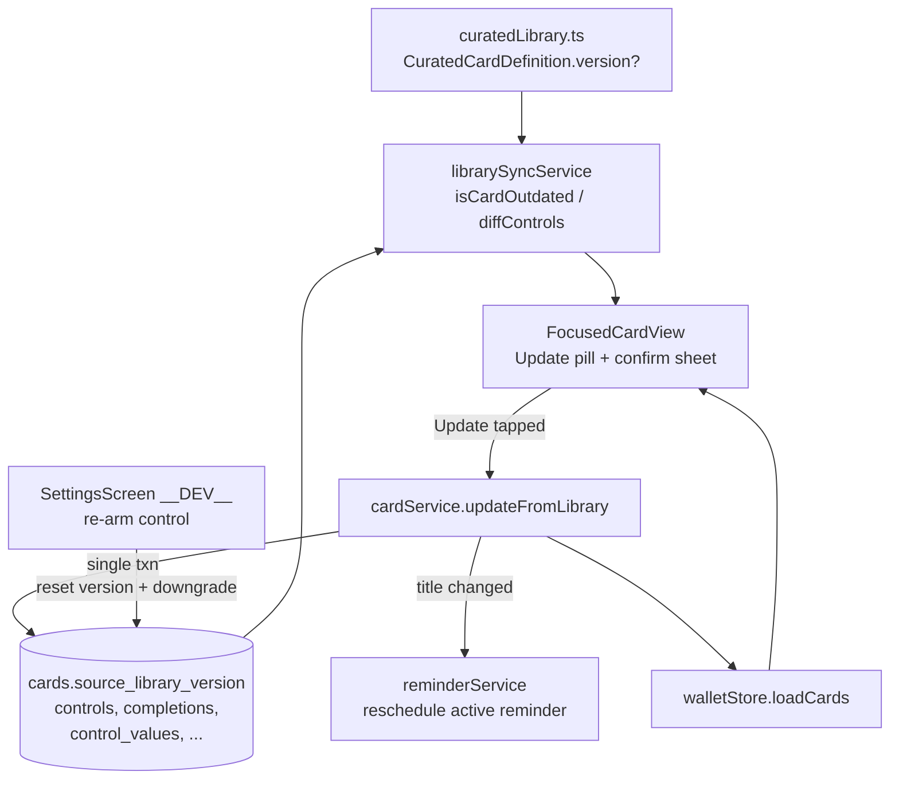

# Design Document

**Feature:** Library Card Sync (Phase 1)

## Overview

Wallet cards are snapshots of a `CuratedCardDefinition` taken at add-time: a `cards` row plus
`controls` rows with fresh UUIDs, linked back to the source only by the string
`cards.source_library_id`. This design adds three things without abandoning the copy model:

1. **A version marker** — an optional `version?: number` on `CuratedCardDefinition` and a nullable
   `source_library_version` column on `cards`, so a copy can be compared to the current curated
   definition and found "outdated."
2. **Detection + surfacing** — a pure function that decides whether a wallet card is outdated, and
   an "Update available" pill + confirmation sheet in `FocusedCardView`.
3. **A history-preserving in-place update** — a new `cardService.updateFromLibrary(cardId)` that
   refreshes shell + controls + category + rationale linkage on the **same `cards.id`** while
   preserving completions, per-completion control values, custom background, reminders, and stats.

The central risk is data integrity: the existing control-replacement pattern
(`CardCreatorScreen.performSave`) does `DELETE FROM controls WHERE card_id = ?` then re-inserts
with fresh UUIDs. Because `control_values.control_id` has `ON DELETE CASCADE`, that pattern would
silently destroy every historical control value tied to the card. This design defines a
**reconciliation** strategy (update-in-place / insert-new / delete-removed) that never orphans
history, and wraps it in a single SQLite transaction so a failure leaves the card untouched.

There is no OTA. Curated content ships with the app binary, so this only takes effect once the
user installs a build whose `curatedLibrary.ts` carries a bumped `version`.

## Architecture



### Layering

- **Data model**: `version?` on `CuratedCardDefinition`; `source_library_version` column on `cards`.
- **Service — detection**: a new `librarySyncService.ts` holds the pure, testable logic
  (`isCardOutdated`, `diffControls`) — no React, no side effects. This keeps the property-based
  tests fast and lets `FocusedCardView` call a single predicate.
- **Service — mutation**: `cardService.updateFromLibrary(cardId)` performs the transactional
  in-place refresh and returns the reloaded `Card`.
- **UI**: `FocusedCardView` renders the pill + confirmation sheet; `CardKebabMenu` optionally gets
  an "Update from library" action. `SettingsScreen` gets a `__DEV__` re-arm control.
- **State**: after a successful update, `walletStore.loadCards()` re-pulls fresh cards+controls.

## Components and Interfaces

### 1. Version marker (Requirement 1)

**`CuratedCardDefinition` (`src/data/curatedLibrary.ts`)** gains one optional field:

```ts
export interface CuratedCardDefinition {
  // ...existing fields...
  /**
   * Present ONLY on cards whose user-visible content has changed since versioning
   * was introduced. Absent = never changed = never prompts an update. First change
   * sets 1; each subsequent change bumps by 1. Bump this in the same edit that changes
   * shell, controls, or rationale (see steering rule, Req 1.6).
   */
  version?: number;
}
```

Cards that have never changed keep **no** `version`. The first content change to a given card
sets `version: 1`. (For the motivating 1.0.5 change — the check-in `text_area` conversion — the
check-in definition and any other edited card get `version: 1` in that release.)

**Database column (`src/data/migrations.ts`)** — a new nullable column on `cards`:

```sql
ALTER TABLE cards ADD COLUMN source_library_version INTEGER
```

Added via a new idempotent migration `runSourceLibraryVersionMigration(db)` following the existing
`PRAGMA table_info(cards)` + `.some(col => col.name === 'source_library_version')` guard pattern
(same shape as the `source_library_id` add in `runEmotionMigration`). It is appended to the
`runMigrations` sequence. The column is **also added to the copy lists of the two table-rebuild
migrations** (`runIconTypeCheckMigration`'s `cards_new` definition + column copy, and
`runOriginBadgeAppMigration`'s dynamic `baseColumns`) so a future CHECK-constraint rebuild
preserves it. Type `INTEGER` (nullable) mirrors the `number | null` domain; `NULL` means "predates
this card's versioning."

**Persisting the version at add-time:**

- `cardService.create(...)` gains a new trailing optional parameter
  `sourceLibraryVersion?: number | null` and writes it into the new column in the card INSERT.
  `LibraryBrowserScreen.handleAddToWallet` / `handlePreviewAddToWallet` pass
  `card.version ?? null` from the `CuratedCardDefinition` being added.
- `kpiService.seedKpiCard(...)` writes the check-in card's current curated version
  (`CURATED_LIBRARY`/KPI definition `version ?? null`) into the same column in its direct INSERT,
  so the seeded 🌱 card participates identically.

**Card domain type (`src/types`)** gains `sourceLibraryVersion: number | null`, and
`mapRowToCard` reads `row.source_library_version`.

### 2. Detection (Requirement 1.3–1.5, 2.5)

New file **`src/services/librarySyncService.ts`** — pure functions, no DB, no React:

```ts
export interface OutdatedResult {
  isOutdated: boolean;
  /** null when not applicable (no source_library_id, curated missing, or unversioned). */
  curatedVersion: number | null;
  curated: CuratedCardDefinition | null;
}

/** Req 1.3 / 1.4 / 2.5. Looks the curated def up in CURATED_LIBRARY by sourceLibraryId. */
export function evaluateOutdated(card: Card): OutdatedResult;

/**
 * Reconciliation plan between the card's current controls and the curated
 * definition's controls, matched by position (stable identity for curated cards).
 * Used by the in-place update to avoid delete-and-reinsert.
 */
export function diffControls(
  current: Control[],
  target: CuratedControlDefinition[]
): {
  toUpdate: { id: string; target: CuratedControlDefinition }[]; // matched by position
  toInsert: CuratedControlDefinition[];                          // extra target positions
  toDeleteIds: string[];                                         // current positions with no target
};
```

`evaluateOutdated` implements Req 1.3 exactly: **outdated IFF** the card has a `sourceLibraryId`
**AND** a curated card with that id exists **AND** that curated card's `version` is non-null
**AND** (`card.sourceLibraryVersion` is null **OR** `< curated.version`). Every "not updatable"
case (Req 1.4: no `source_library_id`; unversioned curated; curated removed) returns
`isOutdated: false`. This is the single source of truth the pill, the menu action, and the guard
inside `updateFromLibrary` all consult.

The field-comparison style is borrowed from `adminCardService.isOverrideMatchingStatic` but keyed
on `sourceLibraryId` rather than id-equality. Detection deliberately relies on the **version
number**, not a full field diff — the version is the authoritative signal (Req 1.6 makes bumping
it mandatory), so we never guess at "content changed" heuristically.

### 3. Surfacing the update (Requirement 2, 4)

**`FocusedCardView.tsx`** already looks up `curatedCard` via `sourceLibraryId` (line ~143). We add:

- `const outdated = useMemo(() => evaluateOutdated(card), [card])` — reuses/extends the existing
  curated lookup rather than duplicating it.
- When `outdated.isOutdated`, render a small **"Update available" pill** in the `badgeRow` next to
  `<OriginBadge />` (mirrors the existing `isKpiCard` banner pattern). Not shown when the card is
  expanded into active use.
- Tapping the pill opens an **`UpdateAvailableSheet`** (a bottom-sheet modal like `RationaleSheet`)
  with plain-language reassurance copy ("Updating keeps all your history — streak, past entries,
  reminder, and custom background stay." — matching the exact `UPDATE_SHEET_BODY` constant) and two
  actions: **Update** and **Not now**. (The per-card "What's new" summary now renders above this
  reassurance copy — see Addendum 2 / Req 8.5 — so the previous leading "We've improved this tool."
  prefix was dropped from the body; that phrase survives only as the summary's generic fallback
  line.)
- **Not now** closes the sheet without mutating. A `dismissedThisSession` ref (keyed by `card.id`)
  suppresses re-opening the sheet automatically within the session; the pill itself remains
  visible (the card is still outdated) so the user can act later, satisfying "may reappear on a
  later open" without nagging (Req 2.4). The pill is discoverable on first focus after the app
  update (Req 2.2) and never blocks card use.

Because `evaluateOutdated` returns `false` for `my_tool`, community, and removed-curated cards,
the pill only appears on genuinely updatable cards (Req 2.5).

**Archive (Req 2.6):** no archive-specific UI. `ArchiveScreen` has no focus/detail view, so nothing
changes there. An outdated archived card simply shows the pill once **restored** to the wallet
(existing `cardService.restore` preserves history and does not apply any update).

**`CardKebabMenu.tsx` (optional, Req 4.1):** add an optional prop
`onUpdateFromLibrary?(cardId: string)` and, when provided and `evaluateOutdated(card).isOutdated`,
push an "Update from library" `MenuItem`. This is a secondary entry point to the same flow.

**Surface consistency (Req 4.2):** after a successful update the flow calls
`walletStore.loadCards()`, which re-pulls cards+controls from SQLite; `FocusedCardView` re-renders
from the fresh `Card`, `evaluateOutdated` now returns `false` (version caught up), and the pill
disappears. No surface shows a stale copy.

### 4. History-preserving in-place update (Requirement 3)

New method on `cardService` (`src/services/cardService.ts`):

```ts
async updateFromLibrary(cardId: string): Promise<Card>
```

**Algorithm:**

1. Load the card (`getById`) with its controls. If it has no `sourceLibraryId`, throw
   `PERSISTENCE_NOT_FOUND`-style validation error (not updatable).
2. Look up the current `CuratedCardDefinition` by `sourceLibraryId`. If missing → not updatable.
3. Call `evaluateOutdated`. **If not outdated, return the card unchanged (idempotent no-op, Req
   3.8).**
4. Compute `diffControls(card.controls, curated.controls)` (matched by `position`).
5. `BEGIN TRANSACTION`:
   - **Shell + category:** `UPDATE cards SET title=?, description=?, icon_type=?, icon_value=?,
     background_type=?, background_value=?, category_id=?, source_library_version=?, updated_at=?
     WHERE id=?`. **`background_*` is only overwritten if the user has no `background_overlays`
     row** (a custom background wins — Req 3.4; the overlay row is never touched here anyway, it
     is a separate table joined at read time). Stats columns (`total_uses`, `current_streak`,
     `last_used_at`, `stack_position`, `created_at`) are **not** in the SET clause, so they are
     preserved (Req 3.2).
   - **Controls (the critical part — no blanket delete):**
     - `toUpdate`: `UPDATE controls SET type=?, config=?, is_required=? WHERE id=?` — the control
       **keeps its existing UUID**, so all `control_values.control_id` references stay valid
       (Req 3.3). `position` is set to the target position.
     - `toInsert`: `INSERT INTO controls (...)` with a fresh UUID for genuinely new controls.
     - `toDeleteIds`: `DELETE FROM controls WHERE id=?` only for positions the new definition no
       longer has. This cascades `control_values` for those specific controls — acceptable and
       intended (that control no longer exists), and it never touches surviving controls' history.
   - **Rationale linkage:** rationale is read live from `CURATED_LIBRARY` by `sourceLibraryId` at
     display time (per card-display-surfaces steering, FocusedCardView path), so refreshing the
     shell is sufficient — no DB rationale columns are written for wallet cards.
   - `COMMIT`.
6. On any error: `ROLLBACK` and throw `AppError.persistence(...)`. The card is left in its prior,
   consistent state (Req 3.7).
7. **Reminders (Req 3.5):** reminders key off `card_id` (unaffected by control changes) and pull
   the card title **fresh at schedule time**. After COMMIT, if the update changed the card
   **title** and the card has an **active** reminder, reschedule it so the notification text
   matches: cancel + re-schedule via `reminderService.scheduleNotification(reminder)` (which reads
   the now-updated title). This runs **after** the transaction (notification I/O must never sit
   inside an open SQLite transaction — same rule the `archive`/`restore` paths follow) and is
   best-effort. If the title is unchanged, no reminder work is needed.
8. Re-read via `getById(cardId)` and return.

**Why match controls by `position`, not by config identity:** curated control definitions have
stable positions (`CuratedControlDefinition.position`), and the copy was created preserving those
positions. Matching by position lets the common case (config/label tweak, type change,
required-flag change at the same slot — e.g. `text_input` → `text_area`) become an in-place
`UPDATE` that preserves the control's UUID and therefore its historical `control_values`. This
directly serves the motivating 1.0.5 change.

**Custom background (Req 3.4):** stored in `background_overlays` (separate table, `UNIQUE(card_id)`,
joined at read time in `getAll`/`getById`). `updateFromLibrary` never deletes or rewrites that
table, so a user's custom background survives untouched. The card's own `background_*` columns are
only refreshed when no overlay exists, avoiding a pointless write that a user override would mask.

### 5. Developer re-arm control (Requirement 5)

Added to the existing `__DEV__` Developer section in `SettingsScreen.tsx` (alongside
`handleResetOnboarding` / `AdminKpiBadgeTools` / `SeedInsightsButton`), as a small self-contained
component `DevReArmSyncButton` (mirrors `SeedInsightsButton`). It is gated by `{__DEV__ && ...}` so
it never ships in production UI (Req 5.6).

Behavior (Req 5.2–5.5):

- Scope: re-arm **all updatable cards** (has `sourceLibraryId`, curated exists and is versioned),
  and the button label states this ("Re-arm library update flow (all eligible cards)").
- **Version reset:** `UPDATE cards SET source_library_version = NULL WHERE source_library_id IS NOT
  NULL` — puts every eligible card back into the outdated state so the pill reappears (Req 5.2).
- **Content downgrade (Req 5.3, best-effort):** because we do not retain historical curated
  definitions, a faithful downgrade isn't generally possible. For the common config-tweak case the
  dev tool applies a **targeted downgrade** of the control fields the current update changed
  (e.g. flip a `text_area` back to `text_input` for the check-in note field) so re-applying
  produces a visible change. Where a faithful downgrade isn't feasible, re-arming the version
  marker alone is acceptable and is documented in the button's helper text ("re-applying may be a
  no-op refresh for some cards").
- **History preserved (Req 5.5):** the re-arm only writes `source_library_version` (and, for the
  targeted case, a control `config`/`type`) — it never deletes controls, completions,
  control_values, reminders, or background overlays, and never touches stats.
- After running, it calls `walletStore.loadCards()` so the pills reappear immediately.

## Data Models

New/changed:

- `CuratedCardDefinition.version?: number` (curatedLibrary.ts).
- `cards.source_library_version INTEGER` (nullable) — added by `runSourceLibraryVersionMigration`.
- `Card.sourceLibraryVersion: number | null` (domain type; read in `mapRowToCard`).

Unchanged but relied upon: `controls` (matched by `position`, updated in place to keep UUIDs),
`completions` / `control_values` (preserved by never blanket-deleting controls),
`background_overlays` (untouched), `reminders` (rescheduled only on title change).

## Correctness Properties

These target `librarySyncService` (pure) and the `updateFromLibrary` reconciliation over an
in-memory SQLite DB. `fast-check` generators build arbitrary cards/curated defs/versions.

### Property 1: Outdated detection is exactly Req 1.3

For all cards and curated defs, `evaluateOutdated(card).isOutdated === (hasSourceLibraryId &&
curatedExists && curated.version != null && (card.sourceLibraryVersion == null ||
card.sourceLibraryVersion < curated.version))`. In particular: unversioned curated ⇒ never
outdated; missing curated ⇒ never outdated; no `sourceLibraryId` ⇒ never outdated.
**Validates: Requirements 1.3, 1.4, 1.5, 2.5**

### Property 2: Update clears outdated

After `updateFromLibrary` succeeds on an outdated card, `evaluateOutdated(reloaded)` is `false`
and `reloaded.sourceLibraryVersion === curated.version`.
**Validates: Requirements 3.6**

### Property 3: Idempotency

Running `updateFromLibrary` twice equals running it once (the second call is a no-op); running it
on an already-current card returns it unchanged.
**Validates: Requirements 3.8**

### Property 4: History is never orphaned

For any pre-existing set of completions/control_values on surviving control positions, the count
and contents of `control_values` for those controls are identical before and after the update;
only control_values of controls whose position was removed disappear.
**Validates: Requirements 3.3**

### Property 5: Stats are invariant

`total_uses`, `current_streak`, `last_used_at`, `stack_position`, and `created_at` are unchanged
across an update.
**Validates: Requirements 3.2**

### Property 6: Custom background survives

If a `background_overlays` row existed, it is identical after the update.
**Validates: Requirements 3.4**

### Property 7: Atomicity

If any statement in the transaction fails (injected fault), the card, its controls, and its
control_values equal their pre-update state.
**Validates: Requirements 3.7**

### Property 8: Control reconciliation matches the definition

After update, the card's controls (by position, type, config, isRequired) equal the curated
definition's controls exactly.
**Validates: Requirements 3.1**

## Error Handling

- `updateFromLibrary` wraps all mutations in `BEGIN/COMMIT` with `ROLLBACK` on error, throwing
  `AppError.persistence(ErrorCode.PERSISTENCE_WRITE_FAILED, ...)` (consistent with `create`).
- Not-updatable inputs (no `sourceLibraryId`, curated missing) are treated as a no-op / guarded
  error rather than a partial write.
- The UI surfaces a failure with a non-blocking message and leaves the card as-is; the pill remains
  so the user can retry.
- Reminder rescheduling is best-effort and never fails the update (the DB change already
  committed); a stale reminder degrades gracefully, matching the archive/restore convention.

## Testing Strategy

- **Property-based (fast-check):** the 8 properties above, against `librarySyncService` and
  `updateFromLibrary` over an in-memory DB.
- **Unit:** migration idempotency (running twice adds the column once; rows preserved); table
  rebuild preserves `source_library_version`; `create`/`seedKpiCard` persist the curated version;
  `diffControls` update/insert/delete partitioning; title-change ⇒ reminder reschedule, no-title-
  change ⇒ no reschedule.
- **Component:** `FocusedCardView` shows the pill only when outdated; Not-now suppresses the sheet
  for the session but keeps the pill; Update triggers `updateFromLibrary` + `loadCards`; pill gone
  after update.
- **Verification level (per steering):** all of the above are unit/store-level. Notification
  rescheduling text and any on-device reminder delivery cannot be confirmed in CI — that path is
  verified at the unit level (correct reschedule call issued) and flagged for a manual on-device
  pass. The whole feature only takes effect in an installed build carrying a bumped `version`
  (no OTA).

## Addendum: Check-in (KPI) card sync (Phase 1.1)

Phase 1 shipped the version-based "Update available" flow for cards in `CURATED_LIBRARY`. This
addendum closes a gap the original design assumed away: the built-in Daily Check-in card
(`source_library_id = 'lib-personal-kpi'`) never actually participates in the flow, and adding it
naively would leak it into every `CURATED_LIBRARY`-driven listing surface. Phase 1.1 is spec- and
code-scoped to the check-in card only; it does not change the Phase 1 mechanism for any other card.

### The gap

`librarySyncService.evaluateOutdated` resolves the curated definition **only** via
`CURATED_LIBRARY.find(c => c.id === card.sourceLibraryId)`. The check-in card is **not** in
`CURATED_LIBRARY` — its definition is inlined in `src/services/kpiService.ts` `seedKpiCard`. So for
the check-in card `evaluateOutdated` gets `curated = null`, returns `isOutdated: false`
unconditionally, and the card can never be detected outdated or updated. The Phase 1 dev re-arm
tool (`devReArmLibrarySync.ts`) already nulls `source_library_version` for every `source_library_id`
card and already downgrades the check-in note control `text_area → text_input`, but since detection
can't see the card, that downgrade is inert for the update flow.

**Why not just add the check-in card to `CURATED_LIBRARY`?** `CURATED_LIBRARY` feeds many
listing/consumer surfaces, and `lib-personal-kpi` is deliberately excluded from all of them:

- `adminCardService.getMergedLibrary` → Library Browser listing
- `recommendationService` → tool recommendations
- `onboardingService` → onboarding suggestions
- `analyticsStressTest` → stress/seed data
- `exportService` → export listing
- `correlationEngine` special-cases `lib-personal-kpi` **out**

Adding it to the array would leak the check-in card into all of these (violating Req 6.4). So the
check-in definition must live **outside** `CURATED_LIBRARY` while still being resolvable by the
sync path.

### Design: a dedicated definition module

New file **`src/data/kpiCardDefinition.ts`** exporting a single `CuratedCardDefinition`:

```ts
import { CuratedCardDefinition } from './curatedLibrary';

/**
 * Canonical definition of the built-in Daily Check-in card. Lives OUTSIDE
 * CURATED_LIBRARY on purpose — lib-personal-kpi is excluded from every
 * CURATED_LIBRARY-driven listing surface (Library Browser, recommendations,
 * onboarding, export, correlationEngine). Both seedKpiCard and the library-sync
 * resolver read from this so seed and sync never drift.
 *
 * version: 1 corresponds to the 1.0.5 note-field change (text_input -> text_area).
 */
export const KPI_CARD_DEFINITION: CuratedCardDefinition = {
  id: 'lib-personal-kpi',
  version: 1,
  // shell (title/description/icon/background/category) as currently seeded
  // controls, by position:
  //   position 0: mood_slider — config holds a TEMPLATE label placeholder
  //               (the runtime, per-user label is applied separately; see below)
  //   position 1: note field — type 'text_area' (the 1.0.5 change baked in at version 1)
  // ...
};
```

`seedKpiCard` is refactored to build its INSERT from `KPI_CARD_DEFINITION` (shell + controls +
`version`) instead of inlining the shape, **keeping** its two existing responsibilities:

1. **Dynamic label application** — after building the mood_slider from the template, `seedKpiCard`
   still applies the current per-user label (`How are you doing with: {kpi}?` via
   `updateKpiCardLabel` / the personal KPI setting). The template label in `KPI_CARD_DEFINITION` is
   never shown to the user; it is a structural placeholder only.
2. **Version persistence** — it writes `KPI_CARD_DEFINITION.version ?? null` into
   `source_library_version` (the Phase 1 add-time behavior), so a freshly seeded check-in card is
   already at the current version and not spuriously flagged outdated.

This guarantees seed and sync read the identical shape, satisfying Req 6.1.

### A resolver seam in `librarySyncService`

Introduce a single resolver and route both curated lookups through it:

```ts
import { KPI_CARD_DEFINITION } from '@/data/kpiCardDefinition';

/** Resolve a curated definition by source_library_id, including the off-library check-in card. */
export function resolveCuratedDefinition(
  sourceLibraryId: string | null | undefined
): CuratedCardDefinition | null {
  if (!sourceLibraryId) return null;
  if (sourceLibraryId === KPI_CARD_DEFINITION.id) return KPI_CARD_DEFINITION;
  return CURATED_LIBRARY.find(c => c.id === sourceLibraryId) ?? null;
}
```

- `evaluateOutdated` uses `resolveCuratedDefinition(card.sourceLibraryId)` instead of
  `CURATED_LIBRARY.find(...)` directly. Everything else in Property 1's logic is unchanged, so the
  check-in card is now detected outdated **exactly** like any other versioned curated card (Req 6.2).
- `cardService.updateFromLibrary`'s curated lookup uses the same resolver, so the check-in card
  refreshes in place through the identical reconciliation path (Req 6.3).
- **Listing surfaces are untouched.** Only the two sync-path lookups gain the resolver;
  `getMergedLibrary`, `recommendationService`, `onboardingService`, `exportService`, and
  `correlationEngine` continue to read `CURATED_LIBRARY` and never see `KPI_CARD_DEFINITION`
  (Req 6.4).

### Label preservation on update (Req 7)

The check-in mood_slider label is dynamic and user-owned. A structural update must apply the note
field change **without** clobbering that label. In `updateFromLibrary`, after the normal control
reconciliation (`diffControls` → update/insert/delete), add a **check-in-specific post-step**:

- If the card being updated is the check-in card (`sourceLibraryId === KPI_CARD_DEFINITION.id`),
  RE-DERIVE the mood_slider label from the user's **current** personal KPI setting and write it
  into that control's `config`, overwriting whatever template label came from `KPI_CARD_DEFINITION`.
- The re-derived label uses the canonical format `How are you doing with: {kpi.toLowerCase()}?`,
  matching `kpiService` / `updateKpiCardLabel`.
- This runs inside the same transaction as the reconciliation (it is a plain control-config
  `UPDATE` on a surviving control that keeps its UUID), so the note field change (position 1,
  `text_input → text_area`) applies while position 0's label ends up re-derived rather than left as
  the template. Completions/streak/KPI setting are untouched by this step (Req 7.1–7.4).

**Design decision — dependency direction.** `cardService.updateFromLibrary` needs the current
check-in label but should not take a hard dependency on `kpiService` (which itself depends on card
data — a cycle risk). Two seams were considered:

- **(A) Read the personal-KPI setting directly** inside `cardService` (the same settings row
  `kpiService.getPersonalKpi()` reads) and format the label locally. No service cycle.
- **(B) Inject the label** — have the caller (or a small callback) supply the already-derived
  label to `updateFromLibrary`.

**Recommendation: (A) — read the setting directly.** It keeps the update self-contained (the
re-derive is deterministic given the stored setting), avoids a `cardService → kpiService` cycle,
and needs no signature change to the generic update path (the check-in branch reads the setting
only when `sourceLibraryId === 'lib-personal-kpi'`). This is flagged as a design decision because
it duplicates the label format string in one more place; that duplication is acceptable and should
be kept in sync with `kpiService` (a shared format helper is an optional cleanup, not required).

### Dev re-arm (Req 5.7)

`reArmLibrarySync()` already (a) nulls `source_library_version` for **all** `source_library_id`
cards — which now includes the check-in card once the resolver lets detection see it — and (b)
downgrades the check-in note control `text_area → text_input`. With the resolver +
`KPI_CARD_DEFINITION.version = 1` in place, the check-in card genuinely re-arms: after re-arm its
stored version is null and its note field is `text_input`, so `evaluateOutdated` (via the resolver)
reports it outdated again and re-applying the update reproduces the visible note-field change.

**No new re-arm code is required** beyond what already exists. One guard to document: re-arm must
**leave the user's personalized mood_slider label alone** — it only touches
`source_library_version` and the note control. Re-arm does not reset the label, and the subsequent
update RE-DERIVES it (Req 7.2), so the personalized label and KPI history/stats are preserved
across a re-arm → re-update cycle (Req 5.7).

### New Correctness Properties

These extend the Phase 1 property set and target the same layers (pure `librarySyncService` +
`updateFromLibrary` over an in-memory SQLite DB).

#### Property 9: Check-in card is detected outdated via the resolver

For all check-in card copies and all versions of `KPI_CARD_DEFINITION`,
`evaluateOutdated(card).isOutdated` equals the same predicate as Property 1 with the curated
definition resolved through `resolveCuratedDefinition` (i.e. `KPI_CARD_DEFINITION` for
`lib-personal-kpi`): a null/older copy version against a versioned `KPI_CARD_DEFINITION` is
outdated; an unversioned definition or a caught-up copy is not. The check-in card behaves exactly
like any other versioned curated card.
**Validates: Requirements 6.1, 6.2**

#### Property 10: Update re-derives the label and applies the structural change while preserving history

For any outdated check-in card copy with an arbitrary set personal KPI and arbitrary
completions/streak, after `updateFromLibrary` succeeds: the mood_slider label equals the
re-derived label from the **current** KPI setting (`How are you doing with: {kpi.toLowerCase()}?`)
and is **not** the `KPI_CARD_DEFINITION` template; the note control is `text_area`; and the
completions, control_values on surviving controls, streak, stats, and the personal-KPI
setting/history are all unchanged.
**Validates: Requirements 6.3, 7.1, 7.2, 7.3, 7.4**

#### Guard: check-in card does not leak into listing surfaces

Not a universally-quantified property but a required guard test: `getMergedLibrary` output and
`recommendationService` output never contain a card with `id === 'lib-personal-kpi'` after the
resolver and `KPI_CARD_DEFINITION` are introduced.
**Validates: Requirements 6.4**

### Verification level

All Phase 1.1 checks are unit/DB-level (in-memory SQLite + pure functions), consistent with
Phase 1. The resolver, detection, label re-derivation, and reconciliation are fully unit-verified.
On-device behavior of the check-in card is unaffected by this change (no new native surface, no
notification path touched) and does not require a separate manual pass beyond the Phase 1
end-to-end check-in update run.

## Addendum 2: Prominent update notice + per-card change summary (UX revision)

This addendum is a **follow-on UX revision** to Phase 1's "Update available" surfacing (see
"Components and Interfaces §3"). It does not change the detection, the transactional
`updateFromLibrary`, or the KPI resolver from Phase 1 / Addendum 1 — it changes only how the
update is *surfaced* (a prominent banner instead of the pill) and *explained* (a per-card
"what changed" summary in the confirmation sheet).

### Motivation (real-device test findings)

Testing the shipped Phase 1 + 1.1 flow on device surfaced three problems:

1. **The pill is not noticeable.** The "Update available" pill lives in `badgeRow` next to
   `<OriginBadge />`, so it looks like every other badge (e.g. the "Library" badge) and users
   don't register it as actionable. They asked for a much more prominent, differently-located
   affordance — a banner bar across the top of the focused card, like the existing check-in
   "days since check-in" banner (`BadgeExplanationBanner`, amber `#FFF3E0`, rendered at the top
   of the card body).
2. **The affordance disappears when expanded.** The pill is gated on `!isExpanded`, so once the
   user expands the card into active use it vanishes. It must remain visible in the expanded
   state too.
3. **The confirmation copy is generic.** `UpdateAvailableSheet` shows identical copy for every
   card and never says *what* changed on the specific card, so the user can't judge whether to
   update.

The KPI/check-in card can legitimately show **two** top banners at once (the update notice AND
the days-since-check-in notice); they must stack and be color-differentiated.

### New component: `UpdateAvailableBanner`

New file **`src/components/wallet/UpdateAvailableBanner.tsx`**, modeled on
`BadgeExplanationBanner`: a full-width, tappable bar rendered at the top of the card body with an
**informational (blue)** palette, deliberately distinct from the amber check-in banner.

```tsx
interface UpdateAvailableBannerProps {
  /** Short summary line(s) for a11y / compact display (from summarizeUpdate). */
  summary: string[];
  onPress: () => void;
}

// Proposed palette (blue / informational — distinct from check-in amber #FFF3E0 / text #E65100):
//   background: #E3F2FD
//   border:     #90CAF9
//   text:       #0D47A1
```

- Renders a single-line headline ("Update available — see what changed") with the blue palette.
- `accessibilityRole="button"`, `accessibilityLabel` e.g. `"Update available — see what changed"`
  (the `summary` may be folded into the a11y hint so screen-reader users hear the gist without
  opening the sheet).
- `onPress` opens the `UpdateAvailableSheet` (single action path — the banner is not an inline
  Update button; it opens the confirmation, per Req 8.4).

### Placement in `FocusedCardView`

`FocusedCardView` has two relevant render paths (confirmed in the current file):

- The **custom-content expanded branch** (`if (isExpanded && renderExpandedContent)`, ~line 366)
  — used for cards that supply their own expanded UI (e.g. the session launcher). This branch has
  **no outdated state to surface** (it is not a curated wallet card in an updatable sense), so no
  banner is needed there.
- The **shared header/body branch** used for the collapsed state and for the normal
  (non-custom) expanded state — this branch renders `badgeRow` and, for the KPI card, the
  `BadgeExplanationBanner` in **both** its sub-render points (~lines 464 and 525).

Changes:

- Render `UpdateAvailableBanner` at the **top of the card body in the shared branch**, in **both**
  sub-render points (the Android-expanded body and the collapsed/expanded-iOS body), so the notice
  shows **collapsed AND expanded** (fixes finding #2). It MUST render whenever
  `outdated.isOutdated` is true, **regardless of `isExpanded`** — no `!isExpanded` gate.
- On the check-in card the update banner stacks **above** the existing `BadgeExplanationBanner`
  (update banner first, then the amber days-since banner), so both are visible and
  color-differentiated (Req 8.3).
- **Remove the old pill** from `badgeRow` (the `!isExpanded`-gated "Update available" pill next to
  `<OriginBadge />`). The banner replaces it as the primary affordance.
- The **KPI check-in card uses the normal (shared) branch**, so the banner shows there — including
  in its expanded note-taking state. The session-launcher custom branch is intentionally left
  without a banner (no outdated state). Confirm via component test that the banner still shows for
  a check-in card in its expanded state.
- The kebab "Update from library" secondary entry point (`CardKebabMenu.onUpdateFromLibrary`) is
  kept as-is.

### Per-card change summary (finding #3)

A new **pure, testable** helper on `librarySyncService.ts`:

```ts
export function summarizeUpdate(
  card: Card,
  curated: CuratedCardDefinition
): string[];
```

It builds on the existing `diffControls(card.controls, curated.controls)` plus a shell-field
comparison, and derives plain-language lines written for humans (not developers). Derivation
rules:

**Controls** (from `diffControls`):

- A control at the **same position** whose type changes to `text_area` (from `text_input` or any
  other) → `"Makes the '{label}' field bigger, for longer entries"` (use the control's label).
- A **new** control added at a position (`toInsert`) → `"Adds a new step: '{label}'"` (or
  `"Adds a new field"` when no usable label).
- A **removed** control (`toDeleteIds`) → `"Removes the '{label}' step"`.
- Any **other same-position config change** (label / placeholder / options / required) that is not
  a `text_area` widening → `"Updates the '{label}' field"`.

**Shell:**

- title changed → `"Updates the title"`
- description changed → `"Updates the description"`
- icon / background / category changed → `"Refreshes the look"` (emit once, not per-field).

**Fallback (Req 8.5):** if the rules produce **no** describable lines, return a single generic
line: `["We've improved this tool."]`. `summarizeUpdate` therefore **never returns an empty
array**.

**KPI exclusion (critical):** the summary is derived at display time from the **resolved** curated
definition via `resolveCuratedDefinition(card.sourceLibraryId)` (so it works for the check-in card
too) and the wallet card's current controls. For the check-in card, the mood_slider label differs
between the personalized wallet copy (`How are you doing with: {goal}?`) and the
`KPI_CARD_DEFINITION` **template** label — this is a re-derived, non-user-facing difference, **not**
a real change. `summarizeUpdate` MUST **exclude the check-in mood_slider (position 0) label from
the diff summary** so it is never reported as "Updates the '…' field". The real check-in change
(the note field widening at position 1) is still reported normally.

Because it is pure (no DB, no React), `summarizeUpdate` is directly unit-testable.

### `UpdateAvailableSheet` changes

`UpdateAvailableSheet` gains a `changeSummary: string[]` prop and renders it as a
"What's new / What changes" list **above** the existing reassurance copy and the Update / Not now
actions. The existing "Updating keeps all your history — your streak, past entries, reminder, and
custom background stay." copy is kept unchanged; the summary is added on top of it, not in place
of it.

### State / props flow in `FocusedCardView`

- `FocusedCardView` already computes `const outdated = useMemo(() => evaluateOutdated(card), [card])`.
- When `outdated.isOutdated`, it additionally computes
  `const summary = useMemo(() => summarizeUpdate(card, outdated.curated!), [card, outdated])`.
- `summary` is passed to **both** the `UpdateAvailableBanner` (for its a11y label / short text)
  and the `UpdateAvailableSheet` (as `changeSummary`).
- The Not-now session-suppression ref and the Update → `updateFromLibrary` → `loadCards` flow are
  unchanged from Phase 1 §3; only the trigger (banner tap instead of pill tap) and the sheet's
  extra summary list change.

### New Correctness Properties

These extend the Phase 1 / Addendum 1 property set (Properties 1–10) and target the pure
`summarizeUpdate` helper.

#### Property 11: The change summary is never empty

For all wallet cards and resolved curated definitions, `summarizeUpdate(card, curated)` returns a
non-empty array — at minimum the generic fallback line `"We've improved this tool."` — so the
confirmation always has something to show (Req 8.5 fallback).
**Validates: Requirements 8.5**

#### Property 12: The motivating text-widening change is described, and the KPI label is not

For a check-in card copy whose note field is `text_input` against a `KPI_CARD_DEFINITION` whose
note field is `text_area` (the motivating 1.0.5 bump), `summarizeUpdate` returns a line that names
that field as being made "bigger" (for longer entries) and does **not** return any line about the
mood_slider / check-in label change (the position-0 label difference is excluded as a re-derived,
non-user-facing difference).
**Validates: Requirements 8.5, 7.2**

> **Note on banner visibility:** the update notice's visibility now depends **only** on
> `outdated.isOutdated`, no longer on `isExpanded`. This is a component-level behavior verified by
> the `FocusedCardView` component tests (banner present in both collapsed and expanded states);
> it is not a universally-quantified property.

### Verification level

All of Addendum 2 is verified at the **unit / component** level: `summarizeUpdate` by pure unit +
property tests (fast-check), and the banner placement / expanded-visibility / stacking-above-the
amber-banner / pill-removal by `FocusedCardView` and `UpdateAvailableBanner` component tests. The
**on-device visual pass** — that the blue banner reads as prominent, that both banners stack
legibly on the check-in card, and that the notice is obvious in the expanded state — is a manual
pass that cannot be confirmed in CI.
