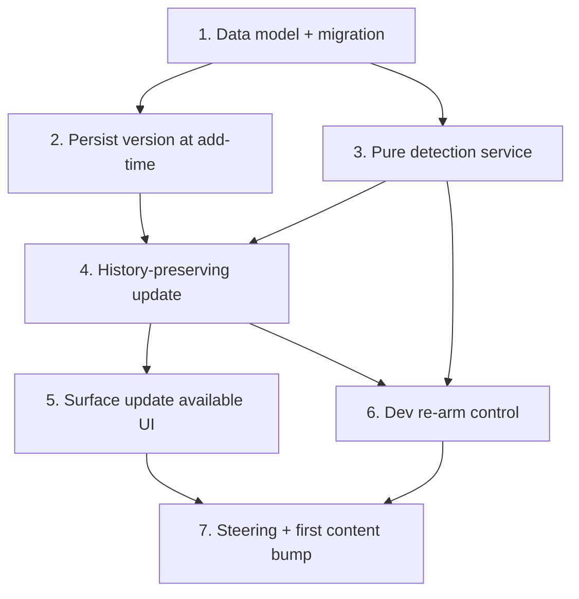
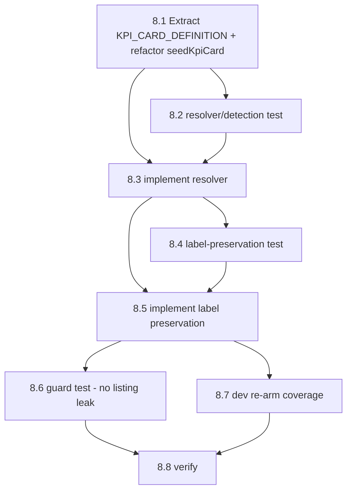
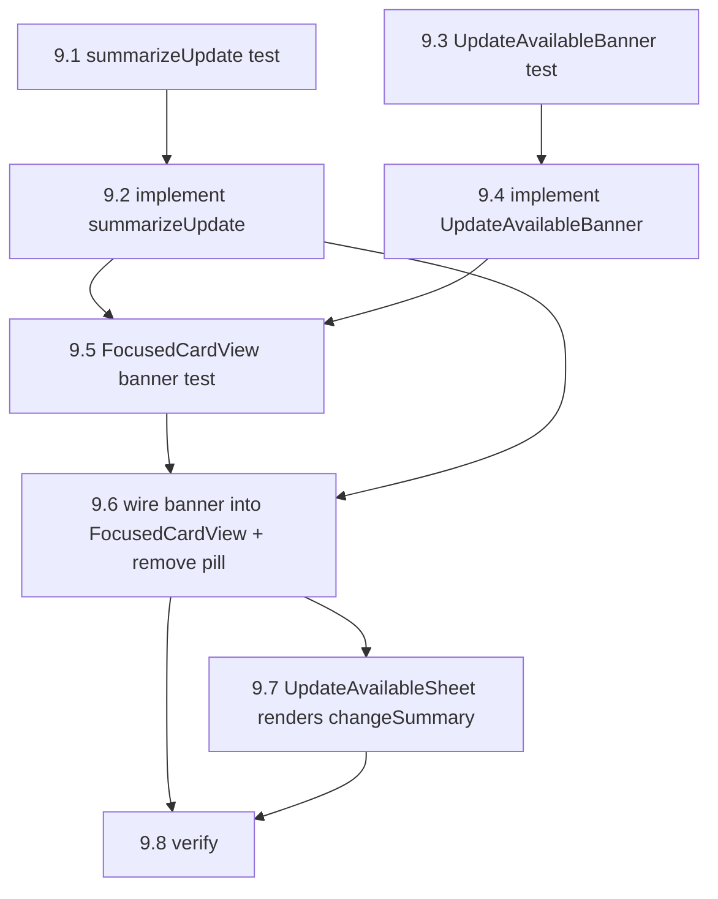

# Implementation Plan — Library Card Sync (Phase 1)

## Overview

Built bottom-up so each layer is verifiable before the next depends on it: **data model +
migration → persist version at add-time → pure detection → history-preserving update →
UI → dev re-arm → steering + first content bump**. Property-based tests (fast-check) cover the
pure detection and the transactional update per the design's Correctness Properties.

This ships behind an installed build (no OTA). The reminder-reschedule-on-title-change and any
on-device notification behavior are verified at the unit level (correct reschedule call issued);
the on-device notification text needs a manual pass and cannot be confirmed in CI.

## Tasks

## 1. Data model + migration (Req 1.1, 1.2 schema)

- [x] 1.1 Add optional `version?: number` to `CuratedCardDefinition` in `src/data/curatedLibrary.ts` (do NOT assign a version to any card yet — untouched cards stay unversioned). Add `sourceLibraryVersion: number | null` to the `Card` domain type in `src/types` and read `row.source_library_version` in `mapRowToCard` (`src/services/cardService.ts`).
  - _Requirements: 1.1, 1.2_
- [x] 1.2 (Test) Add a migration test: on a DB created before this column, running migrations adds `source_library_version` (nullable INTEGER) to `cards` exactly once and preserves existing rows; running twice is a no-op. Fails before the migration exists.
  - _Requirements: 1.2_
- [x] 1.3 (Migration) Add `runSourceLibraryVersionMigration(db)` in `src/data/migrations.ts` using the `PRAGMA table_info(cards)` + `.some(col => col.name === 'source_library_version')` guard (same shape as the `source_library_id` add); `ALTER TABLE cards ADD COLUMN source_library_version INTEGER`. Register it in the `runMigrations` sequence. Add the column to the `cards_new` definition + copy list in `runIconTypeCheckMigration` and to the dynamic `baseColumns` in `runOriginBadgeAppMigration` so a future table rebuild preserves it.
  - _Requirements: 1.2_
- [x] 1.4 (Verify) Migration test (1.2) passes; `npm run typecheck` clean.
  - _Requirements: 1.1, 1.2_

## 2. Persist the curated version at add-time (Req 1.2)

- [x] 2.1 (Test) Add tests: `cardService.create(..., sourceLibraryVersion)` writes the value to `source_library_version` (and null when omitted); `kpiService.seedKpiCard` persists the check-in card's current curated version (null while unversioned). Fails before the param is wired.
  - _Requirements: 1.2_
- [x] 2.2 (Fix) Add a trailing optional `sourceLibraryVersion?: number | null` param to `cardService.create` and include the column in the card INSERT. Pass `card.version ?? null` from `LibraryBrowserScreen.handleAddToWallet` and `handlePreviewAddToWallet`. In `kpiService.seedKpiCard`, write the KPI definition's `version ?? null` into the same column in its direct INSERT.
  - _Requirements: 1.2_
- [x] 2.3 (Verify) Tests (2.1) pass; `npm run typecheck` clean.
  - _Requirements: 1.2_

## 3. Pure detection service (Req 1.3, 1.4, 1.5, 2.5)

- [x] 3.1 (Property test) Create `src/services/__tests__/librarySyncService.test.ts`. With fast-check generators over cards/curated defs/versions, assert **Property 1**: `evaluateOutdated(card).isOutdated` equals `(hasSourceLibraryId && curatedExists && curated.version != null && (card.sourceLibraryVersion == null || card.sourceLibraryVersion < curated.version))`. Include the not-updatable cases: no `sourceLibraryId`, unversioned curated, curated removed.
  - _Requirements: 1.3, 1.4, 1.5, 2.5_
- [x] 3.2 (Implement) Create `src/services/librarySyncService.ts` with `evaluateOutdated(card): OutdatedResult` (looks curated up in `CURATED_LIBRARY` by `sourceLibraryId`) and `diffControls(current, target)` returning `{ toUpdate, toInsert, toDeleteIds }` matched by `position` (comparison style borrowed from `adminCardService.isOverrideMatchingStatic`).
  - _Requirements: 1.3, 1.4, 1.5_
- [x] 3.3 (Test) Unit-test `diffControls` partitioning: same positions → toUpdate (keeps id); extra target positions → toInsert; current positions with no target → toDeleteIds.
  - _Requirements: 3.1, 3.3_
- [x] 3.4 (Verify) Property + unit tests pass; `npm run typecheck` clean.
  - _Requirements: 1.3, 3.1_

## 4. History-preserving in-place update (Req 3)

- [x] 4.1 (Property tests) Add `src/services/__tests__/updateFromLibrary.test.ts` over an in-memory SQLite DB. Encode Correctness Properties 2–8: update clears outdated + sets version (P2); idempotency / no-op when current (P3); surviving controls' `control_values` count+contents unchanged, only removed-position control_values disappear (P4); stats invariant (P5); `background_overlays` row unchanged (P6); injected mid-transaction fault ⇒ full rollback to prior state (P7); post-update controls equal the curated definition by position/type/config/isRequired (P8). These fail before the method exists.
  - _Requirements: 3.1, 3.2, 3.3, 3.4, 3.6, 3.7, 3.8_
- [x] 4.2 (Implement) Add `cardService.updateFromLibrary(cardId): Promise<Card>`: load card+controls; guard not-updatable (no `sourceLibraryId` / curated missing) and no-op when `evaluateOutdated` is false; compute `diffControls`; in a single `BEGIN/COMMIT` (ROLLBACK on error) UPDATE shell + category + `source_library_version` (skip `background_*` when a `background_overlays` row exists; never touch stats), then apply control `toUpdate` (UPDATE by existing id — keeps UUID), `toInsert` (fresh UUID), `toDeleteIds` (targeted DELETE). Throw `AppError.persistence(PERSISTENCE_WRITE_FAILED, ...)` on failure. Re-read via `getById`.
  - _Requirements: 3.1, 3.2, 3.3, 3.4, 3.6, 3.7, 3.8_
- [x] 4.3 (Reminder reschedule) After COMMIT, if the update changed the card **title** and the card has an **active** reminder, reschedule via `reminderService.scheduleNotification` (reads the now-updated title) — run AFTER the transaction, best-effort, never failing the update. No reminder work when the title is unchanged. Add a unit test: title change ⇒ reschedule called; no title change ⇒ not called.
  - _Requirements: 3.5_
- [x] 4.4 (Verify) All property tests (4.1), diff tests, and the reminder test pass; `npm run typecheck` clean. State plainly: DB/service layer is unit-verified; on-device notification text after a title-change update needs a manual pass.
  - _Requirements: 3.1, 3.2, 3.3, 3.4, 3.5, 3.6, 3.7, 3.8_

## 5. Surface "update available" (Req 2, 4)

- [x] 5.1 (Test) Component test for `FocusedCardView`: pill shows only when `evaluateOutdated(card).isOutdated`; hidden for `my_tool` / community / removed-curated / current cards; hidden while expanded.
  - _Requirements: 2.1, 2.2, 2.5_
- [x] 5.2 (Implement pill) In `src/components/wallet/FocusedCardView.tsx`, compute `const outdated = useMemo(() => evaluateOutdated(card), [card])` (reuse the existing curated lookup). Render a non-intrusive "Update available" pill in `badgeRow` next to `<OriginBadge />` when outdated; never block card use.
  - _Requirements: 2.1, 2.2, 4.1_
- [x] 5.3 (Implement sheet) Add `UpdateAvailableSheet` (bottom-sheet modal like `RationaleSheet`) with plain-language copy ("We've improved this tool. Updating keeps all your history — streak, past entries, reminder, and custom background stay.") and **Update** / **Not now** actions. Tapping the pill opens it.
  - _Requirements: 2.3_
- [x] 5.4 (Not-now suppression) Track a per-card `dismissedThisSession` ref: "Not now" closes the sheet without mutating and suppresses auto-reopening within the session; the pill stays visible so the user can act later (no repeated nag).
  - _Requirements: 2.4_
- [x] 5.5 (Wire Update) On **Update**, call `cardService.updateFromLibrary(card.id)`, then `walletStore.loadCards()`; on failure show a non-blocking message and leave the card + pill as-is. After success the pill disappears (version caught up). Add a test for the update→reload→pill-gone path and the failure path.
  - _Requirements: 3.7, 4.2_
- [x] 5.6 (Kebab menu, optional entry point) Add optional `onUpdateFromLibrary?(cardId)` to `CardKebabMenu`; when provided and the card is outdated, push an "Update from library" `MenuItem` that runs the same flow.
  - _Requirements: 4.1_
- [x] 5.7 (Archive check) Confirm no archive-specific UI is added: an outdated archived card shows the pill only after `restore` (which already preserves history and applies no update). Add/confirm a test that restore does not change version or content.
  - _Requirements: 2.6_
- [x] 5.8 (Verify) Component tests pass; `npm run typecheck` clean.
  - _Requirements: 2.1, 2.3, 2.4, 4.2_

## 6. Developer re-arm control (Req 5)

- [x] 6.1 (Implement) Add a `__DEV__`-gated `DevReArmSyncButton` (self-contained, like `SeedInsightsButton`) into the Developer section of `src/screens/SettingsScreen.tsx`. Label states scope: "Re-arm library update flow (all eligible cards)". On press: `UPDATE cards SET source_library_version = NULL WHERE source_library_id IS NOT NULL`; where feasible apply a targeted content downgrade of fields the current update changed (e.g. flip the check-in note field back to `text_input`) so re-applying is visible; helper text notes re-applying may be a no-op refresh for some cards. Call `walletStore.loadCards()` after.
  - _Requirements: 5.1, 5.2, 5.3, 5.4, 5.6_
- [x] 6.2 (Test) Unit test: re-arm sets `source_library_version` to null for eligible cards and does NOT delete controls/completions/control_values/reminders/background_overlays or change stats; after re-arm `evaluateOutdated` is true again.
  - _Requirements: 5.2, 5.5_
- [x] 6.3 (Verify) Test passes; confirm the control is absent in a production (`__DEV__ === false`) build; `npm run typecheck` clean.
  - _Requirements: 5.6_

## 7. Steering + first content bump (Req 1.6, motivating 1.0.5 case)

- [x] 7.1 (Steering) Add a steering rule (paired with the admin export workflow) requiring that any change to a curated card's user-visible content sets/bumps its `version` (first change → 1, then +1); unchanged cards stay unversioned (no mass `version: 1`).
  - _Requirements: 1.6_
- [x] 7.2 (First bump) For the 1.0.5 `text_area` conversions (including the check-in "Anything you want to note?" field), set `version: 1` on exactly the curated definitions that changed, so existing installs' copies become outdated and can opt in. Confirm end-to-end on an in-memory DB: a copy at null/older version is detected outdated, Update applies the field change in place, history preserved, pill clears.
  - _Requirements: 1.1, 1.5_
- [x] 7.3 (Verify) `npm test` for the sync suite green; `npm run typecheck` clean; `npm run lint` clean.
  - _Requirements: 1.1, 1.5, 1.6_

> **Section 8 is a follow-on (Phase 1.1).** Tasks 1–7 and the Task Dependency Graph below are the
> completed Phase 1 work and are left intact. Section 8 (below the graph) adds the check-in (KPI)
> card to the sync flow and has its own wave ordering; see "Section 8 wave ordering" at the end.

---

## Task Dependency Graph



```json
{
  "waves": [
    { "wave": 1, "tasks": ["1"], "rationale": "Data model + migration — the foundation everything else builds on." },
    { "wave": 2, "tasks": ["2", "3"], "rationale": "Persist-at-add-time and pure detection each depend only on Task 1 and can proceed in parallel." },
    { "wave": 3, "tasks": ["4"], "rationale": "History-preserving update needs the version column, detection, and diffControls." },
    { "wave": 4, "tasks": ["5", "6"], "rationale": "UI and dev re-arm both depend on the update (and dev re-arm on detection)." },
    { "wave": 5, "tasks": ["7"], "rationale": "Steering rule + first real version bump, once the full flow is verifiable end-to-end." }
  ]
}
```

## Notes

- No OTA: this only takes effect in an installed build whose `curatedLibrary.ts` carries a bumped `version`.
- The critical data-integrity rule is in Task 4 — never blanket-delete controls; UPDATE surviving controls in place by position so `control_values.control_id` references stay valid.
- Verification level: the service/DB and UI layers are unit- and property-tested; the reminder reschedule is unit-verified (correct call issued), but on-device notification text after a title change needs a manual pass and can't be confirmed in CI.
- Property-based tests (fast-check) map 1:1 to the design's Correctness Properties 1–8.

---

## 8. Check-in (KPI) card sync (Phase 1.1)

Follow-on to Tasks 1–7. Brings the built-in Daily Check-in card (`source_library_id =
'lib-personal-kpi'`) into the version-based update flow without leaking it into any
`CURATED_LIBRARY`-driven listing surface, and preserves the user's personalized mood_slider label
on update. Spec-first: this section is planning only. TDD-ordered (test before implementation).

- [x] 8.1 (Extract definition) Create `src/data/kpiCardDefinition.ts` exporting `KPI_CARD_DEFINITION: CuratedCardDefinition` with `id: 'lib-personal-kpi'`, `version: 1` (the 1.0.5 note-field change), the note control (position 1) as `text_area`, and the mood_slider (position 0) config holding a TEMPLATE label placeholder. Do NOT add it to `CURATED_LIBRARY`. Refactor `kpiService.seedKpiCard` to build its INSERT (shell + controls + version) from `KPI_CARD_DEFINITION`, keeping its existing dynamic per-user label application (`How are you doing with: {kpi}?`) and its `source_library_version` persistence (`KPI_CARD_DEFINITION.version ?? null`).
  - _Requirements: 6.1_

- [x] 8.2 (Test) In `src/services/__tests__/librarySyncService.test.ts`, add resolver + detection cases: `evaluateOutdated` treats `lib-personal-kpi` via the resolver — a null-version check-in copy against a versioned `KPI_CARD_DEFINITION` is outdated; a caught-up copy is not; an unversioned definition is not. Assert **Property 9**. These fail before the resolver exists (today `evaluateOutdated` returns `false` for the check-in card unconditionally).
  - _Requirements: 6.1, 6.2_

- [x] 8.3 (Implement resolver) Add `resolveCuratedDefinition(sourceLibraryId)` to `src/services/librarySyncService.ts` returning `KPI_CARD_DEFINITION` when `sourceLibraryId === 'lib-personal-kpi'` else `CURATED_LIBRARY.find(...)`. Point `evaluateOutdated` and `cardService.updateFromLibrary`'s curated lookup at the resolver. Leave all listing-surface lookups (`getMergedLibrary`, `recommendationService`, `onboardingService`, `exportService`, `correlationEngine`) reading `CURATED_LIBRARY` directly.
  - _Requirements: 6.2, 6.3_

- [x] 8.4 (Test) In `src/services/__tests__/updateFromLibrary.test.ts` (or a KPI-focused sibling), add a property/unit test over an in-memory DB for **Property 10**: seed an outdated check-in copy (note = `text_input`, version null) with an arbitrary set personal KPI and arbitrary completions/streak; after `updateFromLibrary`, assert the note control is `text_area`, the mood_slider label equals the re-derived label from the set KPI (`How are you doing with: {kpi.toLowerCase()}?`) and is NOT the `KPI_CARD_DEFINITION` template, and completions/streak/stats/personal-KPI setting are preserved. Fails before the label re-derive step exists.
  - _Requirements: 6.3, 7.1, 7.2, 7.3, 7.4_

- [x] 8.5 (Implement label preservation) In `cardService.updateFromLibrary`, after control reconciliation and inside the same transaction, add a check-in branch (`sourceLibraryId === 'lib-personal-kpi'`): read the current personal-KPI setting directly (design decision (A) — avoid a `cardService → kpiService` cycle), format `How are you doing with: {kpi.toLowerCase()}?`, and UPDATE the mood_slider (position 0) control config with that re-derived label, overwriting the template. The note-field structural change still applies via the normal reconciliation.
  - _Requirements: 7.1, 7.2, 7.3_

- [x] 8.6 (Guard test) Add a guard test asserting the check-in card does NOT leak into listings: `adminCardService.getMergedLibrary` output and `recommendationService` output never contain a card with `id === 'lib-personal-kpi'` after the resolver + `KPI_CARD_DEFINITION` are introduced.
  - _Requirements: 6.4_

- [x] 8.7 (Dev re-arm coverage) Extend the `devReArmLibrarySync` test to assert the check-in card is re-armed: after `reArmLibrarySync()`, its `source_library_version` is null and its note control is downgraded to `text_input`, so `evaluateOutdated` (via the resolver) reports it outdated again; and its completions/stats/personal-KPI history plus the personalized mood_slider label are preserved (re-arm touches only version + note control, never the label). No new re-arm code expected beyond what exists.
  - _Requirements: 5.7_

- [x] 8.8 (Verify) Sync suite (including the KPI detection, update, and guard tests) green; `npm run typecheck` clean. State the verification level: resolver/detection/label re-derive/reconciliation are unit/DB-verified over in-memory SQLite; the check-in card's on-device behavior is unaffected by this change and needs no separate manual pass beyond the Phase 1 end-to-end check-in update run.
  - _Requirements: 6.1, 6.2, 6.3, 6.4, 7.1, 7.2, 7.3, 7.4, 5.7_

### Section 8 wave ordering

Section 8 runs after Phase 1. Its internal ordering (independent of the Phase 1 graph above):



- Wave 8a: `8.1`
- Wave 8b: `8.2`, `8.3`
- Wave 8c: `8.4`, `8.5`
- Wave 8d: `8.6`, `8.7`
- Wave 8e: `8.8`

---

## 9. Update notice UX revision (prominent banner + per-card summary)

> **Section 9 is a follow-on UX revision** (see design "Addendum 2"). It changes only how the
> update is surfaced and explained — detection, `updateFromLibrary`, and the KPI resolver from
> Sections 1–8 are unchanged. Sections 1–8 and their graphs above are left intact. TDD-ordered
> (test before implementation within each slice). Checkboxes are unchecked (planning only).

- [x] 9.1 (Test) Unit/property-test `summarizeUpdate(card, curated)` in `src/services/__tests__/librarySyncService.test.ts`: a same-position `text_input → text_area` change yields a line naming the field as made "bigger" (for longer entries); an added control yields an "Adds a new step: '{label}'" line; a removed control yields a "Removes the '{label}' step" line; another same-position config change yields "Updates the '{label}' field"; shell title/description changes yield the title/description lines and an icon/background/category change yields a single "Refreshes the look"; an empty diff yields the generic fallback `["We've improved this tool."]`; and the check-in `mood_slider` (position 0) label difference is **not** reported. Assert **Property 11** (never empty) and **Property 12** (widening named, KPI label excluded). Fails before the helper exists.
  - _Requirements: 8.5, 7.2_

- [x] 9.2 (Implement) Add the pure `summarizeUpdate(card, curated): string[]` to `src/services/librarySyncService.ts` using the existing `diffControls` + a shell-field comparison, resolving the curated definition via `resolveCuratedDefinition` so it works for the check-in card. Apply the derivation rules and the check-in `mood_slider` (position 0) label exclusion from the design; return the generic fallback line when no describable lines are produced (never empty).
  - _Requirements: 8.5, 7.2_

- [x] 9.3 (Test) Component test for `UpdateAvailableBanner` in `src/components/wallet/__tests__/`: renders a tappable blue bar with `accessibilityRole="button"` and the "Update available — see what changed" label, and fires `onPress` when pressed. Fails before the component exists.
  - _Requirements: 8.1, 8.4_

- [x] 9.4 (Implement) Create `src/components/wallet/UpdateAvailableBanner.tsx` modeled on `BadgeExplanationBanner`: full-width tappable top-of-card bar, blue/informational palette (background `#E3F2FD`, border `#90CAF9`, text `#0D47A1`) distinct from the amber check-in banner, correct a11y role/label, `onPress` opens the sheet.
  - _Requirements: 8.1, 8.4_

- [x] 9.5 (Test) `FocusedCardView` component tests: the update banner shows when `evaluateOutdated(card).isOutdated` in **both** the collapsed and the expanded states (no `!isExpanded` gate); it is hidden when not outdated / `my_tool` / community / removed-curated; on the KPI check-in card the update banner renders **above** the amber `BadgeExplanationBanner` (both visible, stacked); and the old "Update available" pill is no longer rendered in `badgeRow`. Fails before the wiring change.
  - _Requirements: 8.1, 8.2, 8.3, 2.5_

- [x] 9.6 (Implement) Wire `UpdateAvailableBanner` into `FocusedCardView` at the top of the card body in **both** sub-render points of the shared branch (collapsed + normal-expanded), rendering whenever `outdated.isOutdated` regardless of `isExpanded`; stack it above the KPI `BadgeExplanationBanner`; remove the old pill from `badgeRow`; compute `summary = summarizeUpdate(card, outdated.curated)` and pass it to both the banner and the sheet; keep the Not-now session-suppression ref and the Update → `updateFromLibrary` → `loadCards` flow. Leave the custom-content expanded branch (session launcher) without a banner.
  - _Requirements: 8.1, 8.2, 8.3, 8.4, 8.6, 2.4_

- [x] 9.7 (Implement) `UpdateAvailableSheet`: accept a `changeSummary: string[]` prop and render it as a "What's new / What changes" list **above** the existing reassurance copy and the Update / Not now actions; keep the existing "keeps all your history" copy unchanged.
  - _Requirements: 8.5_

- [x] 9.8 (Verify) Run the sync suite + the new component tests green; `npm run typecheck` clean; `npm run lint` clean. State the verification level: `summarizeUpdate`, the banner, its placement/expanded-visibility/stacking, and pill removal are unit/component-verified; the on-device visual pass (banner prominence, blue-vs-amber stacking on the check-in card, visibility in the expanded state) is a manual pass not confirmable in CI.
  - _Requirements: 8.1, 8.2, 8.3, 8.4, 8.5, 8.6_

### Section 9 wave ordering

Section 9 runs after Sections 1–8. Its internal ordering (test-before-impl within each slice):



- Wave 9a: `9.1`, `9.3` (tests, independent)
- Wave 9b: `9.2`, `9.4` (implementations, independent)
- Wave 9c: `9.5` (FocusedCardView banner test — needs `summarizeUpdate` + the banner component)
- Wave 9d: `9.6`, `9.7` (wire-in + sheet — `9.7` touches a different file than `9.6`)
- Wave 9e: `9.8` (verify)
