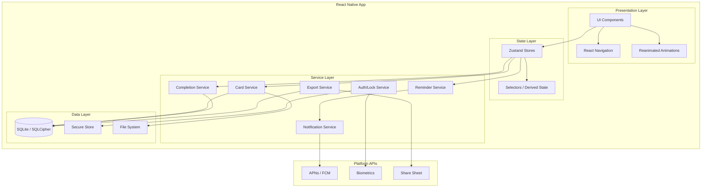
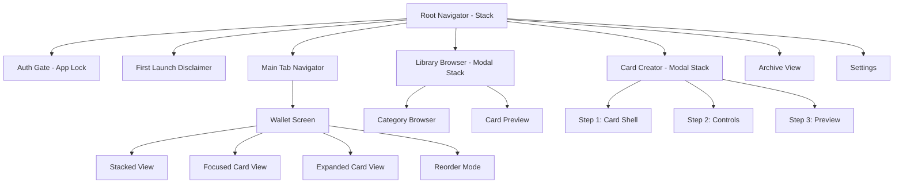
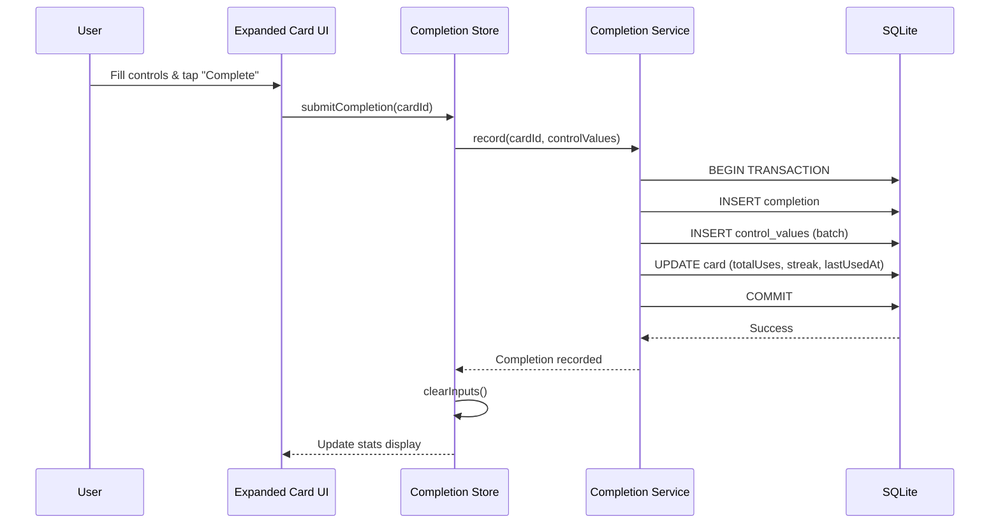
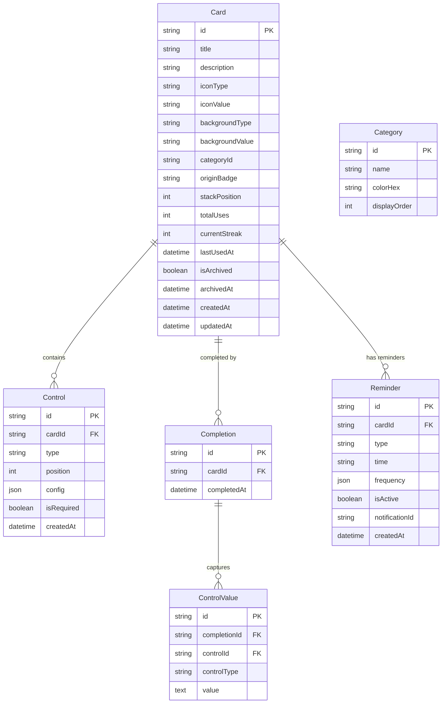
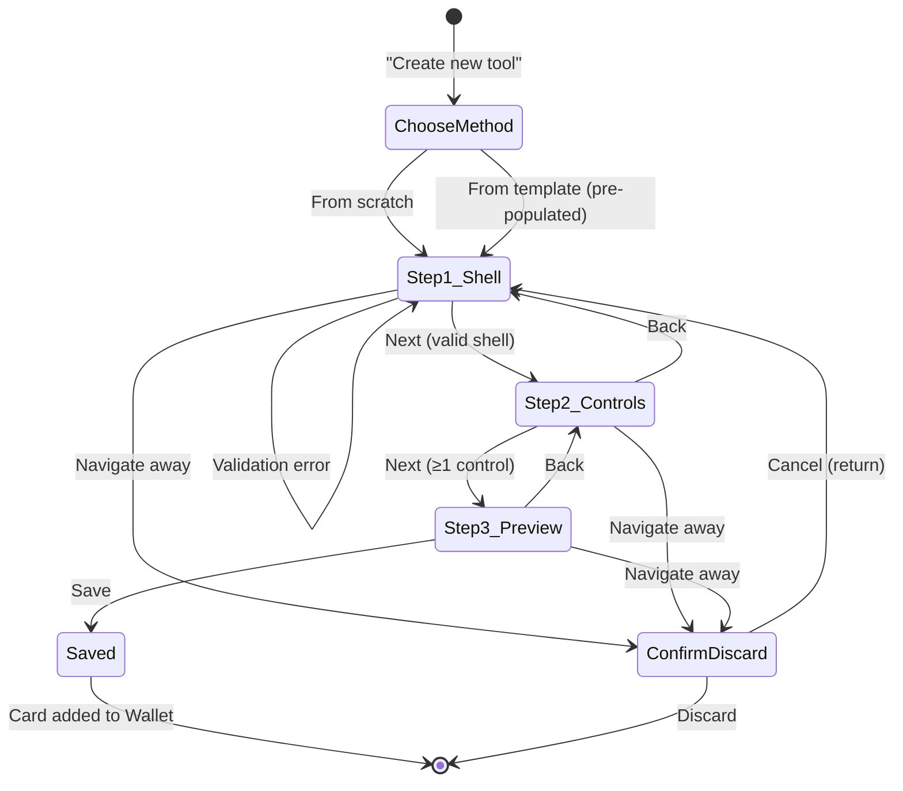
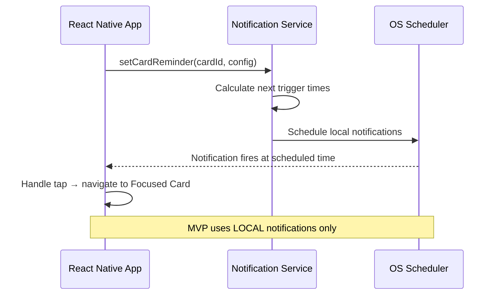

# Design Document: Mental Health Wallet MVP

## Overview

Mental Health Wallet is a React Native mobile application (iOS and Android) that provides a unified, habit-forming toolkit for mental health coping tools. The app uses a local-first architecture with no cloud sync, storing all user data in an encrypted SQLite database on-device. The core interaction model is a stacked card UI (inspired by Apple Wallet) where users collect, create, practice, and track coping tools represented as cards.

This document covers the **MVP scope**: core card interaction loop (stack → focus → expand → complete), card creation/editing, curated library browsing, per-card reminders, streak tracking, archive/restore, and essential safety features. Post-MVP features (badges, mood analytics, insights, community submissions, curator admin) are excluded.

### Key Design Decisions

| # | Decision | Rationale |
|---|----------|-----------|
| 1 | **React Native with Expo** | Cross-platform targeting iOS and Android from a single codebase. Expo provides managed native modules for camera, notifications, biometrics, and file system access. |
| 2 | **SQLite via expo-sqlite** | Local-first relational database for structured card data, completions, and reminders. Simpler relational queries and better community support in the Expo ecosystem. |
| 3 | **Zustand for state management** | Lightweight, unopinionated state management that avoids Redux boilerplate while providing excellent React Native performance through selective re-renders. |
| 4 | **React Navigation** | Industry-standard navigation library supporting stack, tab, and modal navigation patterns required by the wallet interaction model. |
| 5 | **Local encryption via expo-secure-store + SQLCipher** | SQLCipher encrypts the SQLite database at rest; expo-secure-store holds the encryption key in the platform keychain. |
| 6 | **Reanimated + Gesture Handler** | Smooth 60fps animations for card transitions (focus, expand, reorder) running on the native thread. |

## Architecture

### High-Level Architecture Diagram



### Layer Responsibilities

| Layer | Responsibility |
|-------|----------------|
| Presentation | Render UI, handle gestures, drive animations, navigation routing |
| State | Hold application state, compute derived values, trigger side effects |
| Service | Business logic, data transformations, orchestration between data and state |
| Data | Persistence (SQLite), secure key storage (Keychain/Keystore), file I/O (images) |

### Navigation Structure



### Data Flow — Card Completion



## Components and Interfaces

### Component Hierarchy — Wallet UI

```
WalletScreen
├── WalletHeader (title: "My Wallet", kebab menu)
├── StackedCardList (virtualized, gesture-enabled)
│   ├── CardEdge (compact card showing title, icon, category, background)
│   └── ... (repeats per card)
├── FocusedCardView (animated overlay)
│   ├── CardShellDisplay (title, description, origin badge, category)
│   ├── StatsRow (total uses, streak, last used)
│   ├── PrimaryActionButton
│   ├── KebabMenu
│   └── ExpandedContent (scrollable, conditionally rendered)
│       ├── ControlRenderer (iterates controls)
│       │   ├── StaticTextControl
│       │   ├── TextInputControl
│       │   ├── TextAreaControl
│       │   ├── MoodSliderControl
│       │   ├── ChoiceButtonsControl
│       │   ├── CheckboxControl
│       │   ├── CounterControl
│       │   ├── DateTimeStampControl
│       │   ├── ImageAttachmentControl
│       │   └── LinkButtonControl
│       └── SaveCompleteButton
├── CollapsedStack (bottom, tappable to fan out)
│   └── FannedCardTops (up to 5 card edges)
└── EmptyWalletState (shown when 0 cards)
```

### Key Service Interfaces

```typescript
// Card Service
interface CardService {
  getAll(): Promise<Card[]>;
  getById(id: string): Promise<Card | null>;
  create(shell: CardShell, controls: Control[], originBadge: OriginBadge): Promise<Card>;
  update(id: string, updates: Partial<Card>): Promise<Card>;
  reorder(orderedIds: string[]): Promise<void>;
  archive(id: string): Promise<void>;
  restore(id: string): Promise<void>;
  duplicate(id: string): Promise<Card>;
  delete(id: string): Promise<void>;
  validateShell(shell: CardShell): ValidationResult;
  validateControls(controls: Control[]): ValidationResult;
}

// Completion Service
interface CompletionService {
  record(cardId: string, values: ControlValue[]): Promise<Completion>;
  getByCard(cardId: string, pagination?: Pagination): Promise<Completion[]>;
  deleteEntry(completionId: string): Promise<void>;
  getStreakInfo(cardId: string): Promise<StreakInfo>;
  updateStreak(cardId: string): Promise<void>;
}

// Reminder Service (per-card only in MVP)
interface ReminderService {
  setCardReminder(cardId: string, config: ReminderConfig): Promise<Reminder>;
  getReminder(cardId: string): Promise<Reminder | null>;
  updateReminder(reminderId: string, config: ReminderConfig): Promise<Reminder>;
  deleteReminder(reminderId: string): Promise<void>;
  disableForCard(cardId: string): Promise<void>;
  scheduleNotification(reminder: Reminder): Promise<void>;
}

// Notification Service
interface NotificationService {
  requestPermission(): Promise<boolean>;
  hasPermission(): Promise<boolean>;
  scheduleLocal(config: NotificationConfig): Promise<string>;
  cancelScheduled(notificationId: string): Promise<void>;
  handleNotificationTap(data: NotificationData): void;
}
```

### Zustand Store Structure

```typescript
// Wallet Store
interface WalletStore {
  cards: Card[];
  cardOrder: string[];
  focusedCardId: string | null;
  isExpanded: boolean;
  isReorderMode: boolean;
  // Actions
  loadCards: () => Promise<void>;
  focusCard: (id: string) => void;
  expandCard: () => void;
  collapseCard: () => void;
  returnToStack: () => void;
  enterReorderMode: () => void;
  commitReorder: (newOrder: string[]) => void;
  cancelReorder: () => void;
}

// Completion Store
interface CompletionStore {
  currentInputValues: Record<string, ControlValue>;
  // Actions
  setControlValue: (controlId: string, value: ControlValue) => void;
  submitCompletion: (cardId: string) => Promise<void>;
  clearInputs: () => void;
}

// Auth Store (simplified for MVP — no PIN lockout)
interface AuthStore {
  isAuthenticated: boolean;
  lockEnabled: boolean;
  // Actions
  authenticate: () => Promise<boolean>;
  checkLockStatus: () => Promise<void>;
}
```

## Data Models

### Entity Relationship Diagram



### SQLite Schema

```sql
-- Categories (seeded on first launch)
CREATE TABLE categories (
  id TEXT PRIMARY KEY,
  name TEXT NOT NULL,
  color_hex TEXT NOT NULL,
  display_order INTEGER NOT NULL
);

-- Cards
CREATE TABLE cards (
  id TEXT PRIMARY KEY,
  title TEXT NOT NULL CHECK(length(trim(title)) > 0),
  description TEXT NOT NULL CHECK(length(trim(description)) > 0),
  icon_type TEXT NOT NULL CHECK(icon_type IN ('library', 'emoji', 'custom_image')),
  icon_value TEXT NOT NULL,
  background_type TEXT NOT NULL CHECK(background_type IN ('color', 'gradient', 'image')),
  background_value TEXT NOT NULL,
  category_id TEXT NOT NULL REFERENCES categories(id),
  origin_badge TEXT NOT NULL CHECK(origin_badge IN ('library', 'community', 'my_tool')),
  stack_position INTEGER NOT NULL DEFAULT 0,
  total_uses INTEGER NOT NULL DEFAULT 0,
  current_streak INTEGER NOT NULL DEFAULT 0,
  last_used_at TEXT,
  is_archived INTEGER NOT NULL DEFAULT 0,
  archived_at TEXT,
  previous_stack_position INTEGER,
  created_at TEXT NOT NULL DEFAULT (datetime('now')),
  updated_at TEXT NOT NULL DEFAULT (datetime('now'))
);

CREATE INDEX idx_cards_archived ON cards(is_archived);
CREATE INDEX idx_cards_stack_position ON cards(stack_position) WHERE is_archived = 0;
CREATE INDEX idx_cards_category ON cards(category_id);

-- Controls (field types within cards)
CREATE TABLE controls (
  id TEXT PRIMARY KEY,
  card_id TEXT NOT NULL REFERENCES cards(id) ON DELETE CASCADE,
  type TEXT NOT NULL CHECK(type IN (
    'static_text', 'text_input', 'text_area', 'mood_slider',
    'choice_buttons', 'checkbox', 'counter', 'datetime_stamp',
    'image_attachment', 'link_button'
  )),
  position INTEGER NOT NULL,
  config TEXT NOT NULL DEFAULT '{}',
  is_required INTEGER NOT NULL DEFAULT 0,
  created_at TEXT NOT NULL DEFAULT (datetime('now'))
);

CREATE INDEX idx_controls_card ON controls(card_id);

-- Completions
CREATE TABLE completions (
  id TEXT PRIMARY KEY,
  card_id TEXT NOT NULL REFERENCES cards(id) ON DELETE CASCADE,
  completed_at TEXT NOT NULL DEFAULT (datetime('now'))
);

CREATE INDEX idx_completions_card ON completions(card_id);
CREATE INDEX idx_completions_date ON completions(completed_at);

-- Control Values (captured per completion)
CREATE TABLE control_values (
  id TEXT PRIMARY KEY,
  completion_id TEXT NOT NULL REFERENCES completions(id) ON DELETE CASCADE,
  control_id TEXT NOT NULL REFERENCES controls(id) ON DELETE CASCADE,
  control_type TEXT NOT NULL,
  value TEXT
);

CREATE INDEX idx_control_values_completion ON control_values(completion_id);

-- Reminders
CREATE TABLE reminders (
  id TEXT PRIMARY KEY,
  card_id TEXT REFERENCES cards(id) ON DELETE CASCADE,
  type TEXT NOT NULL CHECK(type IN ('per_card')),
  time TEXT NOT NULL,
  frequency TEXT NOT NULL DEFAULT '{}',
  is_active INTEGER NOT NULL DEFAULT 1,
  notification_id TEXT,
  created_at TEXT NOT NULL DEFAULT (datetime('now'))
);

CREATE INDEX idx_reminders_card ON reminders(card_id);
CREATE INDEX idx_reminders_active ON reminders(is_active) WHERE is_active = 1;

-- App Settings (key-value for preferences)
CREATE TABLE settings (
  key TEXT PRIMARY KEY,
  value TEXT NOT NULL
);

-- Crisis Resources (seeded, geolocation-aware)
CREATE TABLE crisis_resources (
  id TEXT PRIMARY KEY,
  country_code TEXT NOT NULL,
  name TEXT NOT NULL,
  phone TEXT,
  url TEXT,
  is_default INTEGER NOT NULL DEFAULT 0,
  display_order INTEGER NOT NULL
);
```

### TypeScript Type Definitions

```typescript
type OriginBadge = 'library' | 'community' | 'my_tool';
type ControlType =
  | 'static_text' | 'text_input' | 'text_area' | 'mood_slider'
  | 'choice_buttons' | 'checkbox' | 'counter' | 'datetime_stamp'
  | 'image_attachment' | 'link_button';
type ReminderFrequencyType = 'daily' | '3x_week' | 'custom';

interface Card {
  id: string;
  title: string;          // max 80 chars
  description: string;    // max 300 chars
  iconType: 'library' | 'emoji' | 'custom_image';
  iconValue: string;
  backgroundType: 'color' | 'gradient' | 'image';
  backgroundValue: string;
  categoryId: string;
  originBadge: OriginBadge;
  stackPosition: number;
  totalUses: number;
  currentStreak: number;
  lastUsedAt: string | null;
  isArchived: boolean;
  archivedAt: string | null;
  previousStackPosition: number | null;
  controls: Control[];
  createdAt: string;
  updatedAt: string;
}

interface Control {
  id: string;
  cardId: string;
  type: ControlType;
  position: number;
  config: ControlConfig;
  isRequired: boolean;
}

type ControlConfig =
  | StaticTextConfig
  | TextInputConfig
  | TextAreaConfig
  | MoodSliderConfig
  | ChoiceButtonsConfig
  | CheckboxConfig
  | CounterConfig
  | DateTimeStampConfig
  | ImageAttachmentConfig
  | LinkButtonConfig;

interface StaticTextConfig {
  title?: string;
  body: string;
  fontSize: 'small' | 'medium' | 'large';
}

interface TextInputConfig {
  label: string;
  placeholder?: string;
  maxLength: number;
}

interface TextAreaConfig {
  label: string;
  placeholder?: string;
}

interface MoodSliderConfig {
  label: string;
  minLabel?: string;
  maxLabel?: string;
}

interface ChoiceButtonsConfig {
  label: string;
  options: { text: string; icon?: string }[];
}

interface CheckboxConfig {
  label: string;
}

interface CounterConfig {
  label: string;
  min?: number;
  max?: number;
}

interface DateTimeStampConfig {
  displayMode: 'visible' | 'hidden';
}

interface ImageAttachmentConfig {
  label: string;
}

interface LinkButtonConfig {
  label: string;
  targetUrl: string;
  fallbackUrl?: string;
}

interface Completion {
  id: string;
  cardId: string;
  completedAt: string;
  values: ControlValue[];
}

interface ControlValue {
  id: string;
  completionId: string;
  controlId: string;
  controlType: ControlType;
  value: string;
}

interface Reminder {
  id: string;
  cardId: string;
  type: 'per_card';
  time: string;
  frequency: ReminderFrequency;
  isActive: boolean;
  notificationId: string | null;
}

interface ReminderFrequency {
  type: ReminderFrequencyType;
  days?: number[];
}
```

## Analytics / Streak Calculation Engine

### Streak Calculation

```typescript
function updateStreak(card: Card, completionDate: Date): StreakUpdate {
  const lastUsed = card.lastUsedAt ? new Date(card.lastUsedAt) : null;
  const today = startOfDay(completionDate);
  const yesterday = subDays(today, 1);

  if (!lastUsed) {
    return { currentStreak: 1, totalUses: card.totalUses + 1 };
  }

  const lastUsedDay = startOfDay(lastUsed);

  if (isSameDay(lastUsedDay, today)) {
    // Already used today — increment uses but not streak
    return { currentStreak: card.currentStreak, totalUses: card.totalUses + 1 };
  }

  if (isSameDay(lastUsedDay, yesterday)) {
    // Used yesterday — extend streak
    return { currentStreak: card.currentStreak + 1, totalUses: card.totalUses + 1 };
  }

  // Gap > 1 day — reset streak
  return { currentStreak: 1, totalUses: card.totalUses + 1 };
}
```

### Streak Reset (Background Check)

A daily background task (or on-app-open check) resets streaks for cards that missed a day:

```typescript
function resetStaleStreaks(cards: Card[], now: Date): string[] {
  const today = startOfDay(now);
  const resetCardIds: string[] = [];

  for (const card of cards) {
    if (card.currentStreak > 0 && card.lastUsedAt) {
      const lastDay = startOfDay(new Date(card.lastUsedAt));
      const daysSince = differenceInCalendarDays(today, lastDay);
      if (daysSince > 1) {
        resetCardIds.push(card.id);
      }
    }
  }
  return resetCardIds;
}
```

## Card Creation / Editing Flow

### State Machine



### Validation Rules

| Field | Rule |
|-------|------|
| Title | Non-empty, non-whitespace, ≤80 characters |
| Description | Non-empty, non-whitespace, ≤300 characters |
| Icon | Must have selection (library icon, emoji, or uploaded image) |
| Background | Must have value (color, gradient, or image) |
| Background Image | Min 750×500px, max 10MB, JPEG/PNG |
| Controls | 1–10 controls per card |
| Text Input max length | ≤200 characters |
| Choice Buttons | 1–8 options |
| Image Attachment | ≤20MB per image, JPEG/PNG |
| Link Button URL | Must match allowed scheme (https://, http://, or custom "://") |

## Push Notification Architecture

### Platform Integration



### Implementation Details

- **expo-notifications** handles both iOS (APNs) and Android (FCM) through a unified API
- All reminders are **local scheduled notifications** — no server needed
- Notification IDs stored in the `reminders` table for cancellation/updates
- On app launch, the service reconciles scheduled notifications with active reminders
- Deep link payload: `{ type: 'card_reminder', cardId: string }` routes to `FocusedCardView`

### Notification Permission Flow

1. User taps "Set reminder" → check `hasPermission()`
2. If not granted → show explainer screen → call `requestPermission()`
3. If denied → show settings redirect guidance
4. If granted → proceed to reminder configuration

## Security

### Encryption at Rest

- **SQLCipher** encrypts the entire SQLite database using AES-256
- Encryption key generated on first launch using `expo-crypto.getRandomBytesAsync(32)`
- Key stored in platform keychain via `expo-secure-store` (hardware-backed on supported devices)
- Images stored in app's private file system directory (OS-level sandboxing)

### Data Boundaries

- No user data leaves the device (MVP)
- Export feature produces a file on-device; user chooses where to share via system share sheet
- No analytics or telemetry SDK in MVP

## Performance Considerations

### Virtualized Lists

- **FlashList** (by Shopify) for all scrollable card lists — significantly faster than FlatList for large lists
- Stacked view uses a custom layout with fixed-height card edges (no full card rendering until focused)
- Archive and usage history views use pagination (20 items per page)

### Animations

- All card transitions (focus, expand, reorder drag) run on the **UI thread** via `react-native-reanimated` worklets
- Shared value animations for position, scale, opacity — no JS bridge round-trips
- Target: all interactions respond within 300ms (Requirement 17.1)
- Spring-based animations with configurable damping for natural feel

### Database Performance

- Indexes on all foreign keys and common query patterns (see schema above)
- Batch reads: load all active cards + controls in a single JOIN query on app launch
- Completion writes are single-transaction (completion + control_values)
- Streak checks run once on app open, not per-render

### Image Handling

- Background images resized client-side to max 1500px width before storage
- Thumbnails generated (200px width) for stack view card edges
- Images stored in app's cache directory with content-addressable filenames
- Lazy loading for expanded card images (loaded only when card expands)

### Memory Management

- Card controls rendered lazily (only when expanded)
- Usage history computed on-demand, not pre-cached
- Image references use weak caching — OS can reclaim memory under pressure
- Maximum 50 cards rendered in virtualized list viewport at once

## Error Handling

### Error Categories and Strategies

| Category | Examples | Strategy |
|----------|----------|----------|
| Validation | Empty title, invalid URL, oversized image | Inline field-level error messages; prevent save |
| Data Persistence | SQLite write failure, disk full | Retry once; show user-friendly error toast; preserve in-memory state |
| Notification | Permission denied, scheduling failure | Graceful degradation; explain in UI; guide to settings |
| Deep Link | App not installed, malformed URL | Fallback URL attempt; friendly error message with edit suggestion |
| Authentication | Biometric unavailable | Graceful degradation; never lose data |
| Image | Camera denied, file too large, corrupt file | Show specific guidance; allow retry; validate before save |
| Export | File system error, generation failure | Retry with toast notification; log error details |

### Validation Error Display

- Inline errors appear immediately below the invalid field
- Red border + error icon on the field itself
- Error text uses contrast-compliant color (meets 4.5:1 ratio)
- Fields with errors remain editable — user corrects in place
- Errors clear automatically when field becomes valid

### Data Integrity

- All multi-step writes (completion + values) wrapped in SQLite transactions
- If transaction fails, all changes roll back — no partial state
- Card reorder uses a single UPDATE transaction for all position changes
- Archive/restore preserves all related data (completions, reminders disabled but not deleted)

## Testing Strategy

### Testing Pyramid

```
        /  E2E Tests  \          ← Detox (critical user flows)
       /  Integration  \         ← Service + DB tests
      / Property-Based  \        ← fast-check (data logic)
     /    Unit Tests     \       ← Jest (components, utils)
    /_____________________\
```

### Unit Tests (Jest + React Native Testing Library)

- Component rendering and interaction (tap, swipe gestures)
- Validation functions (card shell, control configs, URL schemes)
- Pure utility functions (date calculations, formatting)
- Store actions (Zustand store behavior with mocked services)

### Property-Based Tests (fast-check)

Property-based testing is appropriate for this feature because:
- The streak engine contains pure functions with clear input/output
- Card validation has universal properties across all valid/invalid inputs
- Data serialization (control values, export) benefits from round-trip verification
- The card model has invariants that should hold regardless of card composition

**Library:** `fast-check` (TypeScript-native, well-supported in Jest/Vitest ecosystem)
**Configuration:** Minimum 100 iterations per property test

### Integration Tests

- Service layer tests with real SQLite database (in-memory for speed)
- Completion flow: record → streak update → stats update
- Reminder scheduling and cancellation with notification service mocks
- Card CRUD with cascade behaviors (archive disables reminders, delete cascades)

### E2E Tests (Detox)

- Wallet navigation: stack → focus → expand → collapse → return to stack
- Card creation: full 3-step flow with validation errors
- Library browsing: filter by category, add to wallet
- Completion flow: expand card → fill controls → save → verify stats update

## Correctness Properties

*A property is a characteristic or behavior that should hold true across all valid executions of a system — essentially, a formal statement about what the system should do. Properties serve as the bridge between human-readable specifications and machine-verifiable correctness guarantees.*

### Property 1: Card Shell Completeness

*For any* combination of title, description, icon, and background values, the validation function shall reject the card shell if and only if at least one field is empty or consists entirely of whitespace characters, and shall correctly identify which specific fields are invalid.

**Validates: Requirements 5.6, 5.7**

**Property**: `∀ shell ∈ CardShell: validateShell(shell).isValid ⟺ (nonEmpty(shell.title) ∧ nonEmpty(shell.description) ∧ hasValue(shell.icon) ∧ hasValue(shell.background))`

**Verification**: Generate arbitrary CardShell values with fast-check (including empty strings, whitespace-only strings, null values). Assert that validation rejects if and only if at least one field is empty/whitespace, and that the returned error list identifies exactly the invalid fields.

### Property 2: Control Count Invariant

*For any* card, the number of controls must be between 1 and 10 inclusive. Any attempt to add a control beyond 10 or save a card with 0 controls shall be rejected.

**Validates: Requirements 7.7**

**Property**: `∀ card ∈ Card: 1 ≤ |card.controls| ≤ 10`

**Verification**: Generate arbitrary lists of controls (length 0–15) and verify that validateControls accepts lists of length 1–10 and rejects all others.

### Property 3: Streak Monotonicity

*For any* card and any chronologically ordered sequence of completion dates, the streak value shall equal 1 if the previous completion was more than 1 calendar day ago (or no previous completion exists), shall remain unchanged if a completion already exists on the current calendar day, and shall increment by 1 if the previous completion was on the immediately preceding calendar day.

**Validates: Requirements 13.2, 13.3**

**Property**: `∀ card, date: updateStreak(card, date).currentStreak = card.currentStreak + 1 if lastUsedAt = yesterday, = card.currentStreak if lastUsedAt = today, = 1 otherwise`

**Verification**: Generate arbitrary Card states (with varying lastUsedAt and currentStreak) and completion dates. Assert the streak update function produces the correct value for each of the three cases (consecutive day, same day, gap > 1 day).

### Property 4: Archive Data Preservation

*For any* card with completions, streaks, and active reminders, archiving the card shall hide it from the active wallet while preserving all completion records and streak history unchanged, and shall set all associated reminders to inactive.

**Validates: Requirements 14.1**

**Property**: `∀ card with completions C, streak S, reminders R: archive(card) → card.isArchived = true ∧ completions(card) = C ∧ card.currentStreak = S ∧ ∀ r ∈ R: r.isActive = false`

**Verification**: Generate cards with random completions, streak values, and active reminders. Archive each card and verify: card is hidden from active list, all completion records remain intact, streak value is preserved, and all reminders are set to inactive.

### Property 5: Origin Badge Editability

*For any* card, edit actions shall be available if and only if the card's origin badge is "my_tool"; cards with origin badge "library" or "community" shall have edit actions hidden and modification attempts blocked.

**Validates: Requirements 9.3, 9.5**

**Property**: `∀ card: canEdit(card) ⟺ card.originBadge = 'my_tool'`

**Verification**: Generate cards with each possible origin badge value. Assert that edit permission is granted only for "my_tool" and denied for "library" and "community".

### Property 6: Duplicate Independence

*For any* card with any title, controls, and accumulated statistics, duplicating the card shall produce a new card with title "[Original Title] - Copy", origin badge "my_tool", identical Card_Shell fields and Controls, and all usage statistics (total uses, streak, last used) set to zero.

**Validates: Requirements 9.4, 10.3**

**Property**: `∀ card: duplicate(card) → newCard.title = card.title + " - Copy" ∧ newCard.originBadge = 'my_tool' ∧ newCard.totalUses = 0 ∧ newCard.currentStreak = 0 ∧ newCard.lastUsedAt = null ∧ newCard.controls ≡ card.controls`

**Verification**: Generate cards with various titles, origin badges, control configurations, and non-zero statistics. Duplicate each and verify the new card has the expected title suffix, "my_tool" badge, identical controls, and zeroed statistics.

### Property 7: Reminder-Archive Consistency

*For any* card with active reminders, archiving the card shall disable all reminders; restoring the card shall not automatically re-enable previously disabled reminders.

**Validates: Requirements 14.1, 12.6**

**Property**: `∀ card, reminders R: archive(card) → ∀ r ∈ R: r.isActive = false; restore(card) → ∀ r ∈ R: r.isActive = false`

**Verification**: Generate cards with 1–3 active reminders. Archive and verify all reminders become inactive. Restore and verify reminders remain inactive (user must manually re-enable).
