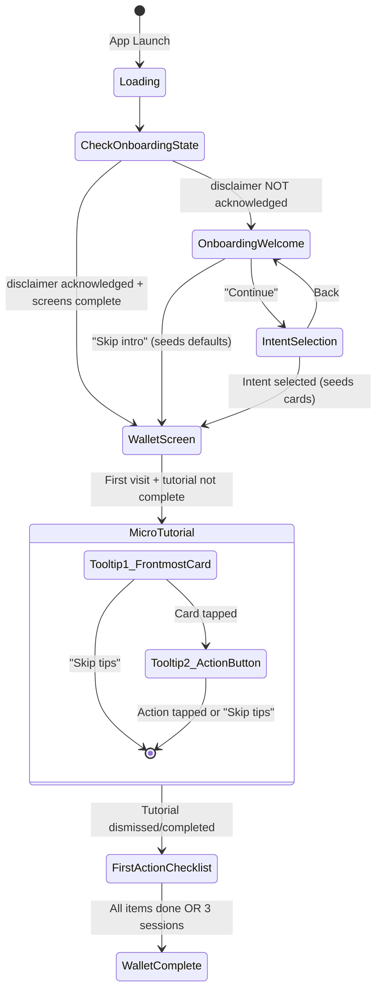
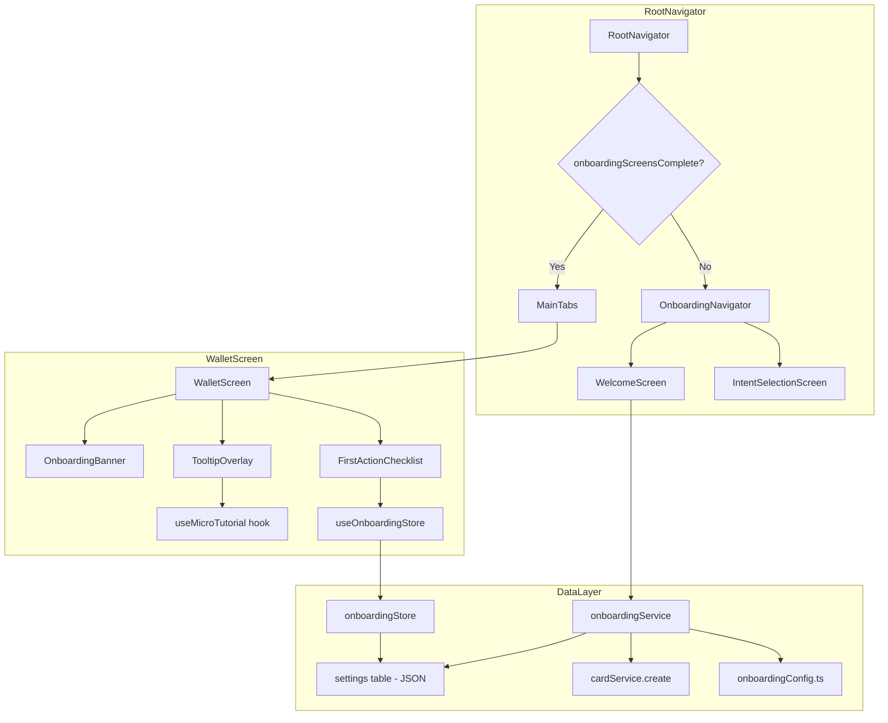

# Design Document: Onboarding

## Overview

The onboarding feature replaces the current standalone `DisclaimerScreen` with a progressive, multi-stage flow that guides first-time users from app launch to their first tool interaction within 60–90 seconds. The flow consists of three phases:

1. **Onboarding Screens** (Welcome → Intent Selection) — embedded disclaimer + intent-based card seeding
2. **Micro-Tutorial** — in-context tooltip overlays on the real Wallet Screen teaching core interactions
3. **First Action Checklist** — inline 3-item checklist driving the user to their "aha moment"

The design preserves backward compatibility with the existing `disclaimer_acknowledged` settings key and integrates seamlessly with the current navigation, wallet store, and card service without modifying their public APIs.

## Architecture

### Navigation Integration

The onboarding replaces the `Disclaimer` route in `RootNavigator` with an `Onboarding` route that houses a nested navigator for the multi-screen flow. The Micro-Tutorial and First Action Checklist live as overlay components within the existing `WalletScreen`.



### Component Architecture



## Components and Interfaces

### New Files

| File | Purpose |
|------|---------|
| `src/screens/onboarding/WelcomeScreen.tsx` | Welcome + embedded disclaimer |
| `src/screens/onboarding/IntentSelectionScreen.tsx` | Job-to-be-done picker |
| `src/navigation/OnboardingNavigator.tsx` | Nested stack for onboarding screens |
| `src/stores/onboardingStore.ts` | Zustand store for onboarding state |
| `src/services/onboardingService.ts` | Business logic: seeding, state transitions |
| `src/data/onboardingConfig.ts` | Starter card mappings per intent |
| `src/components/onboarding/OnboardingBanner.tsx` | "We added tools" info banner |
| `src/components/onboarding/TooltipOverlay.tsx` | Reusable tooltip overlay component |
| `src/components/onboarding/FirstActionChecklist.tsx` | Inline checklist widget |
| `src/hooks/useMicroTutorial.ts` | State machine for tooltip sequencing |

### OnboardingNavigator

Replaces the `Disclaimer` route in `RootNavigator`. Uses a native-stack navigator with gesture-based back-swipe disabled on the Welcome screen.

```typescript
// src/navigation/OnboardingNavigator.tsx
import { createNativeStackNavigator } from '@react-navigation/native-stack';

export type OnboardingStackParamList = {
  Welcome: undefined;
  IntentSelection: undefined;
};

const Stack = createNativeStackNavigator<OnboardingStackParamList>();

export default function OnboardingNavigator() {
  return (
    <Stack.Navigator screenOptions={{ headerShown: false }}>
      <Stack.Screen 
        name="Welcome" 
        component={WelcomeScreen}
        options={{ gestureEnabled: false }} // Req 1.6: no back-swipe
      />
      <Stack.Screen name="IntentSelection" component={IntentSelectionScreen} />
    </Stack.Navigator>
  );
}
```

### Updated RootNavigator Logic

```typescript
// Key change in RootNavigator.tsx
const initialRoute = disclaimerAcknowledged && onboardingScreensComplete
  ? 'MainTabs'
  : disclaimerAcknowledged && !onboardingScreensComplete
    ? 'Onboarding' // Resume at IntentSelection
    : 'Onboarding'; // Start at Welcome

// Route definition replaces 'Disclaimer':
<Stack.Screen name="Onboarding" component={OnboardingNavigator} />
```

### WelcomeScreen

Single-screen design with:
- Headline + value proposition subtext
- Embedded disclaimer text (micro-reassurance: not a crisis service, user stays in control, questions can be left blank)
- "Continue" button (primary action)
- "Skip intro" link (secondary, records disclaimer + seeds defaults + marks screens complete)

### IntentSelectionScreen

Displays 4 plain-language options as large, tappable cards:
1. "I need quick tools for overwhelm" 
2. "I want to build a daily routine"
3. "I have tools already — help me organize"
4. "I'm just exploring"

Single-selection only. On selection: persists intent, seeds cards, marks screens complete, navigates to MainTabs.

### TooltipOverlay Component

A custom overlay component (~100–150 lines) that renders a semi-transparent backdrop with a "spotlight" cutout around a target element, plus a tooltip bubble with text and action buttons.

```typescript
// src/components/onboarding/TooltipOverlay.tsx
interface TooltipOverlayProps {
  /** Whether the overlay is visible */
  visible: boolean;
  /** Layout measurements of the target element to spotlight */
  targetLayout: { x: number; y: number; width: number; height: number } | null;
  /** Tooltip text content */
  text: string;
  /** Position of tooltip relative to target */
  position: 'above' | 'below';
  /** Label for the skip action */
  skipLabel?: string;
  /** Called when user taps the spotlighted area */
  onTargetPress?: () => void;
  /** Called when user taps skip */
  onSkip?: () => void;
}
```

Implementation details:
- Uses `react-native-reanimated` for fade-in/fade-out animations
- Renders a full-screen `View` with `pointerEvents="box-none"` 
- Semi-transparent black backdrop (opacity 0.5) with a transparent "hole" using SVG mask or multiple rect overlay approach
- Tooltip bubble positioned relative to target with a directional arrow
- "Skip tips" text button in the tooltip area

### useMicroTutorial Hook

A state-machine hook that manages the tooltip sequence:

```typescript
// src/hooks/useMicroTutorial.ts
type TutorialStep = 'idle' | 'tooltip_frontmost_card' | 'tooltip_action_button' | 'complete';

interface UseMicroTutorialReturn {
  currentStep: TutorialStep;
  isActive: boolean;
  tooltipText: string;
  targetRef: 'frontmost_card' | 'action_button' | null;
  /** Call when user performs the guided action */
  advance: () => void;
  /** Call to skip all remaining tips */
  skip: () => void;
  /** Call to start the tutorial (after banner dismiss or auto-start) */
  start: () => void;
}

function useMicroTutorial(): UseMicroTutorialReturn;
```

State transitions:
- `idle` → `tooltip_frontmost_card`: triggered by `start()` (immediately when wallet loads after onboarding)
- `tooltip_frontmost_card` → `tooltip_action_button`: user taps the frontmost card spotlight
- `tooltip_action_button` → `complete`: user taps the expand arrow
- Any step → `complete`: user taps "Skip tips"

On reaching `complete`, the hook calls `onboardingStore.completeTutorial()`.

### FirstActionChecklist Component

Collapsible inline component rendered at the top of WalletScreen content area (below the header, above the card stack) when the tutorial is complete but the checklist is not. Hidden automatically when a card is focused to give space for the expanded card.

Features:
- Starts expanded with a "Getting started" header and collapse toggle
- User can manually collapse to a compact progress bar ("Getting started 1/3 ▼")
- Shows celebration message ("🎉 Great start!...") when all items complete, with X to dismiss manually and 12-second auto-dismiss
- Hidden when a card is focused, shown when returning to stack view

```typescript
// src/components/onboarding/FirstActionChecklist.tsx
interface ChecklistItem {
  id: 'open_tool' | 'try_exercise' | 'add_tool';
  label: string;
  isDone: boolean;
}

interface FirstActionChecklistProps {
  items: ChecklistItem[];
  onItemPress: (id: ChecklistItem['id']) => void;
  onDismiss: () => void;
}
```

Checklist items:
1. "Open your first tool" — tapping focuses the frontmost card
2. "Complete a tool" — tapping expands the focused card
3. "Discover a new tool" — tapping opens Library Browser

Auto-marking logic lives in `WalletScreen` by subscribing to wallet store events (using `queueMicrotask` to avoid setState-during-render):
- `open_tool`: marked when `focusedCardId` transitions from null to any value (fires even during tutorial)
- `try_exercise`: marked when any card's `totalUses` increases
- `add_tool`: marked when card count increases (new card added from library or created)

### OnboardingBanner

Non-modal informational banner (currently bypassed — tutorial starts immediately without requiring banner dismissal). The component exists but is not rendered in the current flow. The tutorial starts automatically via `queueMicrotask` when the wallet loads after onboarding completes.

## Data Models

### Onboarding State Shape (Zustand Store)

```typescript
// src/stores/onboardingStore.ts
export interface OnboardingState {
  // Persisted state
  disclaimerAcknowledged: boolean;
  onboardingScreensComplete: boolean;
  selectedIntent: string | null;
  tutorialComplete: boolean;
  checklist: {
    openTool: boolean;
    tryExercise: boolean;
    addTool: boolean;
  };
  checklistSessionCount: number;
  bannerDismissed: boolean;

  // Derived
  isChecklistVisible: boolean;
  isChecklistComplete: boolean;

  // Actions
  acknowledgeDisclaimer: () => Promise<void>;
  completeOnboardingScreens: (intent: string | null) => Promise<void>;
  completeTutorial: () => Promise<void>;
  markChecklistItem: (item: 'openTool' | 'tryExercise' | 'addTool') => Promise<void>;
  dismissChecklist: () => Promise<void>;
  dismissBanner: () => Promise<void>;
  incrementSessionCount: () => Promise<void>;
  loadState: () => Promise<void>;
}
```

### Persistence Format (settings table)

The onboarding state is stored as a single JSON-serialized value in the existing `settings` table:

```sql
-- Key: 'onboarding_state'
-- Value: JSON string
{
  "disclaimerAcknowledged": true,
  "onboardingScreensComplete": true,
  "selectedIntent": "overwhelm",
  "tutorialComplete": false,
  "checklist": { "openTool": false, "tryExercise": false, "addTool": false },
  "checklistSessionCount": 1,
  "bannerDismissed": false
}
```

Additionally, the legacy `disclaimer_acknowledged` key is still written separately for backward compatibility (Requirement 8.2).

### Starter Card Configuration

```typescript
// src/data/onboardingConfig.ts
export type IntentId = 'overwhelm' | 'routine' | 'organize' | 'explore';

export interface StarterCardMapping {
  intentId: IntentId;
  label: string; // Display label for the intent option
  description: string; // Subtext shown below the label
  cardIds: string[]; // References to CURATED_LIBRARY card IDs
}

export const INTENT_OPTIONS: StarterCardMapping[] = [
  {
    intentId: 'overwhelm',
    label: 'I need quick tools for overwhelm',
    description: 'Fast exercises to calm your mind in the moment',
    cardIds: ['lib-grounding-54321', 'lib-box-breathing', 'lib-name-it-tame-it'],
  },
  {
    intentId: 'routine',
    label: 'I want to build a daily routine',
    description: 'Tools to check in with yourself each day',
    cardIds: ['lib-daily-mood', 'lib-win-of-day', 'lib-evening-gratitude'],
  },
  {
    intentId: 'organize',
    label: 'I have tools already — help me organize',
    description: 'An example to get you started — add your own from the library',
    cardIds: ['lib-grounding-54321'],
  },
  {
    intentId: 'explore',
    label: "I'm just exploring",
    description: 'A mix of popular tools to try',
    cardIds: ['lib-box-breathing', 'lib-thought-feeling-action', 'lib-win-of-day'],
  },
];

export const DEFAULT_STARTER_CARD_IDS: string[] = [
  'lib-grounding-54321',
  'lib-daily-mood',
  'lib-self-compassion-pause',
];
```

### New Curated Library Cards

Three new entries added to `CURATED_LIBRARY` in `src/data/curatedLibrary.ts`:

| ID | Title | Category |
|----|-------|----------|
| `lib-name-it-tame-it` | Name It to Tame It | grounding-calming |
| `lib-win-of-day` | Win of the Day | daily-checkin-journaling |
| `lib-evening-gratitude` | Evening Gratitude | daily-checkin-journaling |

Note: "Win of the Day" already exists in the library. "Name It to Tame It" and "Evening Gratitude" are new additions.

### OnboardingService

```typescript
// src/services/onboardingService.ts
export interface OnboardingService {
  /** Seed starter cards into the wallet for the given intent (or defaults) */
  seedStarterCards(intentId: IntentId | null): Promise<void>;
  
  /** Persist onboarding state to settings table */
  saveState(state: Partial<OnboardingState>): Promise<void>;
  
  /** Load onboarding state from settings table */
  loadState(): Promise<OnboardingState>;
  
  /** Write legacy disclaimer_acknowledged key for backward compat */
  writeLegacyDisclaimerFlag(): Promise<void>;
}
```

The `seedStarterCards` method:
1. Looks up card IDs from `onboardingConfig.ts` for the given intent (or defaults if null)
2. For each card ID, finds the matching `CuratedCardDefinition` in `CURATED_LIBRARY`
3. Calls `cardService.create(shell, controls, 'library', categoryId)` for each card
4. Cards are inserted at ascending stack positions so the first card in the array becomes the frontmost (position 0)

### Updated Navigation Types

```typescript
// Updated src/navigation/types.ts
export type RootStackParamList = {
  Onboarding: undefined;  // Replaces 'Disclaimer'
  MainTabs: undefined;
  LibraryBrowser: undefined;
  CardCreator: { cardId?: string } | undefined;
  Archive: undefined;
  Settings: undefined;
  CrisisResources: undefined;
  UsageHistory: { cardId: string };
  ReminderConfig: { cardId: string };
};
```


## Correctness Properties

*A property is a characteristic or behavior that should hold true across all valid executions of a system — essentially, a formal statement about what the system should do. Properties serve as the bridge between human-readable specifications and machine-verifiable correctness guarantees.*

### Property 1: Intent-to-cards mapping correctness

*For any* valid intent selection (including null for skip/default), the set of card IDs seeded into the wallet SHALL exactly match the configured `cardIds` array for that intent in `onboardingConfig.ts`.

**Validates: Requirements 2.2, 3.2, 3.3, 3.4, 3.5, 3.6**

### Property 2: Seeded cards always have origin "library"

*For any* intent selection that triggers card seeding, all resulting cards persisted to the database SHALL have `originBadge` equal to `'library'`.

**Validates: Requirements 3.7**

### Property 3: Starter config referential integrity

*For any* card ID referenced in any intent mapping in `onboardingConfig.ts` (including the default set), that card ID SHALL exist in the `CURATED_LIBRARY` array.

**Validates: Requirements 3.9**

### Property 4: Tutorial dismissal activates checklist

*For any* active tutorial step (tooltip 1 or tooltip 2), dismissing the tutorial (via skip or completing all guided actions) SHALL result in `tutorialComplete` being `true` and `isChecklistVisible` being `true`.

**Validates: Requirements 5.3, 5.5**

### Property 5: Wallet events auto-mark corresponding checklist items

*For any* wallet interaction event — focusing a card marks `openTool`, recording a completion marks `tryExercise`, adding a card marks `addTool` — the corresponding checklist boolean SHALL transition from `false` to `true` without affecting other checklist items.

**Validates: Requirements 6.3, 6.4, 6.5**

### Property 6: Onboarding state serialization round-trip

*For any* valid `OnboardingState` object, serializing it to JSON via `saveState` and then deserializing via `loadState` SHALL produce a state object equivalent to the original.

**Validates: Requirements 7.1, 6.8**

### Property 7: State-to-route resolution

*For any* valid combination of onboarding completion flags (`disclaimerAcknowledged`, `onboardingScreensComplete`, `tutorialComplete`, `checklistSessionCount`), the resolved initial navigation route SHALL be deterministic: Welcome if disclaimer not acknowledged; IntentSelection if disclaimer acknowledged but screens not complete; WalletScreen if screens complete.

**Validates: Requirements 7.2**

### Property 8: Stage completion independence

*For any* onboarding state and any single stage completion action (acknowledging disclaimer, completing screens, completing tutorial, marking a checklist item), only the targeted flag(s) SHALL change — all other stage flags SHALL remain unchanged.

**Validates: Requirements 7.3**

### Property 9: Legacy disclaimer flag consistency

*For any* onboarding completion path that sets `disclaimerAcknowledged` to `true`, the settings table SHALL also contain the key `'disclaimer_acknowledged'` with value `'true'`.

**Validates: Requirements 8.2**

## Error Handling

| Scenario | Handling |
|----------|----------|
| DB write fails during card seeding | Wrap in transaction; rollback on failure. Show alert "Something went wrong — please try again" and remain on Intent Selection screen. Do NOT mark screens as complete. |
| DB write fails during state persistence | Retry once silently. If retry fails, proceed with in-memory state (next app launch will re-show the relevant stage). Log error for diagnostics. |
| Card referenced in onboardingConfig not found in CURATED_LIBRARY | Skip that card during seeding (graceful degradation). Log warning. Proceed with remaining valid cards. |
| Tutorial starts but wallet has no cards | Should not occur (seeding happens before navigation). Defensive: skip tutorial, mark as complete. |
| Checklist item action fails (e.g., library browser crash) | Checklist item remains unmarked. User can retry. No error shown for the checklist itself. |
| Legacy user has `disclaimer_acknowledged` but no `onboarding_state` | Treat as fully complete: navigate to Wallet. Legacy users will have empty wallet (acceptable per Req 8.3). |
| JSON parse error when loading onboarding state | Reset to defaults (disclaimer NOT acknowledged). User restarts onboarding. |

## Testing Strategy

### Property-Based Tests (fast-check)

Each correctness property is implemented as a property-based test with minimum 100 iterations using `fast-check`:

- **Intent mapping**: Generate random intent IDs from the valid set, verify card IDs match config
- **Seeded card origin**: Generate random intents, seed cards (via mocked cardService), verify all have origin 'library'
- **Config integrity**: Generate from all config entries, verify each referenced card ID exists in CURATED_LIBRARY
- **Tutorial state machine**: Generate random tutorial steps and random actions (advance/skip), verify terminal state consistency
- **Checklist auto-marking**: Generate random event sequences, verify only the corresponding item is marked
- **State round-trip**: Generate arbitrary valid OnboardingState objects, serialize/deserialize, check equality
- **Route resolution**: Generate all valid flag combinations, verify deterministic route
- **Flag independence**: Generate random states, apply single actions, verify only target flags change
- **Legacy flag**: Generate random completion paths, verify legacy key is always written

Tag format: `Feature: onboarding, Property {N}: {title}`

### Unit Tests (Jest)

- WelcomeScreen renders all required content (headline, disclaimer, buttons, reassurance text)
- IntentSelectionScreen renders 4 options and enforces single-selection
- Continue button writes disclaimer and navigates
- Skip intro seeds defaults and navigates
- Banner renders on first wallet visit and dismisses correctly
- Tooltip overlay positions correctly relative to target measurements
- Checklist dismisses after 3 sessions with incomplete items
- Legacy user bypass works correctly

### Integration Tests

- Full onboarding flow: launch → welcome → intent → wallet with seeded cards visible
- Card seeding performance: < 500ms for 3 cards
- State persistence: close app mid-onboarding, reopen, resume at correct stage

## Implementation Notes

- The old `DisclaimerScreen.tsx` has been deleted (not just dead code — removed entirely)
- A dev-only "Reset Onboarding" button is available in Settings (visible only when `__DEV__` is true) — clears all onboarding state, cards, and navigates to the Welcome screen
- The tooltip positions are calculated using approximate layout measurements with `measureInWindow` — the frontmost card position is computed from `(cards.length - 1) * PEEK_HEIGHT` where PEEK is 60px
- All onboarding-related state updates in WalletScreen use `queueMicrotask()` to avoid "Cannot update a component while rendering" errors
- The TooltipOverlay uses `left: 16, right: 16` for full-width positioning to prevent text overflow on smaller screens
