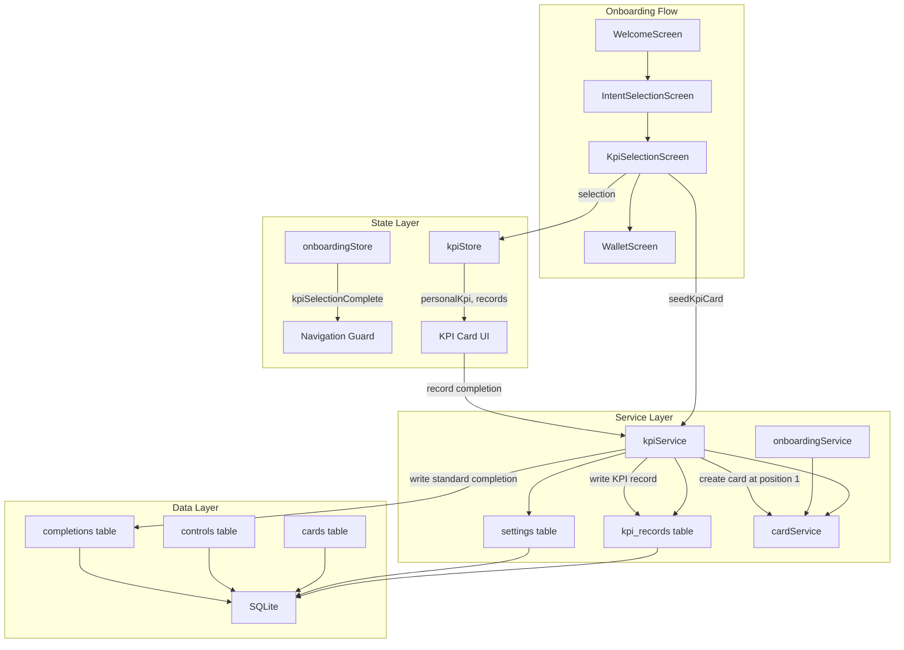

# Design Document: Personal KPI

## Overview

Personal KPI transforms the generic mood-logging experience into a self-defined progress indicator. Users choose what "getting better" means to them — from predefined options like "Feeling calmer" or "Sleeping better", or a custom phrase — during onboarding. This choice drives a seeded wallet card that lets them periodically record their self-rated value (1–10) and an optional note. The system stores these records in a dedicated table for efficient future insights while maintaining compatibility with the existing completion/streak infrastructure.

### Key Design Goals

- Integrate seamlessly with the existing onboarding flow (Welcome → Intent Selection → **KPI Selection** → Wallet)
- Reuse existing control types (mood_slider, text_input) rather than inventing new ones
- Handle the dynamic slider label (driven by user's KPI choice) within the static card infrastructure
- Support legacy users who upgrade without disrupting their experience
- Lay a data foundation for future insights without over-engineering the MVP

## Architecture



### Integration Points

1. **Onboarding Store**: New `kpiSelectionComplete` flag gates navigation to the wallet
2. **Card Service**: KPI card seeded into the database but NOT displayed in the wallet stack — accessed via the KPI FAB
3. **Wallet Screen**: KPI card filtered from `stackCards`; a floating action button (🌱) with spring animation provides access; focused card view shows personalized title/description with ⓘ tooltip
4. **Completion Service**: Standard completion still recorded for streak/usage stats
5. **Settings Table**: Stores `personal_kpi` (current label) and `personal_kpi_history` (JSON array of changes)
6. **Migrations**: New `kpi_records` table added via `runKpiMigration()` following the existing ALTER/PRAGMA pattern

## Components and Interfaces

### New Screen: KpiSelectionScreen

Located at `src/screens/onboarding/KpiSelectionScreen.tsx`. Follows the same pattern as `IntentSelectionScreen` — uses choice_buttons style large tappable cards.

**Props**: None (receives navigation via hook)

**Responsibilities**:
- Display 7 KPI_Options as tappable buttons
- Handle "Other" selection with inline text input
- Validate custom text (≥2 non-whitespace characters, ≤50 chars)
- Persist selection via kpiService
- Trigger KPI card seeding
- Set `kpiSelectionComplete` flag
- Support back navigation and skip

### KPI FAB and Wallet Integration

Located in `src/screens/WalletScreen.tsx` (inline components and logic).

**KpiFab Component**: An animated floating action button (56×56pt, green `#E8F5E9` circle, 🌱 emoji) at the bottom-right of the wallet. Uses Reanimated spring animations to scale/fade in when the stack is visible and out when a card is focused.

**Visibility logic**: `kpiCard && !focusedCardId && !isReorderMode`

**Card filtering**: The KPI card (identified by `sourceLibraryId === 'lib-personal-kpi'`) is excluded from `stackCards` passed to `StackedCardList` and `ReorderMode`. It exists in the database for data recording but is not part of the visible wallet stack.

**Personalized focused view**: When the KPI card is focused (via FAB tap), `FocusedCardView` receives a modified card object:
- Title: "Daily check-in" (static)
- Description: Mapped from `personalKpi` (e.g., "Feeling calmer" → "Checking in on your calm")
- Inline ⓘ icon after description text (via `renderDescriptionSuffix` prop)
- Tooltip below description (via `renderTooltip` prop) with settings link

**Description mapping**:
| Personal KPI | Card Description |
|---|---|
| Feeling calmer | Checking in on your calm |
| Sleeping better | Checking in on your sleep |
| Being more present | Checking in on being present |
| Having more energy | Checking in on your energy |
| Feeling more connected | Checking in on connection |
| Managing stress better | Checking in on your stress |
| Feeling good overall | Checking in on how you feel |
| Custom text | Checking in on: [text lowercase] |

### New Service: kpiService

Located at `src/services/kpiService.ts`.

```typescript
export interface KpiService {
  /** Get the user's current Personal KPI label */
  getPersonalKpi(): Promise<string | null>;

  /** Set the user's Personal KPI label (persists to settings) */
  setPersonalKpi(label: string): Promise<void>;

  /** Change the KPI label and record the change in history */
  changePersonalKpi(newLabel: string): Promise<void>;

  /** Get the KPI change history */
  getChangeHistory(): Promise<KpiChangeRecord[]>;

  /** Seed the KPI card into the wallet at position 1 */
  seedKpiCard(kpiLabel: string): Promise<void>;

  /** Update the KPI card's slider label in the database */
  updateKpiCardLabel(newLabel: string): Promise<void>;

  /** Record a KPI entry */
  recordKpi(value: number, note: string | null): Promise<KpiRecord>;

  /** Query KPI records by date range, paginated */
  getRecords(options: KpiQueryOptions): Promise<KpiRecord[]>;

  /** Check if a KPI card exists in the wallet */
  kpiCardExists(): Promise<boolean>;
}

export interface KpiRecord {
  id: string;
  value: number;       // 1–10
  note: string | null; // max 200 chars
  kpiLabel: string;    // label at time of recording
  recordedAt: string;  // UTC ISO 8601
}

export interface KpiChangeRecord {
  previousValue: string;
  newValue: string;
  changedAt: string; // UTC ISO 8601
}

export interface KpiQueryOptions {
  startDate?: string;  // inclusive, ISO 8601
  endDate?: string;    // inclusive, ISO 8601
  page?: number;       // default 1
  pageSize?: number;   // default 50
}
```

### New Store: kpiStore

Located at `src/stores/kpiStore.ts`. Zustand store for reactive UI state.

```typescript
export interface KpiState {
  personalKpi: string | null;
  isLoading: boolean;

  // Actions
  loadKpi: () => Promise<void>;
  setKpi: (label: string) => Promise<void>;
  changeKpi: (newLabel: string) => Promise<void>;
}
```

### Modified: onboardingStore

Add `kpiSelectionComplete` field to `PersistedState` and `OnboardingState` interfaces:

```typescript
interface PersistedState {
  // ... existing fields ...
  kpiSelectionComplete: boolean; // NEW — default false
}
```

Add `completeKpiSelection` action and update `loadState` to handle legacy detection.

### Modified: onboardingService

Add `seedKpiCard` delegation that calls `kpiService.seedKpiCard()` after Intent Selection completes. Update Skip_Intro path to seed with default label.

### KPI Card Definition

The KPI card is **not** in the static `CURATED_LIBRARY` array because its slider label is dynamic. Instead, it's defined programmatically in `kpiService.seedKpiCard()`:

```typescript
const KPI_CARD_DEFINITION = {
  id: 'lib-personal-kpi',
  title: 'My Check-In',
  description: 'A moment to check in with yourself on what matters to you.',
  iconType: 'emoji' as const,
  iconValue: '🌱',
  backgroundType: 'color' as const,
  backgroundValue: '#E8F5E9',
  categoryId: 'daily-checkin-journaling',
  allowBackgroundCustomization: true,
} as const;
```

Controls are constructed at seed time with the dynamic label:

```typescript
function buildKpiControls(kpiLabel: string) {
  return [
    {
      type: 'mood_slider' as const,
      position: 0,
      config: { label: kpiLabel, minLabel: 'Not great', maxLabel: 'Really good' },
      isRequired: true,
    },
    {
      type: 'text_input' as const,
      position: 1,
      config: {
        label: 'Anything you want to note?',
        placeholder: 'A word or thought…',
        maxLength: 200,
      },
      isRequired: false,
    },
  ];
}
```

### KPI Card Seeding Strategy

The KPI card is seeded into the database but **not displayed in the wallet card stack**. It is accessed exclusively via the KPI_FAB. The card is seeded using a direct SQL transaction in `kpiService.seedKpiCard()`:

1. Idempotency check: skip if card with `source_library_id = 'lib-personal-kpi'` already exists
2. Shift cards at position ≥ 1 down by 1
3. Insert the KPI card at position 1

Although the card has a stack position in the database, the WalletScreen filters it out of `stackCards` before rendering. The position is maintained for internal ordering only.

### Settings Screen Integration

Add a "What I'm focusing on" row in `SettingsScreen.tsx` that shows the current `personalKpi` value with a chevron. Tapping navigates to `KpiChangeScreen` which reuses the same option list UI. The KPI_Card's ⓘ tooltip also provides a direct link to this screen.

## Data Models

### New Table: `kpi_records`

```sql
CREATE TABLE IF NOT EXISTS kpi_records (
  id TEXT PRIMARY KEY,
  value INTEGER NOT NULL CHECK(value >= 1 AND value <= 10),
  note TEXT,
  kpi_label TEXT NOT NULL,
  recorded_at TEXT NOT NULL
);

CREATE INDEX IF NOT EXISTS idx_kpi_records_recorded_at ON kpi_records(recorded_at);
```

### Settings Keys

| Key | Type | Description |
|-----|------|-------------|
| `personal_kpi` | TEXT (max 50) | Current Personal KPI label |
| `personal_kpi_history` | JSON array | `[{previous_value, new_value, changed_at}]` |

### Modified: onboarding_state JSON

Add `kpiSelectionComplete: boolean` field (default `false`). Legacy users (detected by existing `disclaimer_acknowledged` without `kpiSelectionComplete`) get it auto-set to `true`.

### Migration Strategy

New function `runKpiMigration(db)` called from `runMigrations()`:

```typescript
async function runKpiMigration(db: SQLiteDatabase): Promise<void> {
  await db.execAsync(KPI_SCHEMA_SQL);
}

const KPI_SCHEMA_SQL = `
CREATE TABLE IF NOT EXISTS kpi_records (
  id TEXT PRIMARY KEY,
  value INTEGER NOT NULL CHECK(value >= 1 AND value <= 10),
  note TEXT,
  kpi_label TEXT NOT NULL,
  recorded_at TEXT NOT NULL
);

CREATE INDEX IF NOT EXISTS idx_kpi_records_recorded_at ON kpi_records(recorded_at);
`;
```

Uses `CREATE TABLE IF NOT EXISTS` (idempotent) — no ALTER TABLE needed since this is a new table. Follows the same pattern as `EMOTION_SCHEMA_SQL`.

### KPI Card Label Update Flow

When the user changes their KPI in Settings:

1. `kpiService.changePersonalKpi(newLabel)` is called
2. It reads the current label, compares, skips if same
3. Appends to `personal_kpi_history` JSON array in settings
4. Updates `personal_kpi` in settings
5. Calls `updateKpiCardLabel(newLabel)` which:
   - Finds the control row for card `lib-personal-kpi` with type `mood_slider`
   - Updates its `config` JSON to have the new label
   - Updates the card's `updated_at` timestamp

This is a direct SQL update on the `controls` table config column — no card recreation needed.


## Correctness Properties

*A property is a characteristic or behavior that should hold true across all valid executions of a system — essentially, a formal statement about what the system should do. Properties serve as the bridge between human-readable specifications and machine-verifiable correctness guarantees.*

### Property 1: Custom KPI text validation

*For any* string, the KPI custom text validation SHALL accept it if and only if it contains at least 2 non-whitespace characters and its length is ≤ 50 characters. Furthermore, *for any* accepted string, the persisted value SHALL equal the input with leading and trailing whitespace trimmed.

**Validates: Requirements 1.4**

### Property 2: KPI card seeding correctness

*For any* valid Personal KPI label (non-empty string ≤ 50 chars with ≥ 2 non-whitespace characters, or one of the 6 predefined options), seeding the KPI card SHALL produce a card with: id `lib-personal-kpi`, origin badge `library`, stack position 1, exactly 2 controls where control[0] is a mood_slider at position 0 (required) with label equal to the input KPI label, minLabel "Not great", maxLabel "Really good", and control[1] is a text_input at position 1 (not required) with maxLength 200.

**Validates: Requirements 2.1, 2.3, 2.4**

### Property 3: KPI card seeding idempotency

*For any* sequence of `seedKpiCard` calls with any valid KPI labels, the wallet SHALL contain at most one card with id `lib-personal-kpi`. Subsequent calls after the first SHALL be no-ops.

**Validates: Requirements 2.2, 2.6**

### Property 4: KPI record storage round-trip

*For any* valid slider value (integer 1–10), any valid note (null or string ≤ 200 characters), and any current Personal KPI label, recording a KPI entry and then reading it back SHALL yield a record where value equals the input value, note equals the input note, and kpi_label equals the Personal KPI label that was active at recording time.

**Validates: Requirements 3.1, 5.5**

### Property 5: KPI dual-write correctness

*For any* KPI card completion with a valid slider value and optional note, the system SHALL write both a KPI_Record in `kpi_records` and a standard completion in the `completions` table. Both writes SHALL succeed independently — failure of one SHALL NOT prevent the other.

**Validates: Requirements 3.3**

### Property 6: KPI date range query correctness

*For any* set of KPI records and any date range (startDate, endDate), querying by that range SHALL return only records where `recorded_at` falls within [startDate, endDate] inclusive, ordered by recorded_at descending (newest first), with result count ≤ pageSize.

**Validates: Requirements 3.6**

### Property 7: KPI label change propagation

*For any* new valid KPI label that differs from the current label, calling `changePersonalKpi` SHALL update both the `personal_kpi` setting and the KPI card's mood_slider control config label to equal the new label.

**Validates: Requirements 4.3, 4.4**

### Property 8: KPI change history correctness

*For any* sequence of `changePersonalKpi` calls, the history array SHALL grow by exactly 1 for each call where the new label differs from the current label, and SHALL NOT grow when the new label equals the current label. Each history entry SHALL contain the correct previous_value, new_value, and a valid ISO 8601 timestamp.

**Validates: Requirements 4.5, 4.7**

### Property 9: KPI change preserves existing records

*For any* set of existing KPI_Records and any Personal KPI label change, all previously stored records SHALL remain unchanged — same id, value, note, kpi_label, and recorded_at.

**Validates: Requirements 4.6**

### Property 10: Legacy user detection and migration

*For any* combination of settings state where `disclaimer_acknowledged` is "true" AND either no `onboarding_state` JSON exists OR the JSON has `onboardingScreensComplete: true` without a `kpiSelectionComplete` field, the system SHALL classify the user as legacy, set `kpiSelectionComplete` to true, and seed the KPI card with label "Feeling good overall" if no KPI card exists.

**Validates: Requirements 8.4**

## Error Handling

### Database Write Failures

| Operation | Retry Strategy | Fallback |
|-----------|---------------|----------|
| KPI record write | Retry once | Log silently, continue. Standard completion still attempted independently. |
| Standard completion write | Existing retry logic | Does not block/rollback KPI record |
| Migration | Retry once | Disable KPI recording for session, retry on next app launch |
| Settings persistence | Retry once (existing pattern) | Proceed with in-memory state |

### Validation Errors

- Custom KPI text < 2 non-whitespace chars → Continue button disabled, accessible error announced
- Custom KPI text > 50 chars → Enforced by `maxLength` on TextInput (cannot exceed)
- Slider value outside 1–10 → Enforced by slider control constraints (cannot submit invalid)
- Note > 200 chars → Enforced by `maxLength` on TextInput

### Concurrency

- KPI card seeding checks for existing card within a transaction to prevent race conditions
- Settings writes use `INSERT OR REPLACE` which is atomic in SQLite

### Error Propagation Rules

1. KPI record failure does NOT block standard completion
2. Standard completion failure does NOT block/rollback KPI record
3. Card seeding failure during onboarding logs warning but does not block navigation (card can be seeded on next app launch via legacy detection path)
4. Migration failure is contained — the app functions normally for all non-KPI features

## Testing Strategy

### Property-Based Tests (fast-check 3)

Each correctness property maps to a property-based test with minimum 100 iterations. Tests live in `src/services/__tests__/kpiService.property.test.ts`.

| Property | Test Tag | Focus |
|----------|----------|-------|
| 1 | Feature: personal-kpi, Property 1: Custom KPI text validation | Validation logic with random strings |
| 2 | Feature: personal-kpi, Property 2: KPI card seeding correctness | Card structure after seeding |
| 3 | Feature: personal-kpi, Property 3: KPI card seeding idempotency | Multiple seed calls |
| 4 | Feature: personal-kpi, Property 4: KPI record storage round-trip | Write/read cycle |
| 5 | Feature: personal-kpi, Property 5: KPI dual-write correctness | Both tables written |
| 6 | Feature: personal-kpi, Property 6: KPI date range query correctness | Query filtering and ordering |
| 7 | Feature: personal-kpi, Property 7: KPI label change propagation | Settings + card control update |
| 8 | Feature: personal-kpi, Property 8: KPI change history correctness | History growth rules |
| 9 | Feature: personal-kpi, Property 9: KPI change preserves existing records | Record immutability |
| 10 | Feature: personal-kpi, Property 10: Legacy user detection | State detection logic |

**Library**: fast-check 3 (already in project dependencies)
**Iterations**: 100 minimum per property
**Mocking**: SQLite mocked via in-memory database for service-layer properties

### Unit Tests (Jest)

Example-based tests for specific scenarios:

- Skip sets default "Feeling good overall"
- Fixed card metadata (title, icon, description) matches spec
- Navigation gate requires both flags true
- Forbidden words not present in UI strings
- Retry logic on DB failure (mocked)
- Back navigation resets selection state

### Integration Tests

- Full onboarding flow: Welcome → Intent → KPI Selection → Wallet
- Settings change flow: open settings → change KPI → verify card updated
- Legacy upgrade path: launch with old state → verify silent migration

### Accessibility Testing

- Screen reader focus order on KPI selection screen
- Tap target sizes ≥ 44pt
- Contrast ratios meet WCAG 2.1 AA
- Live region announcements for validation errors
- Slider value announcements
