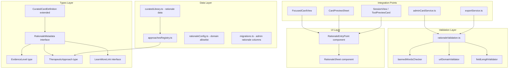

# Design Document: Tool Rationale & Evidence Layer

## Overview

This feature adds a structured rationale and evidence layer to every curated tool card in Mental Health Wallet. Users see a "Why this might help" entry point on card surfaces that opens a bottom sheet explaining the tool's purpose, mechanism, and research backing. The design emphasizes honest, measured language and credible sourcing.

The implementation extends the existing `CuratedCardDefinition` type with rationale metadata, introduces validation utilities for content quality, and adds two new UI components (entry point + rationale sheet) that integrate into existing card display contexts.

## Architecture



## Components and Interfaces

### Type Definitions

```typescript
// src/types/rationale.ts

/**
 * Evidence level categorization for tool research backing.
 * Enforced as a TypeScript union — only these four values compile.
 */
export type EvidenceLevel =
  | 'strong'
  | 'moderate'
  | 'emerging'
  | 'not_specifically_studied';

/**
 * Recognized therapeutic approaches (allowlist).
 * New values require explicit addition to this union.
 */
export type TherapeuticApproach =
  | 'CBT'
  | 'DBT'
  | 'ACT'
  | 'mindfulness-based stress reduction'
  | 'positive psychology'
  | 'somatic techniques'
  | 'grounding'
  | 'behavioral activation'
  | 'psychoeducation'
  | 'self-compassion';

/**
 * External link to a credible educational resource.
 */
export interface LearnMoreLink {
  title: string;   // max 100 characters
  url: string;     // must be valid HTTPS URL on allowlisted domain
}

/**
 * Complete rationale metadata attached to a curated card.
 */
export interface RationaleMetadata {
  approach: TherapeuticApproach;
  inANutshell: string;           // max 300 characters
  howItWorks: string;            // max 600 characters
  evidenceLevel: EvidenceLevel;
  researchSummary: [string, string] | [string, string, string]; // 2-3 items, each max 200 chars
  learnMoreLinks?: LearnMoreLink[];
}
```

### Approaches Registry

```typescript
// src/data/approachesRegistry.ts

import type { TherapeuticApproach } from '@/types/rationale';

export interface ApproachDescription {
  approach: TherapeuticApproach;
  shortDescription: string;       // shared evidence description for this approach
  fullDescription: string;        // longer form for potential future UI
}

/**
 * Single source of truth for approach-level evidence descriptions.
 * When updated here, all cards referencing the approach reflect
 * the change on next render/load.
 */
export const APPROACHES_REGISTRY: Record<TherapeuticApproach, ApproachDescription> = {
  'CBT': {
    approach: 'CBT',
    shortDescription: 'Cognitive Behavioral Therapy techniques...',
    fullDescription: '...',
  },
  // ... one entry per TherapeuticApproach value
};
```

### Domain Allowlist Configuration

```typescript
// src/data/rationaleConfig.ts

/**
 * Credible source domains for learn_more_links validation.
 * New domains require explicit addition before use.
 */
export const CREDIBLE_DOMAINS: readonly string[] = [
  'pmc.ncbi.nlm.nih.gov',
  'pubmed.ncbi.nlm.nih.gov',
  'albertahealthservices.ca',
  'camh.ca',
  'sciencedirect.com',
  'positivepsychology.com',
  'cogbtherapy.com',
  'who.int',
  'nhs.uk',
] as const;

/**
 * Words banned from rationale text fields.
 * Enforces honest, measured tone.
 */
export const BANNED_WORDS: readonly string[] = [
  'cure',
  'fix',
  'guarantee',
  'proven',
  'always works',
] as const;

/**
 * Field length constraints for rationale metadata.
 */
export const RATIONALE_LIMITS = {
  approach: 100,
  inANutshell: 300,
  howItWorks: 600,
  researchSummaryItem: 200,
  researchSummaryMinItems: 2,
  researchSummaryMaxItems: 3,
  learnMoreLinkTitle: 100,
} as const;
```

### Extended CuratedCardDefinition

The existing `CuratedCardDefinition` interface in `src/data/curatedLibrary.ts` gains an optional `rationale` field:

```typescript
import type { RationaleMetadata } from '@/types/rationale';

export interface CuratedCardDefinition {
  // ... existing fields unchanged ...
  rationale?: RationaleMetadata;
}
```

For the initial implementation, all 20 curated cards will have `rationale` populated (required by Requirement 7). The field is typed as optional to support the transition period during development and to avoid breaking the admin card flow until rationale is filled.

### Validation Utilities

```typescript
// src/utils/rationaleValidation.ts

import type { RationaleMetadata, LearnMoreLink, EvidenceLevel, TherapeuticApproach } from '@/types/rationale';
import type { ValidationResult } from '@/types/index';
import { CREDIBLE_DOMAINS, BANNED_WORDS, RATIONALE_LIMITS } from '@/data/rationaleConfig';

/**
 * Validates a complete RationaleMetadata object.
 * Returns all validation errors found.
 */
export function validateRationaleMetadata(metadata: Partial<RationaleMetadata>): ValidationResult;

/**
 * Checks a text field for banned words.
 * Returns the first banned word found, or null if clean.
 */
export function findBannedWord(text: string): string | null;

/**
 * Validates a URL against the credible domains allowlist.
 * Extracts domain from URL and checks membership.
 */
export function isAllowedDomain(url: string): boolean;

/**
 * Validates the learn_more_links array (all-or-nothing semantics).
 * If ANY entry is invalid, the entire array is rejected.
 */
export function validateLearnMoreLinks(links: LearnMoreLink[] | undefined): ValidationResult;

/**
 * Validates that a string is a valid HTTPS URL.
 */
export function isValidHttpsUrl(url: string): boolean;

/**
 * Validates that a value is a valid TherapeuticApproach.
 */
export function isValidApproach(value: string): value is TherapeuticApproach;

/**
 * Validates that a value is a valid EvidenceLevel.
 */
export function isValidEvidenceLevel(value: string): value is EvidenceLevel;
```

### RationaleSheet Component

```typescript
// src/components/rationale/RationaleSheet.tsx

import type { RationaleMetadata } from '@/types/rationale';

interface RationaleSheetProps {
  visible: boolean;
  rationale: RationaleMetadata;
  /** Card title for the sheet header */
  cardTitle: string;
  /** Whether the card's emotion tags include distress emotions */
  isDistressRelated: boolean;
  onDismiss: () => void;
  /** Navigate to Crisis Resources screen */
  onCrisisResourcesPress: () => void;
}
```

Implementation approach:
- Uses React Native `Modal` with `animationType="slide"` (consistent with existing `CardPreviewSheet` and `BackgroundCustomizerSheet` patterns)
- `Pressable` backdrop for tap-to-dismiss
- `ScrollView` for content that exceeds visible area
- Maximum height: 90% of screen height via `Dimensions.get('window').height * 0.9`
- Close button (X) in top-right corner
- Swipe-down gesture using `PanResponder` or Reanimated `Gesture` for dismiss

Content sections rendered in order:
1. Card title (header)
2. "In a nutshell" section with `inANutshell` text
3. "How it works" section with `howItWorks` text
4. Evidence level badge/indicator
5. "What we know from research" section with `researchSummary` bullets
6. Disclaimer (only when `evidenceLevel === 'not_specifically_studied'`)
7. "Learn more" section with tappable links (only when `learnMoreLinks` is non-empty and valid)

### RationaleEntryPoint Component

```typescript
// src/components/rationale/RationaleEntryPoint.tsx

interface RationaleEntryPointProps {
  /** The in_a_nutshell text — if empty/whitespace, component renders null */
  inANutshell: string | undefined;
  /** Callback when tapped — opens the RationaleSheet */
  onPress: () => void;
}
```

Implementation approach:
- Returns `null` if `inANutshell` is falsy or whitespace-only
- Renders a `TouchableOpacity` with text "Why this might help" (info icon optional)
- Minimum hit area: 44×44 points (via `minWidth`/`minHeight` or `hitSlop`)
- `accessibilityRole="button"` and `accessibilityLabel="Why this might help"`
- Styled as a subtle text link (muted color, small font) to avoid visual clutter

### Evidence Level Indicator

Maps `EvidenceLevel` to plain-language labels:

| Value | Display Label |
|-------|------|
| `strong` | "Well-researched approach" |
| `moderate` | "Growing research support" |
| `emerging` | "Early research" |
| `not_specifically_studied` | "Based on general principles" |

Rendered as a small badge/tag with a subtle background color and icon.

### Integration Points

**FocusedCardView** — Add `RationaleEntryPoint` in the card body between description and stats:
- The existing `renderDescriptionSuffix` prop or a new dedicated slot
- Only visible when card is focused (not expanded for active use)

**CardPreviewSheet** (Library Browser) — Add `RationaleEntryPoint` below the card description in the preview modal.

**ToolPreviewCard / SessionView** (Emotion Session) — Add `RationaleEntryPoint` in the card preview during tool selection.

**Hidden contexts** (no entry point rendered):
- `StackedCardList` / `CardEdge` — collapsed cards show only edges
- `ExpandedCardView` / `ExpandedContent` — user is actively using the tool
- `ArchiveScreen` — cards are archived for storage, not engagement

### Admin Card Service Updates

New database columns for admin-created library cards (added via migration):

```sql
ALTER TABLE cards ADD COLUMN rationale_approach TEXT;
ALTER TABLE cards ADD COLUMN rationale_in_a_nutshell TEXT;
ALTER TABLE cards ADD COLUMN rationale_how_it_works TEXT;
ALTER TABLE cards ADD COLUMN rationale_evidence_level TEXT;
ALTER TABLE cards ADD COLUMN rationale_research_summary TEXT; -- JSON array
ALTER TABLE cards ADD COLUMN rationale_learn_more_links TEXT; -- JSON array or NULL
```

The `createLibraryCard` function gains an optional `rationale` parameter. The `serializeToCuratedDefinition` function in `exportService.ts` is extended to emit the `rationale` field in the generated TypeScript literal, and to validate completeness before allowing export.

### Export Service Updates

`serializeToCuratedDefinition` changes:
1. Read rationale columns from the card's DB row
2. Include `rationale: { ... }` in the serialized output
3. New `validateExportReadiness(card)` function that checks all required rationale fields are populated before serialization; returns a `ValidationResult` with field-specific error messages

## Data Models

### Database Migration

```sql
-- Migration: add_rationale_columns
-- Added to runRationaleMigration() in migrations.ts

ALTER TABLE cards ADD COLUMN rationale_approach TEXT;
ALTER TABLE cards ADD COLUMN rationale_in_a_nutshell TEXT;
ALTER TABLE cards ADD COLUMN rationale_how_it_works TEXT;
ALTER TABLE cards ADD COLUMN rationale_evidence_level TEXT
  CHECK(rationale_evidence_level IS NULL OR rationale_evidence_level IN (
    'strong', 'moderate', 'emerging', 'not_specifically_studied'
  ));
ALTER TABLE cards ADD COLUMN rationale_research_summary TEXT; -- JSON string[]
ALTER TABLE cards ADD COLUMN rationale_learn_more_links TEXT; -- JSON LearnMoreLink[] | null
```

These columns are nullable because:
- Existing user-created cards ("my_tool") don't have rationale
- Admin cards being drafted may not yet have rationale filled in
- Only admin export requires all fields to be present

### Static Curated Library Data Shape

Each entry in `CURATED_LIBRARY` gains:

```typescript
{
  id: 'lib-grounding-54321',
  title: '5-4-3-2-1 Grounding',
  // ... existing fields ...
  rationale: {
    approach: 'grounding',
    inANutshell: 'Redirects attention from anxious thoughts to present-moment sensory input, which may help interrupt the stress response.',
    howItWorks: 'Grounding exercises engage the prefrontal cortex by asking it to categorize sensory data. This shift in attention can reduce amygdala activation associated with anxiety. The 5-4-3-2-1 structure provides a simple framework that works even when concentration is low.',
    evidenceLevel: 'moderate',
    researchSummary: [
      'Grounding techniques are widely used in trauma-informed care and anxiety management protocols.',
      'Research suggests sensory-based interventions may reduce acute distress by redirecting cognitive resources.',
    ],
    learnMoreLinks: [
      {
        title: 'Grounding techniques for anxiety — NHS',
        url: 'https://nhs.uk/mental-health/self-help/tips-and-support/how-to-reduce-stress/',
      },
    ],
  },
}
```

## Correctness Properties

*A property is a characteristic or behavior that should hold true across all valid executions of a system — essentially, a formal statement about what the system should do. Properties serve as the bridge between human-readable specifications and machine-verifiable correctness guarantees.*

### Property 1: Rationale metadata validation rejects invalid field lengths

*For any* object with `inANutshell` exceeding 300 characters, or `howItWorks` exceeding 600 characters, or `approach` exceeding 100 characters, or a `researchSummary` item exceeding 200 characters, the `validateRationaleMetadata` function SHALL return an invalid result identifying the offending field.

**Validates: Requirements 1.1, 7.2, 7.3, 7.4**

### Property 2: Evidence level validation accepts only defined values

*For any* string value, the `isValidEvidenceLevel` function SHALL return `true` if and only if the value is one of `"strong"`, `"moderate"`, `"emerging"`, or `"not_specifically_studied"`.

**Validates: Requirements 1.3, 7.5, 8.4**

### Property 3: Research summary cardinality validation

*For any* array of strings, `validateRationaleMetadata` SHALL reject arrays with fewer than 2 items or more than 3 items in the `researchSummary` field.

**Validates: Requirements 1.4, 7.6**

### Property 4: Learn-more-links all-or-nothing validation

*For any* array of `LearnMoreLink` objects where at least one entry has an empty title, empty URL, or non-HTTPS URL, the `validateLearnMoreLinks` function SHALL reject the entire array. Conversely, *for any* array where all entries have non-empty titles and valid HTTPS URLs on allowlisted domains, the function SHALL accept the array.

**Validates: Requirements 1.5, 6.2**

### Property 5: Entry point visibility derives from in_a_nutshell content

*For any* string that is empty, undefined, or composed entirely of whitespace characters, the `RationaleEntryPoint` component SHALL render nothing (null). *For any* string containing at least one non-whitespace character, the component SHALL render the entry point element.

**Validates: Requirements 2.1, 2.2**

### Property 6: Banned words checker rejects text containing forbidden terms

*For any* string containing any word from the banned list (`"cure"`, `"fix"`, `"guarantee"`, `"proven"`, `"always works"`), the `findBannedWord` function SHALL return a non-null result identifying the banned word. *For any* string that does not contain any banned word, the function SHALL return null.

**Validates: Requirements 5.1, 5.2**

### Property 7: Approach allowlist validation

*For any* string value, the `isValidApproach` function SHALL return `true` if and only if the value matches one of the defined `TherapeuticApproach` union members.

**Validates: Requirements 6.1, 8.4**

### Property 8: URL domain allowlist validation

*For any* valid HTTPS URL, the `isAllowedDomain` function SHALL return `true` if and only if the URL's hostname matches (or is a subdomain of) a domain in the `CREDIBLE_DOMAINS` allowlist.

**Validates: Requirements 6.2**

### Property 9: Curated library completeness

*For every* card in the `CURATED_LIBRARY` array, the `rationale` field SHALL be defined and SHALL pass `validateRationaleMetadata` without errors — specifically: `approach` is a valid `TherapeuticApproach`, `inANutshell` is non-empty and ≤ 300 chars, `howItWorks` is non-empty and ≤ 600 chars, `evidenceLevel` is a valid `EvidenceLevel`, and `researchSummary` has 2-3 items each ≤ 200 chars.

**Validates: Requirements 7.1, 7.2, 7.3, 7.4, 7.5, 7.6**

### Property 10: Export serialization includes all rationale fields

*For any* card with complete rationale metadata (all required fields populated), `serializeToCuratedDefinition` SHALL produce output containing the `rationale` key with all sub-fields (`approach`, `inANutshell`, `howItWorks`, `evidenceLevel`, `researchSummary`).

**Validates: Requirements 8.2**

### Property 11: Export blocks on missing rationale fields

*For any* admin card where at least one required rationale field (`approach`, `inANutshell`, `howItWorks`, `evidenceLevel`, or `researchSummary`) is missing or empty, the export validation SHALL return an invalid result and SHALL identify which fields are incomplete.

**Validates: Requirements 8.3**

### Property 12: Evidence level to display label mapping is total

*For any* valid `EvidenceLevel` value, the label mapping function SHALL return a non-empty string. The mapping SHALL be injective (each level maps to a distinct label).

**Validates: Requirements 4.1**

### Property 13: Distress-related cards reference professional help

*For every* card in the `CURATED_LIBRARY` whose `emotionTags` include any of `"anxious"`, `"angry"`, or `"stressed"`, at least one item in `researchSummary` SHALL contain a reference to seeking professional help (verified by presence of keywords like "professional", "therapist", or "clinician").

**Validates: Requirements 5.3**

## Error Handling

| Scenario | Behavior |
|----------|----------|
| `learn_more_link` URL fails to open (Linking.openURL throws) | Display inline error toast within the Rationale Sheet: "This link couldn't be opened." Sheet stays open. |
| Rationale data missing on curated card at runtime | `RationaleEntryPoint` renders nothing (graceful degradation). No crash. |
| Admin exports card with incomplete rationale | `validateExportReadiness` returns validation errors; export is blocked. User sees list of missing fields. |
| Banned word detected during admin card save | Validation warning shown inline on the affected field. Save is allowed (soft warning) but export requires clean text. |
| URL domain not on allowlist during admin input | Inline validation error: "This domain is not on the approved sources list." Field marked as invalid. |
| `evidence_level` value not in allowed set (DB corruption edge case) | Runtime fallback to `"not_specifically_studied"` with disclaimer shown. Log warning. |

## Testing Strategy

### Property-Based Tests (fast-check 3)

Property-based tests verify universal correctness properties using randomized inputs. Each property test runs a minimum of 100 iterations.

**Test files:**
- `src/utils/__tests__/rationaleValidation.property.test.ts` — Properties 1-8, 12
- `src/data/__tests__/curatedLibrary.rationale.property.test.ts` — Properties 9, 13
- `src/services/__tests__/exportService.rationale.property.test.ts` — Properties 10, 11

**Tag format:** Each test is tagged with:
```
// Feature: tool-rationale-evidence, Property {N}: {property text}
```

**Library:** fast-check 3 (already installed)

### Unit Tests (Jest)

Example-based tests for:
- `RationaleEntryPoint` rendering in each visible/hidden context
- `RationaleSheet` section ordering and conditional sections
- Evidence level badge label display
- Disclaimer presence/absence based on evidence level
- Link tap behavior and error handling
- Accessibility attributes (label, role, tap target dimensions)
- Admin card creation with rationale fields
- Database migration column existence

### Integration Tests

- Full flow: tap entry point → sheet opens → scroll content → tap link → browser opens
- Admin flow: create card with rationale → export → verify serialized output
- Library completeness: all 20 curated cards pass validation (also covered by Property 9)

### Test Configuration

```typescript
// fast-check property test configuration
fc.assert(
  fc.property(/* arbitraries */, (input) => {
    // assertion
  }),
  { numRuns: 100 }
);
```
