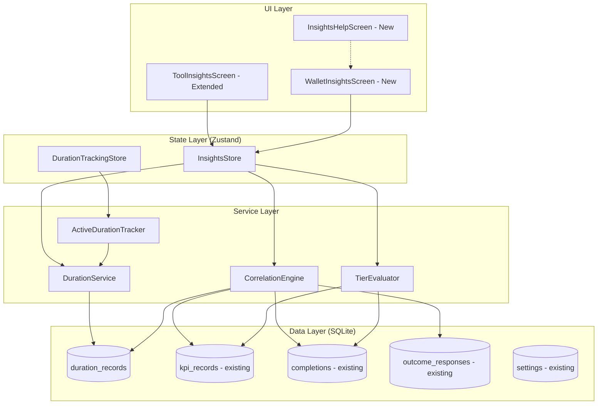
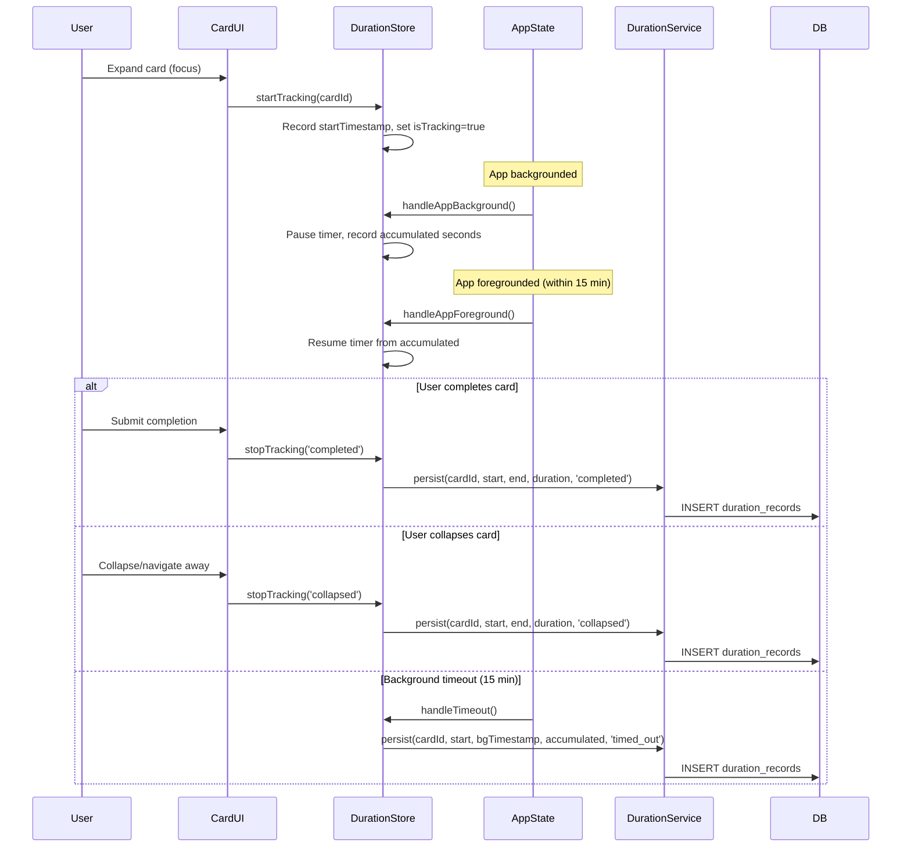
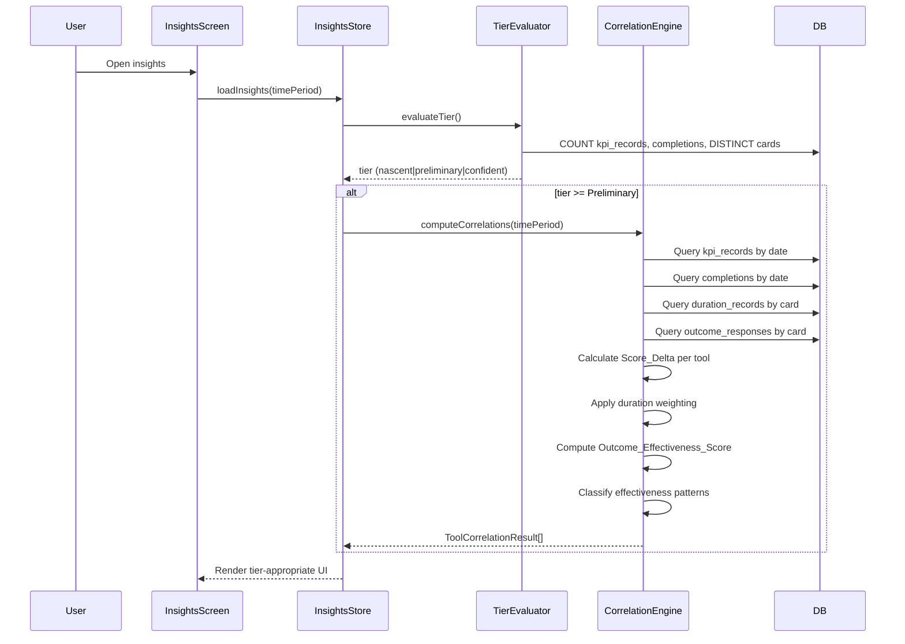
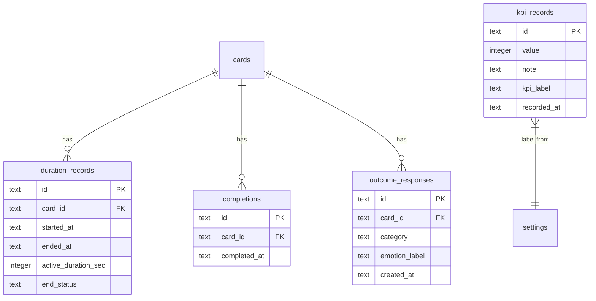

# Design Document: Usage-Outcome Insights

## Overview

Usage-Outcome Insights extends the Mental Health Wallet with two analytical dimensions: **duration tracking** (measuring active engagement time per tool) and **correlation analysis** (connecting tool usage patterns to changes in the user's Personal KPI scores). The system introduces a new `CorrelationEngine` service that computes per-tool and wallet-level correlations, an `ActiveDurationTracker` that measures foreground engagement time, and two new UI screens that present insights progressively based on data availability.

The design integrates with existing infrastructure:
- **CompletionService** — existing completion records provide frequency data
- **KpiService** — existing kpi_records provide Daily_Check_In_Score data
- **OutcomeService** (from user-facing-outcomes spec) — outcome_responses feed the Outcome_Effectiveness_Score
- **Per-tool insights panel** (from per-tool-insights spec) — extended with new sections

Key design decisions:
1. **On-device computation only** — all correlation math runs locally in SQLite queries + TypeScript, no server calls
2. **Lazy recomputation** — correlations are computed fresh each time an insights screen opens (no background jobs)
3. **Progressive disclosure via tiers** — prevents misleading insights from sparse data
4. **Duration tracking via AppState listener** — uses React Native's AppState API to pause/resume timing when backgrounded


## Architecture

### High-Level System Diagram




### Duration Tracking Flow




### Correlation Computation Flow




## Components and Interfaces

### New Service: DurationService

Handles persistence and querying of duration records. Follows the existing factory pattern.

```typescript
// src/services/durationService.ts

export type DurationEndStatus = 'completed' | 'collapsed' | 'timed_out';

export interface DurationRecord {
  id: string;
  cardId: string;
  startedAt: string;       // UTC ISO 8601
  endedAt: string;         // UTC ISO 8601
  activeDurationSec: number; // whole seconds of foreground time
  endStatus: DurationEndStatus;
}

export interface DurationQueryOptions {
  cardId?: string;
  startDate?: string;      // inclusive, ISO 8601
  endDate?: string;        // inclusive, ISO 8601
  endStatus?: DurationEndStatus;
}

export interface DurationStats {
  averageDurationSec: number;
  totalRecords: number;
  recentAverageSec: number;    // last 5 completed sessions
  trendDirection: 'more' | 'less' | 'consistent'; // >=15% above = more, >=15% below = less
}

export interface DurationService {
  /** Persist a duration record. Discards if activeDurationSec < 3. */
  persist(record: Omit<DurationRecord, 'id'>): Promise<DurationRecord | null>;

  /** Query duration records with flexible filters. */
  query(options: DurationQueryOptions): Promise<DurationRecord[]>;

  /** Get computed stats for a card (requires min 3 completed records). Optionally filter by startDate. */
  getStats(cardId: string, startDate?: string): Promise<DurationStats | null>;

  /** Get average active duration for a card (for weighting). */
  getCardAverageDuration(cardId: string): Promise<number | null>;

  /** Delete all duration records (for data reset). */
  deleteAll(): Promise<void>;
}

export function createDurationService(): DurationService {
  // Implementation uses getDatabase() + SQL queries
}
```


### New Service: TierEvaluator

Determines the user's current Insight_Tier based on data thresholds.

```typescript
// src/services/tierEvaluator.ts

export type InsightTier = 'below_nascent' | 'nascent' | 'preliminary' | 'confident';

export interface TierProgress {
  currentTier: InsightTier;
  checkInCount: number;
  toolUseCount: number;
  distinctToolCount: number;
  // Progress toward next tier
  nextTier: InsightTier | null;
  checkInsNeeded: number;    // 0 if threshold met
  toolUsesNeeded: number;    // 0 if threshold met
  distinctToolsNeeded: number; // 0 if threshold met
}

export interface TierEvaluator {
  /** Evaluate the user's current tier and progress toward next. */
  evaluate(): Promise<TierProgress>;

  /** Check if a specific card has enough data for correlation at the given tier. */
  cardQualifiesForCorrelation(
    cardId: string,
    tier: InsightTier,
    timePeriod: TimePeriod
  ): Promise<boolean>;
}

export type TimePeriod = '7d' | '30d' | '90d' | 'all';

// Thresholds (constants)
export const TIER_THRESHOLDS = {
  nascent: { checkIns: 3, toolUses: 3, distinctTools: 1 },
  preliminary: { checkIns: 7, toolUses: 5, distinctTools: 2 },
  confident: { checkIns: 14, toolUses: 10, distinctTools: 2 },
} as const;

export function createTierEvaluator(): TierEvaluator {
  // Implementation queries kpi_records count + completions count + distinct card_id count
}
```


### New Service: CorrelationEngine

The core computation module. Computes Tool_Outcome_Correlation and Outcome_Effectiveness_Score.

```typescript
// src/services/correlationEngine.ts

export interface ToolCorrelationResult {
  cardId: string;
  cardTitle: string;
  scoreDelta: number;              // avg score on tool-associated days - avg on other days
  correlationDirection: 'positive' | 'neutral' | 'negative'; // +0.3, -0.3 thresholds
  sampleSizeToolDays: number;      // number of tool-associated days
  sampleSizeOtherDays: number;     // number of non-tool days
  avgDurationSec: number | null;   // average active duration for this tool
  outcomeEffectivenessScore: number | null; // 0.0-1.0 if >=5 outcome responses
  effectivenessPattern: EffectivenessPattern | null;
}

export type EffectivenessPattern =
  | 'helpful_on_hard_days'   // negative/neutral correlation + high effectiveness (>=0.6)
  | 'reliable_booster'       // positive correlation + high effectiveness (>=0.6)
  | 'comfort_tool'           // negative/neutral correlation + moderate effectiveness (0.3-0.6)
  | 'not_helping';           // neutral/negative correlation + low effectiveness (<0.3)

export interface WalletCorrelationResult {
  weeklyAvgScore: number[];        // weekly average KPI scores for chart
  weeklyTotalDurationMin: number[]; // weekly total duration in minutes for chart
  overallTrend: 'positive' | 'neutral' | 'negative';
  summaryText: string;             // plain-language insight
}

export interface BestToolEntry {
  cardId: string;
  cardTitle: string;
  scoreDelta: number;
  avgDurationSec: number;
  descriptorLabel: string;         // e.g. "Linked to +1.2 higher check-in days"
  isHedged: boolean;               // true at Preliminary tier
}

export interface CorrelationEngine {
  /** Compute per-tool correlations for all tools with enough data. */
  computeToolCorrelations(timePeriod: TimePeriod): Promise<ToolCorrelationResult[]>;

  /** Compute correlation for a single tool. */
  computeSingleToolCorrelation(
    cardId: string,
    timePeriod: TimePeriod
  ): Promise<ToolCorrelationResult | null>;

  /** Compute wallet-level summary for the dual-axis chart. */
  computeWalletCorrelation(timePeriod: TimePeriod): Promise<WalletCorrelationResult>;

  /** Get Best Tools ranking (filtered and sorted). */
  getBestTools(
    tier: InsightTier,
    timePeriod: TimePeriod
  ): Promise<BestToolEntry[]>;

  /** Get tools that qualify for "Tools to Reconsider". */
  getToolsToReconsider(timePeriod: TimePeriod): Promise<ToolCorrelationResult[]>;

  /** Check if user has changed KPI label within the given time period. */
  detectKpiLabelChange(timePeriod: TimePeriod): Promise<KpiLabelChange | null>;
}

export interface KpiLabelChange {
  previousLabel: string;
  newLabel: string;
  changedAt: string;
}

export function createCorrelationEngine(): CorrelationEngine {
  // Implementation details below in algorithms section
}
```


### New Store: DurationTrackingStore (Zustand)

Manages the in-memory state of an active duration tracking session.

```typescript
// src/stores/durationTrackingStore.ts

export interface DurationTrackingState {
  /** Whether a card session is currently being timed. */
  isTracking: boolean;
  /** The card currently being tracked. */
  activeCardId: string | null;
  /** UTC ISO 8601 timestamp when tracking started. */
  startTimestamp: string | null;
  /** Accumulated foreground seconds (updates on pause). */
  accumulatedSec: number;
  /** Timestamp when app was last backgrounded (null if in foreground). */
  backgroundedAt: string | null;

  // Actions
  startTracking: (cardId: string) => void;
  stopTracking: (endStatus: DurationEndStatus) => Promise<void>;
  handleAppBackground: () => void;
  handleAppForeground: () => void;
}
```

### New Store: InsightsStore (Zustand)

Manages computed insights state for both per-tool and wallet-level screens.

```typescript
// src/stores/insightsStore.ts

export interface InsightsState {
  /** Current tier evaluation. */
  tierProgress: TierProgress | null;
  /** Loading state. */
  isLoading: boolean;
  /** Selected time period. */
  timePeriod: TimePeriod;
  /** Wallet-level correlation data. */
  walletCorrelation: WalletCorrelationResult | null;
  /** Best tools ranking. */
  bestTools: BestToolEntry[];
  /** Tools to reconsider. */
  toolsToReconsider: ToolCorrelationResult[];
  /** KPI label change notice. */
  kpiLabelChange: KpiLabelChange | null;
  /** User's choice for historical data inclusion. */
  includePreChangeData: boolean;
  /** Dismissed "keep" tool IDs for current period. */
  dismissedToolIds: string[];
  /** First-time hint states per tier. */
  tierHintsDismissed: Record<InsightTier, boolean>;
  /** Whether first-visit privacy note was shown. */
  privacyNoteShown: boolean;

  // Actions
  loadWalletInsights: () => Promise<void>;
  setTimePeriod: (period: TimePeriod) => void;
  setIncludePreChangeData: (include: boolean) => Promise<void>;
  dismissTool: (cardId: string) => Promise<void>;
  dismissTierHint: (tier: InsightTier) => Promise<void>;
  markPrivacyNoteShown: () => Promise<void>;
}
```


### New UI Components

| Component | Location | Purpose |
|-----------|----------|---------|
| `WalletInsightsScreen` | `src/screens/WalletInsightsScreen.tsx` | Top-level wallet insights screen (Req 5, 6, 13) |
| `InsightsHelpScreen` | `src/screens/InsightsHelpScreen.tsx` | "How this works" help page (Req 11.5-8) |
| `BestToolsSection` | `src/components/insights/BestToolsSection.tsx` | Ranked tools list with tier-appropriate display |
| `EngagementMessage` | `src/components/insights/EngagementMessage.tsx` | Weekly activity reinforcement messaging |
| `OutcomeTrendsSection` | `src/components/insights/OutcomeTrendsSection.tsx` | KPI trend + dual-axis chart |
| `TrySomethingDifferent` | `src/components/insights/TrySomethingDifferent.tsx` | Unused tools suggestion |
| `ToolsToReconsider` | `src/components/insights/ToolsToReconsider.tsx` | Tools not helping section |
| `TierProgressCard` | `src/components/insights/TierProgressCard.tsx` | Progress bar toward next tier |
| `DailyCheckInImpact` | `src/components/insights/DailyCheckInImpact.tsx` | Per-tool correlation card |
| `EngagementSection` | `src/components/insights/EngagementSection.tsx` | Duration stats per tool |
| `CorrelationDisclaimer` | `src/components/insights/CorrelationDisclaimer.tsx` | Shared disclaimer component |
| `InsightTooltip` | `src/components/insights/InsightTooltip.tsx` | Reusable tooltip/bottom-sheet for explanations |
| `DualAxisChart` | `src/components/insights/DualAxisChart.tsx` | Weekly KPI + duration overlay chart |
| `TimePeriodSelector` | `src/components/insights/TimePeriodSelector.tsx` | Segmented control for time periods |
| `TierHintBanner` | `src/components/insights/TierHintBanner.tsx` | One-time contextual hint per tier |

### Navigation Changes

```typescript
// Added to RootStackParamList
export type RootStackParamList = {
  // ... existing routes
  WalletInsights: undefined;
  InsightsHelp: undefined;
};
```

The WalletInsightsScreen is accessed from the wallet header kebab menu via an "Insights" item. The per-tool insights panel (existing `ToolInsightsScreen`) is extended with new sections; its route remains unchanged.

### ActiveDurationTracker (Non-Service Utility)

A module that integrates with React Native's `AppState` API to manage timer state. This is not a service (no DB access) — it coordinates with the store and service.

```typescript
// src/utils/activeDurationTracker.ts

export interface ActiveDurationTracker {
  /** Register AppState listener. Call on app mount. */
  initialize(): void;
  /** Remove AppState listener. Call on app unmount. */
  teardown(): void;
}

export function createActiveDurationTracker(
  store: DurationTrackingState
): ActiveDurationTracker {
  // Uses AppState.addEventListener('change', ...)
  // On 'background': calls store.handleAppBackground()
  // On 'active': calls store.handleAppForeground()
  // Manages a 15-minute setTimeout for background timeout
}
```


## Data Models

### New Table: `duration_records`

```sql
CREATE TABLE IF NOT EXISTS duration_records (
  id TEXT PRIMARY KEY,
  card_id TEXT NOT NULL REFERENCES cards(id) ON DELETE CASCADE,
  started_at TEXT NOT NULL,
  ended_at TEXT NOT NULL,
  active_duration_sec INTEGER NOT NULL CHECK(active_duration_sec >= 3),
  end_status TEXT NOT NULL CHECK(end_status IN ('completed', 'collapsed', 'timed_out'))
);

CREATE INDEX IF NOT EXISTS idx_duration_records_card ON duration_records(card_id);
CREATE INDEX IF NOT EXISTS idx_duration_records_date ON duration_records(started_at);
CREATE INDEX IF NOT EXISTS idx_duration_records_status ON duration_records(end_status);
```

### Settings Keys (added to existing `settings` table)

| Key | Default Value | Description |
|-----|---------------|-------------|
| `insights_include_pre_change_data` | `"true"` | Whether to include KPI data from before a label change |
| `insights_privacy_note_shown` | `"false"` | Whether the first-visit privacy note has been displayed |
| `insights_tier_hint_nascent` | `"false"` | Whether nascent tier hint was dismissed |
| `insights_tier_hint_preliminary` | `"false"` | Whether preliminary tier hint was dismissed |
| `insights_tier_hint_confident` | `"false"` | Whether confident tier hint was dismissed |
| `insights_dismissed_tools` | `"[]"` | JSON array of tool IDs dismissed from "reconsider" for current period |

### Entity Relationship




### Migration Strategy

A new `runDurationMigration` function will be added to `migrations.ts` and called from `runMigrations()`. Uses `CREATE TABLE IF NOT EXISTS` for idempotency (same pattern as existing migrations).

```typescript
// Added to src/data/migrations.ts
export async function runDurationMigration(db: SQLiteDatabase): Promise<void> {
  await db.execAsync(DURATION_SCHEMA_SQL);
}

const DURATION_SCHEMA_SQL = `
CREATE TABLE IF NOT EXISTS duration_records (
  id TEXT PRIMARY KEY,
  card_id TEXT NOT NULL REFERENCES cards(id) ON DELETE CASCADE,
  started_at TEXT NOT NULL,
  ended_at TEXT NOT NULL,
  active_duration_sec INTEGER NOT NULL CHECK(active_duration_sec >= 3),
  end_status TEXT NOT NULL CHECK(end_status IN ('completed', 'collapsed', 'timed_out'))
);

CREATE INDEX IF NOT EXISTS idx_duration_records_card ON duration_records(card_id);
CREATE INDEX IF NOT EXISTS idx_duration_records_date ON duration_records(started_at);
CREATE INDEX IF NOT EXISTS idx_duration_records_status ON duration_records(end_status);
`;
```

## Algorithms

### Tool_Outcome_Correlation Computation

The algorithm computes the Score_Delta for a given tool over a time period:

```typescript
/**
 * Pseudocode for computeSingleToolCorrelation
 *
 * 1. Fetch all kpi_records within the time period → kpiRecords[]
 * 2. Fetch all completions for cardId within the time period → completions[]
 * 3. Fetch duration_records for cardId → durations[]
 * 4. Compute the card's average duration (for weighting)
 *
 * 5. Build a set of "tool-associated days":
 *    For each completion day D, add D and D-1 to the set.
 *
 * 6. Partition kpiRecords into two groups:
 *    - toolDayScores: records where date(recorded_at) is in tool-associated days
 *    - otherDayScores: all other records
 *
 * 7. Compute weighted average for tool days:
 *    For each KPI record on a tool day:
 *      - Find any duration record on that day for this card
 *      - weight = duration / cardAvgDuration (clamped 0.5–2.0)
 *      - If no duration record, weight = 1.0
 *    weightedAvg = sum(score * weight) / sum(weight)
 *
 * 8. Compute simple average for other days:
 *    otherAvg = sum(otherDayScores.value) / count
 *
 * 9. Score_Delta = weightedAvg - otherAvg
 *
 * 10. Classify:
 *     - Score_Delta >= +0.3 → 'positive'
 *     - Score_Delta <= -0.3 → 'negative'
 *     - else → 'neutral'
 */
```


### Duration Weighting Formula

```
weight = clamp(session_duration / card_average_duration, 0.5, 2.0)
```

- `session_duration`: the active_duration_sec of the specific session on that day
- `card_average_duration`: average active_duration_sec across all completed sessions for this card
- Clamped to [0.5, 2.0] to prevent outliers from dominating
- Sessions without duration data (legacy, pre-feature) use weight = 1.0
- Multiple sessions on the same day: use the longest session's weight for that day's KPI score

### Outcome_Effectiveness_Score

```
OES = count(positive_outcomes) / count(all_outcomes)
```

Where:
- `positive_outcomes` = outcome_responses with category IN ('calmer', 'clear', 'hopeful')
- `all_outcomes` = all outcome_responses for the card within the time period
- Only computed when a card has >= 5 outcome_responses
- Range: 0.0 (never positive) to 1.0 (always positive)

### Effectiveness Pattern Classification

| Pattern | Tool_Outcome_Correlation | Outcome_Effectiveness_Score |
|---------|--------------------------|----------------------------|
| `helpful_on_hard_days` | Score_Delta <= +0.3 (neutral/negative) | >= 0.6 |
| `reliable_booster` | Score_Delta > +0.3 (positive) | >= 0.6 |
| `comfort_tool` | Score_Delta <= +0.3 (neutral/negative) | 0.3 – 0.6 |
| `not_helping` | Score_Delta <= +0.3 (neutral/negative) | < 0.3 |

Note: A tool with positive correlation (Score_Delta > +0.3) and low effectiveness (< 0.6) doesn't receive a pattern classification — it appears as a standard positive correlation without an effectiveness label.

### Best Tools Ranking Algorithm

```typescript
/**
 * 1. Compute Tool_Outcome_Correlation for all tools meeting per-card thresholds
 *    - Preliminary: >= 3 completed uses in period
 *    - Confident: >= 5 completed uses in period
 *
 * 2. Filter: exclude tools with negative Score_Delta (< 0)
 *
 * 3. Sort by Score_Delta descending
 *
 * 4. Tiebreaker (same Score_Delta rounded to 1 decimal):
 *    a. Average Active_Duration descending
 *    b. Tool title alphabetically ascending
 *
 * 5. Limit: Preliminary = top 3, Confident = top 5
 */
```

### "Try Something Different" Selection

```typescript
/**
 * 1. Find tools in wallet (not archived) with no completion in last 7 days
 * 2. If none found → hide section entirely
 * 3. Sort by: total_uses descending (most familiar first)
 * 4. Tiebreaker if equal total_uses:
 *    a. Most recently used (last_used_at DESC)
 *    b. Most recently added (created_at DESC)
 * 5. Take top 2
 */
```

### "Tools to Reconsider" Qualification

```typescript
/**
 * Requirements: Confident tier + per tool:
 *   - >= 8 completed uses within time period
 *   - >= 5 outcome_responses within time period
 *   - Classified as 'not_helping' pattern
 *   - NOT the KPI card (source_library_id != 'lib-personal-kpi')
 *   - NOT in dismissed list for current period
 *
 * Sort: by total uses descending (most-used but unhelpful = most impactful to reconsider)
 * Limit: top 3
 */
```


### Engagement Messaging Logic

```typescript
/**
 * All tiers: Count completions for current calendar week (Mon-Sun)
 *
 * Nascent: "You've practiced {count} times this week"
 *
 * Preliminary:
 *   - Calculate previous week count
 *   - If this week > last week: "You've used your tools {count} times this week — that's more than last week"
 *   - If this week <= last week: "{count} sessions this week so far — every bit counts"
 *
 * Confident:
 *   - Calculate 4-week rolling average (excluding current week)
 *   - If current week >= rolling average: "You've been more active this week — nice work."
 *   - If current week < rolling average * 0.7 (30%+ below): "Quieter week so far — that's okay too."
 *   - Otherwise: "You've practiced {count} times this week"
 */
```

### Time Period Date Boundaries

```typescript
/**
 * Given a TimePeriod, compute the start date (inclusive):
 *   '7d'  → now - 7 days (start of that day UTC)
 *   '30d' → now - 30 days
 *   '90d' → now - 90 days
 *   'all' → no start boundary (earliest available data)
 *
 * End date is always "now" (inclusive of current day).
 *
 * Available periods by tier:
 *   below_nascent: none (no selector shown)
 *   nascent: ['7d', 'all']
 *   preliminary: ['7d', '30d', 'all']
 *   confident: ['7d', '30d', '90d', 'all']
 *
 * Default: shortest period for which user meets at least nascent threshold.
 */
```

### KPI Label Change Detection

```typescript
/**
 * 1. Read 'personal_kpi_history' from settings table (JSON array of KpiChangeRecord)
 * 2. Find any change where changedAt falls within the selected time period
 * 3. If found, return { previousLabel, newLabel, changedAt }
 * 4. The user's 'insights_include_pre_change_data' setting determines:
 *    - true: use ALL kpi_records in the period regardless of label
 *    - false: use only kpi_records where recorded_at >= most recent change date
 */
```


## Correctness Properties

*A property is a characteristic or behavior that should hold true across all valid executions of a system — essentially, a formal statement about what the system should do. Properties serve as the bridge between human-readable specifications and machine-verifiable correctness guarantees.*

### Property 1: Duration session lifecycle produces valid record

*For any* valid card ID and any accumulated foreground duration >= 3 seconds and any end status ('completed', 'collapsed', 'timed_out'), calling `stopTracking` on an active session must produce a `DurationRecord` with: a valid UUID `id`, the correct `cardId`, a valid ISO 8601 UTC `startedAt` timestamp, a valid ISO 8601 UTC `endedAt` >= `startedAt`, `activeDurationSec` equal to the accumulated foreground seconds (whole seconds), and the provided `endStatus`. The session must transition to `isTracking=false` and `activeCardId=null`.

**Validates: Requirements 1.1, 1.2**

### Property 2: Duration pause/resume preserves accumulated time

*For any* active tracking session with accumulated time T seconds, and any background period of duration B where B < 900 seconds (15 minutes), backgrounding and then foregrounding the app must result in accumulated time still equal to T (background time is not counted). Any additional foreground time A after resume must produce a total of T + A seconds.

**Validates: Requirements 1.3**

### Property 3: Background timeout auto-ends with correct metadata

*For any* active tracking session with accumulated time T seconds, when the app is backgrounded and the background duration exceeds 900 seconds (15 minutes), the system must auto-persist a DurationRecord with `endStatus = 'timed_out'`, `endedAt` equal to the moment the app was backgrounded, and `activeDurationSec = T` (the accumulated foreground time up to that point).

**Validates: Requirements 1.4**

### Property 4: Three-second minimum filter

*For any* DurationRecord with `activeDurationSec` < 3, the `persist` function must return null and not store the record. *For any* DurationRecord with `activeDurationSec` >= 3, the `persist` function must store and return a valid record.

**Validates: Requirements 1.6**

### Property 5: Duration query filter correctness

*For any* set of persisted DurationRecords and any valid query combining optional filters (cardId, startDate inclusive, endDate inclusive, endStatus), the query results must contain exactly the records matching ALL specified filter criteria, with no extra records and no missing records.

**Validates: Requirements 1.7**

### Property 6: Duration stats correctness

*For any* card with N >= 3 completed DurationRecords with durations [d1, d2, ..., dN] ordered by date:
- The average must equal `sum(d1..dN) / N` (integer division in seconds).
- When N >= 5, the trend must be:
  - `'more'` if `avg(last 5) > avg(all) * 1.15`
  - `'less'` if `avg(last 5) < avg(all) * 0.85`
  - `'consistent'` otherwise.
- When N < 5, no trend indicator is produced.
- When N < 3, stats return null.

**Validates: Requirements 2.1, 2.2, 2.3**

### Property 7: Tier evaluation correctness

*For any* combination of (checkInCount, toolUseCount, distinctToolCount) where all values are non-negative integers, the tier evaluator must return:
- `'confident'` when checkInCount >= 14 AND toolUseCount >= 10 AND distinctToolCount >= 2
- `'preliminary'` when checkInCount >= 7 AND toolUseCount >= 5 AND distinctToolCount >= 2 (and Confident not met)
- `'nascent'` when checkInCount >= 3 AND toolUseCount >= 3 (and Preliminary not met)
- `'below_nascent'` otherwise

The evaluator must always return the *highest* tier whose ALL thresholds are satisfied.

**Validates: Requirements 3.3, 3.4**

### Property 8: Score_Delta computation with duration weighting

*For any* set of KPI records (each with a date and score 1–10), a set of completions for a given card (each with a date), and a set of duration records for that card:
1. Tool-associated days = the union of {D, D-1} for each completion date D.
2. KPI records are partitioned into tool-day scores and other-day scores based on their date.
3. For each tool-day KPI record, its weight is determined by the duration session on that day: `weight = clamp(sessionDuration / cardAvgDuration, 0.5, 2.0)`, defaulting to 1.0 if no duration exists.
4. `Score_Delta = weightedAvg(tool-day scores) - simpleAvg(other-day scores)`.

The computed Score_Delta must satisfy this formula exactly (within floating-point tolerance of ±0.001).

**Validates: Requirements 3.1, 3.2**

### Property 9: Duration weight clamping

*For any* positive session duration S and positive card average duration A, the computed weight must equal `clamp(S / A, 0.5, 2.0)`. Specifically:
- If S/A < 0.5, weight = 0.5
- If S/A > 2.0, weight = 2.0
- Otherwise, weight = S/A
- If S is null or missing, weight = 1.0

**Validates: Requirements 3.2**

### Property 10: Correlation direction classification

*For any* computed Score_Delta value:
- `'positive'` when Score_Delta >= +0.3
- `'negative'` when Score_Delta <= -0.3
- `'neutral'` when -0.3 < Score_Delta < +0.3

The classification must be exhaustive (every Score_Delta maps to exactly one direction) and mutually exclusive.

**Validates: Requirements 4.2, 4.3, 4.4**

### Property 11: Time period date boundaries

*For any* valid current date and any time period selection:
- `'7d'` → start date is current date minus 7 days (start of that day UTC)
- `'30d'` → start date is current date minus 30 days (start of that day UTC)
- `'90d'` → start date is current date minus 90 days (start of that day UTC)
- `'all'` → no start boundary (null)

End date is always the end of the current day UTC. The computed boundaries must produce an inclusive range [start, end].

**Validates: Requirements 3.7, 5.9**

### Property 12: Engagement messaging logic

*For any* current week session count (C), previous week count (P), and 4-week rolling average (R, excluding current week), at each tier:
- **Nascent**: message is always a simple activity count: "You've practiced {C} times this week"
- **Preliminary**: if C > P → comparative positive message; if C <= P → neutral observation
- **Confident**: if C >= R → positive reinforcement; if C < R * 0.7 → gentle "quieter week" observation; otherwise → neutral count message

**Validates: Requirements 5.7**

### Property 13: Best Tools ranking correctness

*For any* set of tool correlation results, a given tier (preliminary or confident), and a time period:
1. **Filter**: Exclude tools with Score_Delta < 0. Exclude tools with fewer than 3 completed uses (Preliminary) or 5 completed uses (Confident) in the period.
2. **Sort**: By Score_Delta descending.
3. **Tiebreak**: When two tools have the same Score_Delta (rounded to 1 decimal place), sort by average Active_Duration descending, then by tool title alphabetically ascending.
4. **Limit**: Result contains at most 3 entries (Preliminary) or 5 entries (Confident).

The final ranking must satisfy all four constraints simultaneously.

**Validates: Requirements 6.1, 6.4, 6.5, 6.6, 6.7**

### Property 14: "Try Something Different" selection

*For any* set of non-archived tools in the wallet with known last-completion dates and total-use counts:
1. Filter to tools with no completion in the last 7 days.
2. If none qualify → result is empty (section hidden).
3. Sort by total_uses descending, breaking ties by most recently used (last_used_at DESC), then most recently added (created_at DESC).
4. Take the top 2.

**Validates: Requirements 6.10**

### Property 15: Outcome_Effectiveness_Score computation

*For any* set of outcome response records for a card where the total count >= 5, the Outcome_Effectiveness_Score must equal:
`count(records where category IN ('calmer', 'clear', 'hopeful')) / count(all records)`

The result must be in the range [0.0, 1.0]. When total count < 5, the score is null (not computed).

**Validates: Requirements 12.1**

### Property 16: Effectiveness pattern classification

*For any* tool with a computed Score_Delta and Outcome_Effectiveness_Score (OES):
- `'helpful_on_hard_days'` when Score_Delta <= +0.3 AND OES >= 0.6
- `'reliable_booster'` when Score_Delta > +0.3 AND OES >= 0.6
- `'comfort_tool'` when Score_Delta <= +0.3 AND OES >= 0.3 AND OES < 0.6
- `'not_helping'` when Score_Delta <= +0.3 AND OES < 0.3
- No pattern (null) when Score_Delta > +0.3 AND OES < 0.6

The classification must be mutually exclusive and cover all valid (Score_Delta, OES) combinations.

**Validates: Requirements 12.2**

### Property 17: Tools to Reconsider qualification

*For any* tool in the wallet, it qualifies for the "Tools to Reconsider" list if and only if ALL of the following are true:
1. The user's current tier is `'confident'`
2. The tool has >= 8 completed uses within the selected time period
3. The tool has >= 5 outcome responses within the selected time period
4. The tool is classified as `'not_helping'` (Property 16)
5. The tool is NOT the KPI card (sourceLibraryId !== 'lib-personal-kpi')
6. The tool has not been dismissed by the user for the current period

The result list is sorted by total completed uses descending and limited to 3 entries.

**Validates: Requirements 13.1, 13.7, 13.8**

### Property 18: Insight text language constraints

*For any* generated insight text, correlation descriptor, or engagement message produced by the system, the text must NOT contain any of the following causal words: "caused", "resulted in", "made you feel", "fixed", "improved your score", "worsened", "damaged", "ruined". The text SHOULD use hedging language such as "tends to", "seems to", "associated with", "linked to".

**Validates: Requirements 8.1, 8.2**


## Error Handling

### DurationService Failures

| Scenario | Behavior |
|----------|----------|
| SQLite INSERT fails (disk full, constraint violation) | Log error silently, return null from `persist()`. Do not show error to user — failed duration records are non-critical. |
| SQLite SELECT fails during query | Return empty array, log error. UI shows "unable to load engagement data" with retry option. |
| Card ID references a deleted card (CASCADE) | Duration records are automatically deleted by FK constraint. No orphan handling needed. |
| `activeDurationSec` computed as negative (clock skew) | Clamp to 0, discard record (fails 3-second minimum). Log warning. |
| Multiple concurrent tracking sessions attempted | `startTracking` overwrites any existing session. Previous session is discarded (no persist). |

### ActiveDurationTracker Failures

| Scenario | Behavior |
|----------|----------|
| AppState listener fails to fire on background | The 15-minute timeout will never trigger. On next foreground detection, if elapsed time > 15 min, treat as timeout retroactively. |
| Device clock changes during active session | Use monotonic elapsed time (via `Date.now()` differences captured at pause/resume) rather than absolute timestamps for `activeDurationSec`. `startedAt`/`endedAt` use wall clock. |
| App killed by OS while backgrounded | No record persisted (by design — Req 1.5). On next app launch, store resets to clean state. |

### TierEvaluator Failures

| Scenario | Behavior |
|----------|----------|
| Database query fails during tier evaluation | Default to `'below_nascent'`, log error. User sees the pre-data onboarding state. |
| Corrupted count data (negative values) | Treat as 0 for threshold comparison. Log data integrity warning. |

### CorrelationEngine Failures

| Scenario | Behavior |
|----------|----------|
| No KPI records exist for the selected time period | Return null for all correlations. UI shows "No check-in data available" message. |
| Division by zero (no "other days" for comparison) | If all days in the period are tool-associated days, Score_Delta cannot be computed. Return null for that tool, display "Not enough comparison data" message. |
| Division by zero (card average duration is 0) | Default weight to 1.0 for all sessions of that card. |
| Outcome responses table empty or card has < 5 responses | `outcomeEffectivenessScore` returns null, `effectivenessPattern` returns null. UI omits the pattern classification section. |
| KPI label change detected | Surface notice to user (Req 3.9). Use user's stored preference for inclusion/exclusion. If preference not set, default to including all data. |
| Extremely large dataset (>1000 records in period) | Computation runs synchronously in JS. If > 500ms elapsed, yield to main thread via `setTimeout(0)` batching. Consider pagination if performance degrades. |

### InsightsStore Failures

| Scenario | Behavior |
|----------|----------|
| `loadWalletInsights()` throws | Set `isLoading = false`, store error message. UI shows "Unable to load insights — pull to refresh" with retry action. |
| Settings read fails (dismissed tools, preferences) | Default to empty dismissed list and `includePreChangeData = true`. User sees all tools and all data. |
| Stale cache after time period change | Force full recomputation. Never serve cached results across period changes. |

### Navigation Failures

| Scenario | Behavior |
|----------|----------|
| Deep link to tool insights for deleted card | Navigate to wallet-level insights instead. Display toast: "That tool is no longer in your wallet." |
| Back navigation from help page fails | Provide both header back button and gesture-based back. If stack is corrupted, navigate to wallet root. |

### Data Integrity

| Scenario | Behavior |
|----------|----------|
| Duration record references non-existent card | FK constraint with CASCADE prevents this. If somehow orphaned, query excludes records with no matching card. |
| Duplicate completion records on same day | Count each completion's day D and D-1 — duplicates simply add the same days to the set (set deduplication handles it). |
| KPI score outside 1-10 range in database | Clamp to [1, 10] during computation. Log data integrity warning. |
| outcome_responses category not in expected set | Exclude from OES computation. Log warning. Only count recognized categories. |


## Testing Strategy

### Property-Based Tests (fast-check)

Each correctness property maps to a dedicated property-based test with minimum 100 iterations. Tests live in `src/services/__tests__/` alongside the service they validate.

| Test File | Properties Covered | Key Generators |
|-----------|-------------------|----------------|
| `durationService.property.test.ts` | P1, P4, P5 | `fc.record({ cardId: fc.uuid(), activeDurationSec: fc.nat(), endStatus: fc.constantFrom('completed','collapsed','timed_out') })` |
| `durationTracking.property.test.ts` | P2, P3 | `fc.record({ accumulatedSec: fc.integer({min:3, max:7200}), backgroundDurationSec: fc.integer({min:0, max:3600}) })` |
| `durationStats.property.test.ts` | P6 | `fc.array(fc.integer({min:3, max:7200}), {minLength:3, maxLength:100})` |
| `tierEvaluator.property.test.ts` | P7 | `fc.record({ checkIns: fc.nat({max:100}), toolUses: fc.nat({max:200}), distinctTools: fc.nat({max:20}) })` |
| `correlationEngine.property.test.ts` | P8, P9, P10 | Custom generators for KPI records (date + score 1-10), completions (dates), duration records (cardId + seconds) |
| `timePeriod.property.test.ts` | P11 | `fc.date({ min: new Date('2024-01-01'), max: new Date('2026-12-31') })` combined with `fc.constantFrom('7d','30d','90d','all')` |
| `engagementMessaging.property.test.ts` | P12 | `fc.record({ currentWeek: fc.nat({max:50}), prevWeek: fc.nat({max:50}), rollingAvg: fc.float({min:0, max:50}) })` combined with tier |
| `bestToolsRanking.property.test.ts` | P13, P14 | Custom generator for arrays of `{cardId, scoreDelta, avgDuration, title, usesInPeriod}` |
| `outcomeEffectiveness.property.test.ts` | P15, P16 | `fc.array(fc.constantFrom('calmer','clear','hopeful','same','worse'), {minLength:5, maxLength:100})` combined with `fc.float({min:-3, max:3})` for Score_Delta |
| `toolsToReconsider.property.test.ts` | P17 | Custom generator for tool qualification tuples: `{tier, uses, outcomes, pattern, isKpiCard, isDismissed}` |
| `insightText.property.test.ts` | P18 | Generate random tool names, Score_Delta values, and OES scores, then verify produced text against forbidden word list |

### Configuration

```typescript
// All property tests use:
fc.assert(fc.property(/* ... */), { numRuns: 100 });
```

Each test includes a comment referencing the design property:
```typescript
// Feature: usage-outcome-insights, Property 7: Tier evaluation correctness
```

### Unit Tests (Jest)

Unit tests cover specific examples, edge cases, and integration points not suited to PBT:

| Test Area | Key Cases |
|-----------|-----------|
| Duration tracking state machine | Start → immediate stop (< 3s discarded), start → background → kill (no record), double-start overwrites |
| DurationService.persist | Exact 3-second boundary (accepted), 2-second boundary (rejected), valid record structure |
| TierEvaluator boundary cases | Exactly at each threshold (3/3/1, 7/5/2, 14/10/2), one below each threshold |
| CorrelationEngine edge cases | Single KPI day (no comparison possible), all days are tool-associated, tool used every day |
| Engagement messaging | Zero sessions this week, first week ever (no previous week data) |
| Best Tools | Empty wallet, single tool, all tools tied |
| Try Something Different | All tools used recently (hidden), no tools in wallet, all tools with 0 uses |
| Tools to Reconsider | KPI card excluded, dismissed tool excluded, exactly at threshold (8 uses, 5 outcomes) |
| OES computation | All positive outcomes (1.0), all negative (0.0), exactly 5 outcomes (minimum threshold) |
| KPI label change | No changes in period, change at period boundary, multiple changes in period |
| Time period boundaries | Leap year dates, timezone edge cases (UTC day boundary), "all time" with no data |

### Integration Tests

Integration tests verify the full flow from UI action through store/service to database:

| Test Scenario | What It Verifies |
|---------------|-----------------|
| Complete card → duration record in DB | Full tracking lifecycle end-to-end |
| Open insights screen → tier computed → correct sections rendered | Progressive disclosure per tier |
| Add KPI records + completions → correlation appears | CorrelationEngine produces correct UI output |
| Archive tool from "reconsider" → removed from list | Archival flow through insights |
| Switch time period → data refreshes | Time period selector drives recomputation |
| First-time tier hint shown once → dismiss → never shown again | Hint state persistence |

### Test Commands

```bash
# Run all property tests
npm test -- --testPathPattern="property.test"

# Run a specific property test file
npm test -- durationService.property.test

# Run all insights-related tests
npm test -- --testPathPattern="(correlation|duration|tier|engagement|bestTools|outcome)"

# Type check
npm run typecheck
```
