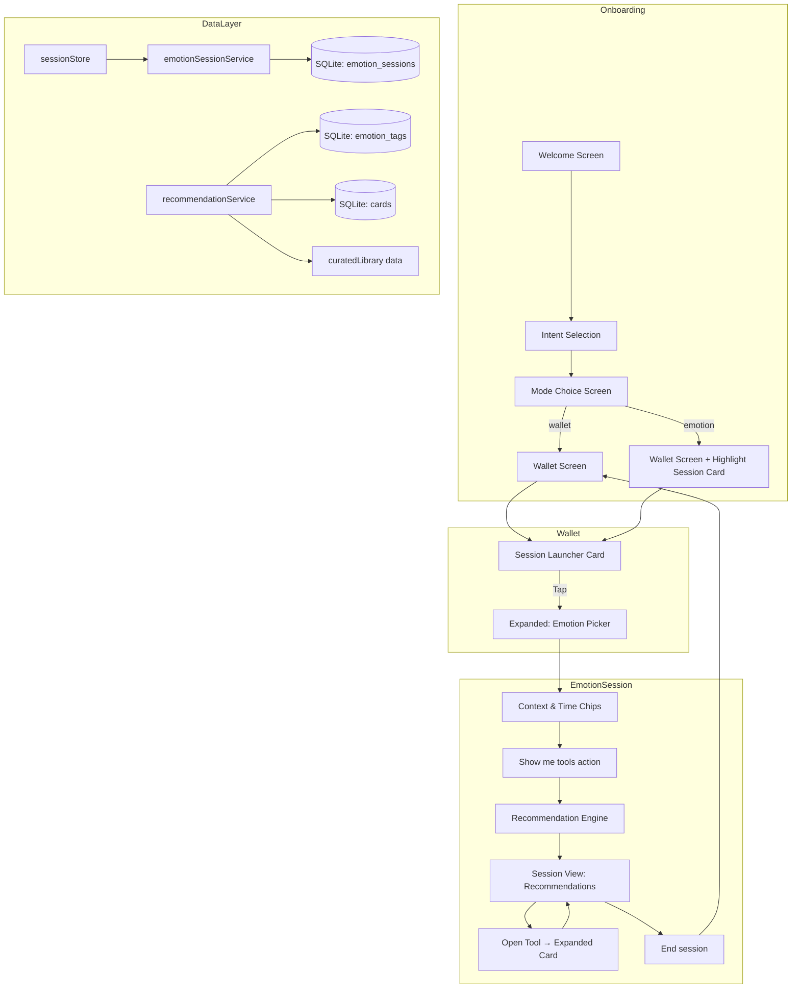

# Design Document: Emotion-First Onboarding

## Overview

This feature adds an emotion-first experience path to the Mental Health Wallet app. Rather than requiring users to browse tools directly, they can begin from their current emotional state and receive contextually relevant tool recommendations. The feature spans four areas:

1. **Onboarding Mode Choice** — A new screen in the onboarding flow letting users pick "wallet-first" or "emotion-first" as their default start experience.
2. **Session Launcher Card** — A special non-deletable card in the wallet that serves as the entry point for emotion-based sessions.
3. **Emotion Picker & Recommendation Engine** — A selection UI (emotion, context, time chips) paired with a local recommendation engine that filters and ranks tools.
4. **Session Lifecycle** — Tracking of emotion sessions (start, tools used, end) for future analytics without transmitting data externally.

The design integrates with the existing Universal Card Model, Zustand stores, SQLite database, and React Navigation stack.

## Architecture



### Key Architectural Decisions

1. **Session flow within expanded card** — The entire emotion session (picker, refinement, recommendations) renders inside the expanded Session_Launcher_Card rather than separate screens. This keeps the navigation stack simple and aligns with the existing card expansion pattern.

2. **Recommendation engine is local-only** — All filtering and ranking runs against the SQLite database and in-memory curated library data. No network calls. This guarantees offline operation and privacy.

3. **Emotion tags as a relational table** — Rather than embedding tags in the card JSON config, we use a dedicated `emotion_tags` table for efficient querying and future extensibility.

4. **Session state in Zustand** — Active session state (selected emotion, context, time, open tools) lives in a `sessionStore` for reactive UI updates, with persistence delegated to `emotionSessionService`.

## Components and Interfaces

### New Screens / Components

| Component | Location | Responsibility |
|-----------|----------|----------------|
| `ModeChoiceScreen` | `src/screens/ModeChoiceScreen.tsx` | Onboarding mode selection (wallet vs emotion) |
| `SessionLauncherContent` | `src/components/session/SessionLauncherContent.tsx` | Expanded content for the Session Launcher Card (hosts picker + session view) |
| `EmotionPicker` | `src/components/session/EmotionPicker.tsx` | Selectable emotion chips with accessible states |
| `ContextChips` | `src/components/session/ContextChips.tsx` | Multi-select context chips |
| `TimeChips` | `src/components/session/TimeChips.tsx` | Single-select time chips |
| `SessionView` | `src/components/session/SessionView.tsx` | Recommendations display + "End session" action |
| `ToolPreviewCard` | `src/components/session/ToolPreviewCard.tsx` | Compact card preview (icon, title, truncated description) |
| `StartExperienceSetting` | `src/components/settings/StartExperienceSetting.tsx` | Radio-style setting control for Start_Mode |

### New Services

| Service | Location | Responsibility |
|---------|----------|----------------|
| `emotionSessionService` | `src/services/emotionSessionService.ts` | CRUD for emotion_sessions table, session lifecycle |
| `recommendationService` | `src/services/recommendationService.ts` | Filtering and ranking tools by emotion/context/time |
| `emotionTagService` | `src/services/emotionTagService.ts` | Read/write emotion tag associations for cards |

### New Stores

| Store | Location | Responsibility |
|-------|----------|----------------|
| `sessionStore` | `src/stores/sessionStore.ts` | Active session UI state (selections, recommendations, session lifecycle) |

### Modified Existing Components

| Component | Change |
|-----------|--------|
| `RootNavigator` | Add `ModeChoice` screen, handle Start_Mode–based initial routing |
| `WalletScreen` | Handle Session_Launcher_Card highlight on "emotion" mode launch |
| `walletStore` | Expose `highlightSessionCard()` action; prevent deletion of session_launcher cards |
| `cardService` | Block permanent deletion of `session_launcher` type cards |
| `SettingsScreen` | Add "Start experience" preference section |
| `seeds.ts` | Seed Session_Launcher_Card + emotion tags |
| `curatedLibrary.ts` | Add `emotionTags`, `contextTags`, and `timeTags` fields to definitions |
| `migrations.ts` | Add `emotion_tags`, `emotion_sessions` tables; add `card_type` column to cards |

### Service Interfaces

```typescript
// src/services/emotionSessionService.ts

export interface EmotionSessionRecord {
  id: string;
  selectedEmotion: EmotionType;
  selectedContexts: ContextType[];
  selectedTime: TimeType | null;
  toolCardIds: string[];
  startedAt: string;
  endedAt: string | null;
}

export interface EmotionSessionService {
  create(emotion: EmotionType): Promise<EmotionSessionRecord>;
  addToolUsed(sessionId: string, cardId: string): Promise<void>;
  endSession(sessionId: string): Promise<void>;
  endUnterminatedSessions(): Promise<void>;
  getActive(): Promise<EmotionSessionRecord | null>;
  updateSelections(
    sessionId: string,
    contexts: ContextType[],
    time: TimeType | null
  ): Promise<void>;
}
```

```typescript
// src/services/recommendationService.ts

export interface ToolRecommendation {
  card: Card | CuratedCardDefinition;
  source: 'wallet' | 'library';
  contextRelevanceScore: number;
}

export interface RecommendationResult {
  walletTools: ToolRecommendation[];
  libraryTools: ToolRecommendation[];
  isFallback: boolean;
}

export interface RecommendationService {
  getRecommendations(
    emotion: EmotionType,
    contexts: ContextType[],
    time: TimeType | null,
    walletCardIds: string[]
  ): Promise<RecommendationResult>;
}
```

```typescript
// src/stores/sessionStore.ts

export interface SessionStore {
  // State
  isSessionActive: boolean;
  selectedEmotion: EmotionType | null;
  selectedContexts: ContextType[];
  selectedTime: TimeType | null;
  recommendations: RecommendationResult | null;
  currentSessionId: string | null;
  toolsUsedInSession: string[];

  // Actions
  selectEmotion: (emotion: EmotionType) => Promise<void>;
  deselectEmotion: () => void;
  toggleContext: (context: ContextType) => void;
  selectTime: (time: TimeType | null) => void;
  fetchRecommendations: () => Promise<void>;
  openTool: (cardId: string) => Promise<void>;
  endSession: () => Promise<void>;
  dismissWithoutSession: () => void;
  restoreUnterminatedSession: () => Promise<void>;
}
```

## Data Models

### New Types

```typescript
// Added to src/types/index.ts

export type EmotionType =
  | 'stressed'
  | 'overwhelmed'
  | 'anxious'
  | 'sad'
  | 'angry'
  | 'numb';

export type ContextType =
  | 'at_work'
  | 'with_family'
  | 'with_friends'
  | 'alone_at_home'
  | 'not_sure';

export type TimeType = '1_2_min' | '5_10_min';

export type StartMode = 'wallet' | 'emotion' | 'last_used';

export type CardType = 'standard' | 'session_launcher';

export interface EmotionTag {
  id: string;
  cardId: string;
  emotion: EmotionType;
}

export interface CardContextTag {
  cardId: string;
  context: ContextType;
}

export interface CardTimeTag {
  cardId: string;
  time: TimeType;
}
```

### Database Schema Additions (Migration)

```sql
-- Add card_type column to cards table
ALTER TABLE cards ADD COLUMN card_type TEXT NOT NULL DEFAULT 'standard'
  CHECK(card_type IN ('standard', 'session_launcher'));

-- Emotion tags for cards (both wallet and library-sourced)
CREATE TABLE IF NOT EXISTS emotion_tags (
  id TEXT PRIMARY KEY,
  card_id TEXT NOT NULL REFERENCES cards(id) ON DELETE CASCADE,
  emotion TEXT NOT NULL CHECK(emotion IN (
    'stressed', 'overwhelmed', 'anxious', 'sad', 'angry', 'numb'
  )),
  UNIQUE(card_id, emotion)
);
CREATE INDEX IF NOT EXISTS idx_emotion_tags_card ON emotion_tags(card_id);
CREATE INDEX IF NOT EXISTS idx_emotion_tags_emotion ON emotion_tags(emotion);

-- Context associations for cards (ranking signal)
CREATE TABLE IF NOT EXISTS card_context_tags (
  card_id TEXT NOT NULL REFERENCES cards(id) ON DELETE CASCADE,
  context TEXT NOT NULL CHECK(context IN (
    'at_work', 'with_family', 'with_friends', 'alone_at_home', 'not_sure'
  )),
  PRIMARY KEY(card_id, context)
);

-- Time associations for cards (filter)
CREATE TABLE IF NOT EXISTS card_time_tags (
  card_id TEXT NOT NULL REFERENCES cards(id) ON DELETE CASCADE,
  time TEXT NOT NULL CHECK(time IN ('1_2_min', '5_10_min')),
  PRIMARY KEY(card_id, time)
);

-- Emotion sessions
CREATE TABLE IF NOT EXISTS emotion_sessions (
  id TEXT PRIMARY KEY,
  selected_emotion TEXT NOT NULL CHECK(selected_emotion IN (
    'stressed', 'overwhelmed', 'anxious', 'sad', 'angry', 'numb'
  )),
  selected_contexts TEXT NOT NULL DEFAULT '[]',
  selected_time TEXT,
  tool_card_ids TEXT NOT NULL DEFAULT '[]',
  started_at TEXT NOT NULL DEFAULT (datetime('now')),
  ended_at TEXT
);
CREATE INDEX IF NOT EXISTS idx_emotion_sessions_active ON emotion_sessions(ended_at)
  WHERE ended_at IS NULL;

-- Settings addition for start_mode (uses existing settings table)
-- Key: 'start_mode', Values: 'wallet' | 'emotion' | 'last_used'
-- Key: 'last_used_mode', Values: 'wallet' | 'emotion'
```

### Curated Library Extension

The existing `CuratedCardDefinition` interface gains optional tag fields:

```typescript
export interface CuratedCardDefinition {
  // ... existing fields ...
  emotionTags?: EmotionType[];
  contextTags?: ContextType[];
  timeTags?: TimeType[];
}
```

These are used by the recommendation engine to match library cards that haven't been added to the wallet yet (and thus have no rows in `emotion_tags` table).

### Session Launcher Card Seed Data

```typescript
{
  id: 'session-launcher',
  title: 'Start from how I feel',
  description: 'Tell the app what you\'re dealing with to get suggested tools.',
  iconType: 'emoji',
  iconValue: '🫶',
  backgroundType: 'color',
  backgroundValue: '#F0E6FF',
  categoryId: 'grounding-calming',
  cardType: 'session_launcher',
  allowBackgroundCustomization: false,
  controls: [
    {
      type: 'choice_buttons',
      position: 0,
      config: {
        label: 'How are you feeling right now?',
        options: [
          { text: 'Stressed', icon: '😰' },
          { text: 'Overwhelmed', icon: '🌊' },
          { text: 'Anxious', icon: '😟' },
          { text: 'Sad/low', icon: '😢' },
          { text: 'Angry', icon: '😤' },
          { text: 'Numb', icon: '😶' },
        ],
      },
      isRequired: true,
    },
    {
      type: 'choice_buttons',
      position: 1,
      config: {
        label: 'Where are you right now?',
        options: [
          { text: 'At work/school' },
          { text: 'With family' },
          { text: 'With friends/social' },
          { text: 'Alone at home' },
          { text: "I'm not sure" },
        ],
      },
      isRequired: false,
    },
    {
      type: 'choice_buttons',
      position: 2,
      config: {
        label: 'How much time do you have?',
        options: [
          { text: 'I have ~1–2 minutes' },
          { text: 'I have ~5–10 minutes' },
        ],
      },
      isRequired: false,
    },
  ],
}
```

### Recommendation Algorithm

```
function getRecommendations(emotion, contexts, time, walletCardIds):
  1. Query emotion_tags WHERE emotion = selectedEmotion → matchingCardIds
  2. For wallet tools:
     a. Filter matchingCardIds to those in walletCardIds
     b. If time selected: exclude cards without matching time tag
     c. Score each by context relevance (count of matching context tags)
     d. Sort by contextScore DESC, then title ASC
     e. Take top 3
  3. For library tools:
     a. Filter CURATED_LIBRARY where emotionTags includes emotion
     b. Exclude cards already in wallet (by curated library ID matching)
     c. If time selected: exclude cards without matching time tag
     d. Score each by context relevance
     e. Sort by contextScore DESC, then title ASC
     f. Take top 3
  4. If both empty → fallback:
     a. Get tools with most emotion tag associations (broadly applicable)
     b. Prefer tools not in wallet
     c. Take top 3
  5. Return { walletTools, libraryTools, isFallback }
```


## Correctness Properties

*A property is a characteristic or behavior that should hold true across all valid executions of a system — essentially, a formal statement about what the system should do. Properties serve as the bridge between human-readable specifications and machine-verifiable correctness guarantees.*

### Property 1: Invalid Start_Mode resolves to "wallet"

*For any* string value stored in the `start_mode` settings key that is not one of the valid values ("wallet", "emotion", "last_used"), including empty strings, null, or arbitrary characters, the app launch logic SHALL resolve the effective start mode to "wallet" and persist "wallet" as the corrected value.

**Validates: Requirements 2.5**

### Property 2: Start_Mode persistence round-trip

*For any* valid StartMode value ("wallet", "emotion", "last_used"), persisting it via the settings control and then reading it back SHALL return the same value.

**Validates: Requirements 3.2**

### Property 3: Session_launcher cards are non-deletable

*For any* card with `card_type` equal to "session_launcher", invoking the permanent delete operation SHALL be rejected (throw an error or return failure), and the card SHALL remain in the database.

**Validates: Requirements 4.6**

### Property 4: Collapse discards all unsaved session selections

*For any* combination of partial selections (any subset of: one emotion, zero-to-five context chips, zero-or-one time chip), collapsing the Session_Launcher_Card without tapping "Show me tools" SHALL result in all selections being cleared (emotion = null, contexts = [], time = null) and no EmotionSession record being created in the database.

**Validates: Requirements 4.9, 12.3**

### Property 5: Emotion single-selection invariant

*For any* sequence of emotion chip tap events on the EmotionPicker, at most one emotion SHALL be selected at any point in time. The "Show me tools" action SHALL be enabled if and only if exactly one emotion is currently selected. Specifically: selecting emotion A then emotion B results in only B selected; selecting A then tapping A again results in zero selected.

**Validates: Requirements 5.2, 5.3, 5.4**

### Property 6: Context chips toggle independently

*For any* context chip and any current selection state of all context chips, tapping a context chip SHALL toggle its selected state without affecting any other chip's state. Multiple context chips can be selected simultaneously.

**Validates: Requirements 6.3**

### Property 7: Time chips single-select with deselect

*For any* pair of time chip tap events, at most one time chip SHALL be selected at any time. Selecting time A while time B is selected SHALL deselect B. Tapping the currently selected time chip SHALL deselect it, resulting in no time selection.

**Validates: Requirements 6.5**

### Property 8: Recommendation engine correctness

*For any* valid emotion, set of context chips, optional time chip, and set of wallet card IDs with their emotion/context/time tags, the recommendation engine SHALL return results where: (a) every returned tool has the selected emotion in its emotion tags, (b) tools matching at least one selected context chip rank above tools matching none within the same section, (c) when a time chip is selected, no returned tool lacks that time tag, (d) each section contains at most 3 tools, and (e) within equal context relevance scores, tools are ordered alphabetically by title.

**Validates: Requirements 7.3, 7.7, 8.8, 9.5**

### Property 9: Fallback recommendations when no matches exist

*For any* emotion selection that produces zero matching tools from both wallet and library sources, the recommendation engine SHALL return a fallback result containing up to 3 tools ordered by their total emotion tag count (descending), preferring tools not already in the user's wallet.

**Validates: Requirements 7.6**

### Property 10: Curated card emotion tag count constraint

*For any* curated card definition that includes emotion tags, the emotion tags array SHALL have a length between 1 and 4 inclusive.

**Validates: Requirements 8.1**

### Property 11: Card tag cardinality constraints

*For any* card in the database, the number of associated context tags SHALL be at most 4, and the number of associated time tags SHALL be at most 1.

**Validates: Requirements 8.4**

### Property 12: Library-to-wallet emotion tag retention

*For any* curated library card with emotion tags, adding it to the user's wallet SHALL result in the wallet card having exactly the same set of emotion tags as the library definition.

**Validates: Requirements 8.3**

### Property 13: Emotion tag save/edit round-trip

*For any* non-empty subset of the 6 valid emotions assigned to a user-created card, saving the card and then reading it back in edit mode SHALL show exactly that same set of emotions as pre-selected.

**Validates: Requirements 9.3, 9.4**

### Property 14: Session tool list append-only during session

*For any* sequence of tool card IDs opened during an active EmotionSession, each opened tool's card ID SHALL be appended to the session's `toolCardIds` array in order, and the array SHALL never lose previously added entries during the session.

**Validates: Requirements 10.2**

### Property 15: No duplicate wallet cards from "Add to wallet"

*For any* tool card that already exists in the user's wallet, invoking "Add to wallet" SHALL NOT create a duplicate card — the wallet card count SHALL remain unchanged.

**Validates: Requirements 10.6**

### Property 16: EmotionSession record completeness

*For any* created EmotionSession record, it SHALL contain all required fields: a non-null `id`, a non-null `startedAt` timestamp, a valid `selectedEmotion` from the enum set, a `selectedContexts` array (possibly empty), a nullable `selectedTime`, a `toolCardIds` array (possibly empty), and a nullable `endedAt`.

**Validates: Requirements 11.4**

### Property 17: Previous unterminated session is closed on new session start

*For any* existing EmotionSession with a null `endedAt`, creating a new EmotionSession SHALL first set the previous session's `endedAt` to a non-null timestamp before persisting the new session. After the operation, there SHALL be at most one session with a null `endedAt`.

**Validates: Requirements 11.7**

## Error Handling

| Scenario | Behavior | User Experience |
|----------|----------|-----------------|
| Start_Mode persistence fails during onboarding | Show error message, allow retry | User stays on Mode Choice screen |
| Start_Mode persistence fails in Settings | Revert UI to previous selection, show error | Settings control snaps back |
| Session record fails to persist on emotion tap | Allow flow to continue, retry on session end | No interruption |
| Recommendation query fails | Show fallback message with general tools | Graceful degradation |
| "Add to wallet" fails (any step) | Abort entire operation, show error, keep tool in "Suggested" section | Tool stays in suggestions |
| Unterminated session detected on launch | Auto-close with best-available timestamp | Silent recovery |
| Curated library card missing emotion tags | Skip for recommendations, log validation error, card still usable | No user-visible error |
| Invalid emotion tag data on user card | Exclude from recommendations | Card still usable in wallet |

### Error Recovery Strategy

- **Optimistic UI**: The session flow never blocks on persistence. Selections are maintained in the Zustand store and persisted asynchronously.
- **Retry on session end**: If initial session creation fails, the entire session object is persisted when the session ends.
- **Fallback-first**: If any recommendation query fails, the fallback message renders immediately rather than showing a loading/error state.
- **Transactional writes**: All multi-step DB operations (adding library card to wallet + emotion tags) use SQLite transactions with full rollback on failure.

## Testing Strategy

### Property-Based Tests (fast-check 3)

Each correctness property above maps to a single property-based test with a minimum of 100 iterations. Tests live in `src/services/__tests__/` and `src/stores/__tests__/`.

**Library**: `fast-check` (already in project dependencies)

**Configuration**: Each test runs at least 100 iterations per property.

**Tag format**: `Feature: emotion-first-onboarding, Property {N}: {title}`

Key test files:
- `src/services/__tests__/recommendationService.property.test.ts` — Properties 8, 9, 10, 11, 12
- `src/services/__tests__/emotionSessionService.property.test.ts` — Properties 14, 16, 17
- `src/services/__tests__/emotionTagService.property.test.ts` — Properties 13
- `src/stores/__tests__/sessionStore.property.test.ts` — Properties 4, 5, 6, 7
- `src/services/__tests__/cardService.property.test.ts` — Properties 3, 15
- `src/services/__tests__/settingsService.property.test.ts` — Properties 1, 2

### Unit Tests (Jest)

Example-based tests for specific scenarios:
- Onboarding mode choice navigation flow
- Session Launcher Card seed data verification
- Initial emotion/context/time tag mappings for all 11 curated cards
- UI rendering tests (EmotionPicker, ContextChips, TimeChips accessibility)
- Settings control behavior
- "Add to wallet" success and duplicate detection flows

### Integration Tests

- Full onboarding flow: Welcome → Intent → Mode Choice → Wallet
- Session lifecycle: emotion select → recommendations → open tool → end session
- Launch behavior for each Start_Mode value
- Database migration applies cleanly on fresh DB

### Testing Generators (fast-check)

Key arbitraries for property tests:

```typescript
// Emotion arbitrary
const emotionArb = fc.constantFrom(
  'stressed', 'overwhelmed', 'anxious', 'sad', 'angry', 'numb'
);

// Context set arbitrary (any subset of contexts)
const contextSetArb = fc.subarray(
  ['at_work', 'with_family', 'with_friends', 'alone_at_home', 'not_sure'] as const
);

// Time arbitrary (nullable)
const timeArb = fc.option(fc.constantFrom('1_2_min', '5_10_min'));

// Tagged card arbitrary (for recommendation tests)
const taggedCardArb = fc.record({
  id: fc.uuid(),
  title: fc.string({ minLength: 1, maxLength: 80 }),
  emotionTags: fc.subarray(
    ['stressed', 'overwhelmed', 'anxious', 'sad', 'angry', 'numb'] as const,
    { minLength: 1, maxLength: 4 }
  ),
  contextTags: fc.subarray(
    ['at_work', 'with_family', 'with_friends', 'alone_at_home', 'not_sure'] as const,
    { maxLength: 4 }
  ),
  timeTags: fc.subarray(['1_2_min', '5_10_min'] as const, { maxLength: 1 }),
});

// Start mode arbitrary (including invalid values)
const startModeArb = fc.oneof(
  fc.constantFrom('wallet', 'emotion', 'last_used'),
  fc.string() // Random invalid strings
);

// Session tool sequence arbitrary
const toolSequenceArb = fc.array(fc.uuid(), { minLength: 0, maxLength: 10 });
```
