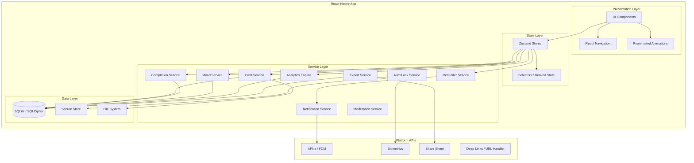
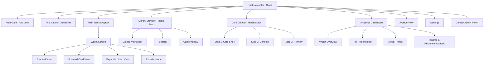
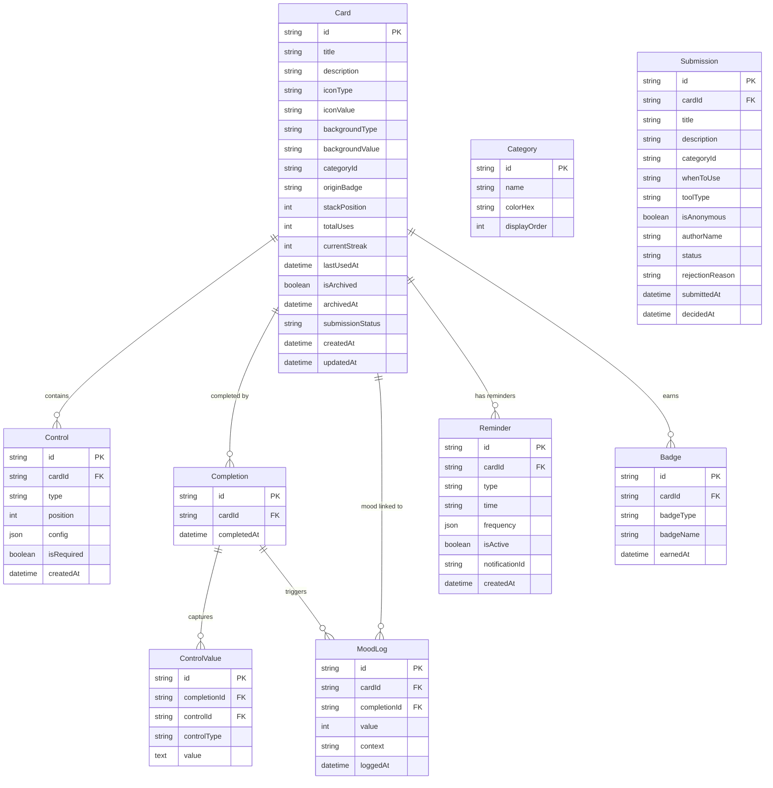
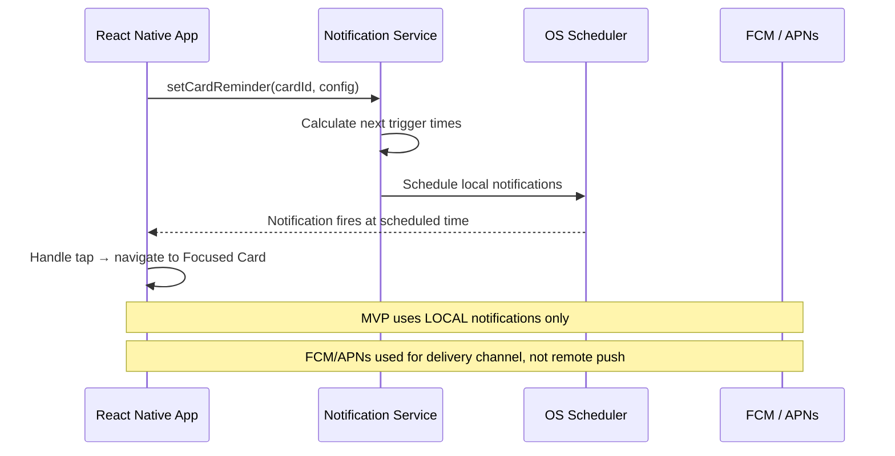
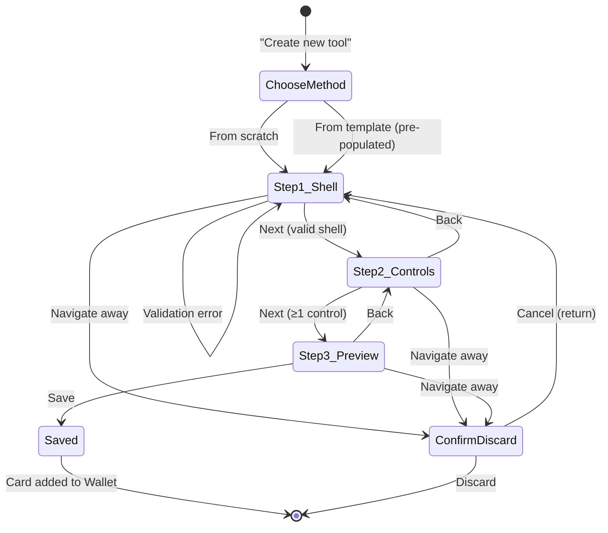
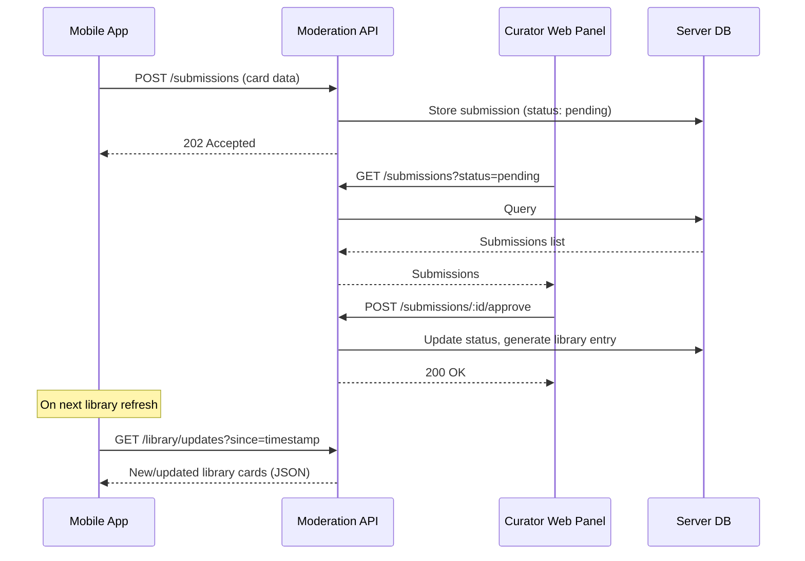

# Design Document: Mental Health Wallet

## Overview

Mental Health Wallet is a React Native mobile application (iOS and Android) that provides a unified, habit-forming toolkit for mental health coping tools. The app uses a local-first architecture with no cloud sync in MVP, storing all user data in an encrypted SQLite database on-device. The core interaction model is a stacked card UI (inspired by Apple Wallet) where users collect, create, practice, and track coping tools represented as cards.

### Key Design Decisions

1. **React Native with Expo** — Cross-platform development targeting iOS and Android from a single codebase. Expo provides managed native modules for camera, notifications, biometrics, and file system access.
2. **SQLite via expo-sqlite** — Local-first relational database for structured card data, completions, mood logs, and analytics. Chosen over Realm for simpler relational queries and better community support in the Expo ecosystem.
3. **Zustand for state management** — Lightweight, unopinionated state management that avoids Redux boilerplate while providing excellent React Native performance through selective re-renders.
4. **React Navigation** — Industry-standard navigation library supporting stack, tab, and modal navigation patterns required by the wallet interaction model.
5. **Local encryption via expo-secure-store + SQLCipher** — SQLCipher encrypts the SQLite database at rest; expo-secure-store holds the encryption key in the platform keychain.
6. **Reanimated + Gesture Handler** — Smooth 60fps animations for card transitions (focus, expand, reorder) running on the native thread.

## Architecture

### High-Level Architecture Diagram



### Layer Responsibilities

| Layer | Responsibility |
|-------|----------------|
| Presentation | Render UI, handle gestures, drive animations, navigation routing |
| State | Hold application state, compute derived values, trigger side effects |
| Service | Business logic, data transformations, orchestration between data and state |
| Data | Persistence (SQLite), secure key storage (Keychain/Keystore), file I/O (images) |

## Components and Interfaces

### Navigation Structure



### Component Hierarchy — Wallet UI

```
WalletScreen
├── WalletHeader (title: "My Wallet", kebab menu)
├── StackedCardList (virtualized, gesture-enabled)
│   ├── CardEdge (compact card showing title, icon, category, background)
│   └── ... (repeats per card)
├── FocusedCardView (animated overlay)
│   ├── CardShellDisplay (title, description, origin badge, category)
│   ├── StatsRow (total uses, streak, last used)
│   ├── BadgeRow (earned badge icons)
│   ├── PrimaryActionButton
│   ├── KebabMenu
│   └── ExpandedContent (scrollable, conditionally rendered)
│       ├── ControlRenderer (iterates controls)
│       │   ├── StaticTextControl
│       │   ├── TextInputControl
│       │   ├── TextAreaControl
│       │   ├── MoodSliderControl
│       │   ├── ChoiceButtonsControl
│       │   ├── CheckboxControl
│       │   ├── CounterControl
│       │   ├── DateTimeStampControl
│       │   ├── ImageAttachmentControl
│       │   └── LinkButtonControl
│       └── SaveCompleteButton
├── CollapsedStack (bottom, tappable to fan out)
│   └── FannedCardTops (up to 5 card edges)
├── MoodSliderPrompt (dismissable overlay, pre/post use)
└── EmptyWalletState (shown when 0 cards)
```

### Key Service Interfaces

```typescript
// Card Service
interface CardService {
  getAll(): Promise<Card[]>;
  getById(id: string): Promise<Card | null>;
  create(shell: CardShell, controls: Control[], originBadge: OriginBadge): Promise<Card>;
  update(id: string, updates: Partial<Card>): Promise<Card>;
  reorder(orderedIds: string[]): Promise<void>;
  archive(id: string): Promise<void>;
  restore(id: string): Promise<void>;
  duplicate(id: string): Promise<Card>;
  delete(id: string): Promise<void>;
  validateShell(shell: CardShell): ValidationResult;
  validateControls(controls: Control[]): ValidationResult;
}

// Completion Service
interface CompletionService {
  record(cardId: string, values: ControlValue[]): Promise<Completion>;
  getByCard(cardId: string, pagination?: Pagination): Promise<Completion[]>;
  deleteEntry(completionId: string): Promise<void>;
  getStreakInfo(cardId: string): Promise<StreakInfo>;
  updateStreak(cardId: string): Promise<void>;
}

// Mood Service
interface MoodService {
  logMood(entry: MoodLogInput): Promise<MoodLog>;
  getMoodsByCard(cardId: string, period: TimePeriod): Promise<MoodLog[]>;
  getMoodsForPeriod(period: TimePeriod): Promise<MoodLog[]>;
  calculateTrend(logs: MoodLog[]): MoodTrend;
  calculateToolEffectiveness(cardId: string, period: TimePeriod): Promise<ToolEffectiveness | null>;
  hasDailyCheckIn(date: Date): Promise<boolean>;
}

// Analytics Engine
interface AnalyticsEngine {
  getWalletStats(period: TimePeriod): Promise<WalletStats>;
  getCardInsights(cardId: string, period: TimePeriod): Promise<CardInsights>;
  getMoodAnalytics(period: TimePeriod): Promise<MoodAnalytics>;
  generateInsights(): Promise<Insight[]>;
  getToolEffectivenessRanking(period: TimePeriod): Promise<ToolRanking[]>;
}

// Reminder Service
interface ReminderService {
  setCardReminder(cardId: string, config: ReminderConfig): Promise<Reminder>;
  setGlobalReminder(time: string): Promise<Reminder>;
  getReminder(cardId: string): Promise<Reminder | null>;
  updateReminder(reminderId: string, config: ReminderConfig): Promise<Reminder>;
  deleteReminder(reminderId: string): Promise<void>;
  disableForCard(cardId: string): Promise<void>;
  scheduleNotification(reminder: Reminder): Promise<void>;
  getLeastUsedCard(days: number): Promise<Card | null>;
}

// Notification Service
interface NotificationService {
  requestPermission(): Promise<boolean>;
  hasPermission(): Promise<boolean>;
  scheduleLocal(config: NotificationConfig): Promise<string>;
  cancelScheduled(notificationId: string): Promise<void>;
  handleNotificationTap(data: NotificationData): void;
}

// Auth/Lock Service
interface AuthLockService {
  isLockEnabled(): Promise<boolean>;
  enableLock(method: 'biometric' | 'pin', pin?: string): Promise<void>;
  disableLock(): Promise<void>;
  authenticate(): Promise<boolean>;
  recordFailedAttempt(): Promise<{ locked: boolean; remainingSeconds: number }>;
  isLockedOut(): Promise<boolean>;
}
```

### Zustand Store Structure

```typescript
// Main stores
interface WalletStore {
  cards: Card[];
  cardOrder: string[];
  focusedCardId: string | null;
  isExpanded: boolean;
  isReorderMode: boolean;
  // Actions
  loadCards: () => Promise<void>;
  focusCard: (id: string) => void;
  expandCard: () => void;
  collapseCard: () => void;
  returnToStack: () => void;
  enterReorderMode: () => void;
  commitReorder: (newOrder: string[]) => void;
  cancelReorder: () => void;
}

interface CompletionStore {
  currentInputValues: Record<string, ControlValue>;
  // Actions
  setControlValue: (controlId: string, value: ControlValue) => void;
  submitCompletion: (cardId: string) => Promise<void>;
  clearInputs: () => void;
}

interface MoodStore {
  showPreUseMood: boolean;
  showPostUseMood: boolean;
  showDailyCheckIn: boolean;
  // Actions
  promptPreUseMood: (cardId: string) => void;
  promptPostUseMood: (cardId: string) => void;
  submitMoodLog: (value: number, context: MoodContext, cardId?: string) => Promise<void>;
  dismissMoodPrompt: () => void;
}

interface AnalyticsStore {
  selectedPeriod: TimePeriod;
  walletStats: WalletStats | null;
  // Actions
  setPeriod: (period: TimePeriod) => void;
  loadWalletStats: () => Promise<void>;
}

interface AuthStore {
  isAuthenticated: boolean;
  lockEnabled: boolean;
  failedAttempts: number;
  lockedUntil: number | null;
  // Actions
  authenticate: () => Promise<boolean>;
  checkLockStatus: () => Promise<void>;
}
```

## Data Models

### Entity Relationship Diagram



### SQLite Schema

```sql
-- Categories (seeded on first launch)
CREATE TABLE categories (
  id TEXT PRIMARY KEY,
  name TEXT NOT NULL,
  color_hex TEXT NOT NULL,
  display_order INTEGER NOT NULL
);

-- Cards
CREATE TABLE cards (
  id TEXT PRIMARY KEY,
  title TEXT NOT NULL CHECK(length(trim(title)) > 0),
  description TEXT NOT NULL CHECK(length(trim(description)) > 0),
  icon_type TEXT NOT NULL CHECK(icon_type IN ('library', 'emoji', 'custom_image')),
  icon_value TEXT NOT NULL,
  background_type TEXT NOT NULL CHECK(background_type IN ('color', 'gradient', 'image')),
  background_value TEXT NOT NULL,
  category_id TEXT NOT NULL REFERENCES categories(id),
  origin_badge TEXT NOT NULL CHECK(origin_badge IN ('library', 'community', 'my_tool')),
  stack_position INTEGER NOT NULL DEFAULT 0,
  total_uses INTEGER NOT NULL DEFAULT 0,
  current_streak INTEGER NOT NULL DEFAULT 0,
  last_used_at TEXT,
  is_archived INTEGER NOT NULL DEFAULT 0,
  archived_at TEXT,
  previous_stack_position INTEGER,
  submission_status TEXT CHECK(submission_status IN ('none', 'pending', 'approved', 'rejected')),
  created_at TEXT NOT NULL DEFAULT (datetime('now')),
  updated_at TEXT NOT NULL DEFAULT (datetime('now'))
);

CREATE INDEX idx_cards_archived ON cards(is_archived);
CREATE INDEX idx_cards_stack_position ON cards(stack_position) WHERE is_archived = 0;
CREATE INDEX idx_cards_category ON cards(category_id);

-- Controls (field types within cards)
CREATE TABLE controls (
  id TEXT PRIMARY KEY,
  card_id TEXT NOT NULL REFERENCES cards(id) ON DELETE CASCADE,
  type TEXT NOT NULL CHECK(type IN (
    'static_text', 'text_input', 'text_area', 'mood_slider',
    'choice_buttons', 'checkbox', 'counter', 'datetime_stamp',
    'image_attachment', 'link_button'
  )),
  position INTEGER NOT NULL,
  config TEXT NOT NULL DEFAULT '{}', -- JSON blob for type-specific config
  is_required INTEGER NOT NULL DEFAULT 0,
  created_at TEXT NOT NULL DEFAULT (datetime('now'))
);

CREATE INDEX idx_controls_card ON controls(card_id);

-- Completions
CREATE TABLE completions (
  id TEXT PRIMARY KEY,
  card_id TEXT NOT NULL REFERENCES cards(id) ON DELETE CASCADE,
  completed_at TEXT NOT NULL DEFAULT (datetime('now'))
);

CREATE INDEX idx_completions_card ON completions(card_id);
CREATE INDEX idx_completions_date ON completions(completed_at);

-- Control Values (captured per completion)
CREATE TABLE control_values (
  id TEXT PRIMARY KEY,
  completion_id TEXT NOT NULL REFERENCES completions(id) ON DELETE CASCADE,
  control_id TEXT NOT NULL REFERENCES controls(id) ON DELETE CASCADE,
  control_type TEXT NOT NULL,
  value TEXT -- Stored as text; interpreted based on control_type
);

CREATE INDEX idx_control_values_completion ON control_values(completion_id);

-- Mood Logs
CREATE TABLE mood_logs (
  id TEXT PRIMARY KEY,
  card_id TEXT REFERENCES cards(id) ON DELETE SET NULL,
  completion_id TEXT REFERENCES completions(id) ON DELETE SET NULL,
  value INTEGER NOT NULL CHECK(value >= 1 AND value <= 10),
  context TEXT NOT NULL CHECK(context IN ('before_use', 'after_use', 'standalone')),
  logged_at TEXT NOT NULL DEFAULT (datetime('now'))
);

CREATE INDEX idx_mood_logs_card ON mood_logs(card_id);
CREATE INDEX idx_mood_logs_date ON mood_logs(logged_at);
CREATE INDEX idx_mood_logs_context ON mood_logs(context);

-- Reminders
CREATE TABLE reminders (
  id TEXT PRIMARY KEY,
  card_id TEXT REFERENCES cards(id) ON DELETE CASCADE,
  type TEXT NOT NULL CHECK(type IN ('per_card', 'global')),
  time TEXT NOT NULL, -- HH:MM format
  frequency TEXT NOT NULL DEFAULT '{}', -- JSON: { type: 'daily' | '3x_week' | 'custom', days: number[] }
  is_active INTEGER NOT NULL DEFAULT 1,
  notification_id TEXT,
  created_at TEXT NOT NULL DEFAULT (datetime('now'))
);

CREATE INDEX idx_reminders_card ON reminders(card_id);
CREATE INDEX idx_reminders_active ON reminders(is_active) WHERE is_active = 1;

-- Badges
CREATE TABLE badges (
  id TEXT PRIMARY KEY,
  card_id TEXT REFERENCES cards(id) ON DELETE CASCADE,
  badge_type TEXT NOT NULL CHECK(badge_type IN ('streak', 'variety', 'consistency')),
  badge_name TEXT NOT NULL,
  earned_at TEXT NOT NULL DEFAULT (datetime('now'))
);

CREATE INDEX idx_badges_card ON badges(card_id);
CREATE INDEX idx_badges_type ON badges(badge_type);

-- Submissions (for community moderation)
CREATE TABLE submissions (
  id TEXT PRIMARY KEY,
  card_id TEXT NOT NULL REFERENCES cards(id),
  title TEXT NOT NULL CHECK(length(title) <= 60),
  description TEXT NOT NULL CHECK(length(description) <= 200),
  category_id TEXT NOT NULL REFERENCES categories(id),
  when_to_use TEXT NOT NULL CHECK(length(when_to_use) <= 300),
  tool_type TEXT NOT NULL,
  is_anonymous INTEGER NOT NULL DEFAULT 0,
  author_name TEXT,
  status TEXT NOT NULL DEFAULT 'pending' CHECK(status IN ('pending', 'approved', 'rejected', 'changes_requested')),
  rejection_reason TEXT,
  submitted_at TEXT NOT NULL DEFAULT (datetime('now')),
  decided_at TEXT
);

CREATE INDEX idx_submissions_status ON submissions(status);

-- App Settings (key-value for preferences)
CREATE TABLE settings (
  key TEXT PRIMARY KEY,
  value TEXT NOT NULL
);

-- Crisis Resources (seeded, geolocation-aware)
CREATE TABLE crisis_resources (
  id TEXT PRIMARY KEY,
  country_code TEXT NOT NULL,
  name TEXT NOT NULL,
  phone TEXT,
  url TEXT,
  is_default INTEGER NOT NULL DEFAULT 0,
  display_order INTEGER NOT NULL
);
```

### TypeScript Type Definitions

```typescript
type OriginBadge = 'library' | 'community' | 'my_tool';
type ControlType = 
  | 'static_text' | 'text_input' | 'text_area' | 'mood_slider'
  | 'choice_buttons' | 'checkbox' | 'counter' | 'datetime_stamp'
  | 'image_attachment' | 'link_button';
type MoodContext = 'before_use' | 'after_use' | 'standalone';
type TimePeriod = '7d' | '30d' | 'year' | 'all';
type SubmissionStatus = 'none' | 'pending' | 'approved' | 'rejected' | 'changes_requested';
type BadgeType = 'streak' | 'variety' | 'consistency';
type ReminderFrequencyType = 'daily' | '3x_week' | 'custom';

interface Card {
  id: string;
  title: string;          // max 80 chars
  description: string;    // max 300 chars
  iconType: 'library' | 'emoji' | 'custom_image';
  iconValue: string;
  backgroundType: 'color' | 'gradient' | 'image';
  backgroundValue: string;
  categoryId: string;
  originBadge: OriginBadge;
  stackPosition: number;
  totalUses: number;
  currentStreak: number;
  lastUsedAt: string | null;
  isArchived: boolean;
  archivedAt: string | null;
  previousStackPosition: number | null;
  submissionStatus: SubmissionStatus;
  controls: Control[];
  createdAt: string;
  updatedAt: string;
}

interface Control {
  id: string;
  cardId: string;
  type: ControlType;
  position: number;
  config: ControlConfig;
  isRequired: boolean;
}

// Type-specific configs
type ControlConfig =
  | StaticTextConfig
  | TextInputConfig
  | TextAreaConfig
  | MoodSliderConfig
  | ChoiceButtonsConfig
  | CheckboxConfig
  | CounterConfig
  | DateTimeStampConfig
  | ImageAttachmentConfig
  | LinkButtonConfig;

interface StaticTextConfig {
  title?: string;
  body: string;      // Rich text (markdown subset)
  fontSize: 'small' | 'medium' | 'large';
}

interface TextInputConfig {
  label: string;
  placeholder?: string;
  maxLength: number; // default 200
}

interface TextAreaConfig {
  label: string;
  placeholder?: string;
}

interface MoodSliderConfig {
  label: string;
  minLabel?: string;
  maxLabel?: string;
}

interface ChoiceButtonsConfig {
  label: string;
  options: { text: string; icon?: string }[]; // max 8
}

interface CheckboxConfig {
  label: string;
}

interface CounterConfig {
  label: string;
  min?: number;
  max?: number;
}

interface DateTimeStampConfig {
  displayMode: 'visible' | 'hidden';
}

interface ImageAttachmentConfig {
  label: string;
}

interface LinkButtonConfig {
  label: string;
  targetUrl: string;
  fallbackUrl?: string;
}

interface Completion {
  id: string;
  cardId: string;
  completedAt: string;
  values: ControlValue[];
}

interface ControlValue {
  id: string;
  completionId: string;
  controlId: string;
  controlType: ControlType;
  value: string; // Serialized based on type
}

interface MoodLog {
  id: string;
  cardId: string | null;
  completionId: string | null;
  value: number; // 1-10
  context: MoodContext;
  loggedAt: string;
}

interface Reminder {
  id: string;
  cardId: string | null; // null for global reminders
  type: 'per_card' | 'global';
  time: string; // HH:MM
  frequency: ReminderFrequency;
  isActive: boolean;
  notificationId: string | null;
}

interface ReminderFrequency {
  type: ReminderFrequencyType;
  days?: number[]; // 0=Sun, 1=Mon, ... 6=Sat
}

interface Badge {
  id: string;
  cardId: string | null; // null for global badges
  badgeType: BadgeType;
  badgeName: string;
  earnedAt: string;
}

interface Submission {
  id: string;
  cardId: string;
  title: string;
  description: string;
  categoryId: string;
  whenToUse: string;
  toolType: string;
  isAnonymous: boolean;
  authorName: string | null;
  status: SubmissionStatus;
  rejectionReason: string | null;
  submittedAt: string;
  decidedAt: string | null;
}
```


## Push Notification Architecture

### Platform Integration



### Implementation Details

- **expo-notifications** handles both iOS (APNs) and Android (FCM) through a unified API
- All reminders are **local scheduled notifications** — no server needed for MVP
- Notification IDs are stored in the `reminders` table for cancellation/updates
- On app launch, the service reconciles scheduled notifications with active reminders (handles timezone changes, app reinstalls)
- Deep link payload: `{ type: 'card_reminder', cardId: string }` routes to `FocusedCardView`

### Notification Permission Flow

1. User taps "Set reminder" → check `hasPermission()`
2. If not granted → show explainer screen → call `requestPermission()`
3. If denied → show settings redirect guidance
4. If granted → proceed to reminder configuration

### Global Reminder Logic

The "Daily wellness check-in" reminder selects a card to suggest:
1. Find the card with the fewest uses in the last 14 days (excluding archived)
2. If all cards used equally, pick randomly
3. Notification message: "Time for your [Card Title] practice"

## Analytics / Insights Calculation Engine

### Streak Calculation

```typescript
function updateStreak(card: Card, completionDate: Date): StreakUpdate {
  const lastUsed = card.lastUsedAt ? new Date(card.lastUsedAt) : null;
  const today = startOfDay(completionDate);
  const yesterday = subDays(today, 1);

  if (!lastUsed) {
    return { currentStreak: 1, totalUses: card.totalUses + 1 };
  }

  const lastUsedDay = startOfDay(lastUsed);

  if (isSameDay(lastUsedDay, today)) {
    // Already used today — increment uses but not streak
    return { currentStreak: card.currentStreak, totalUses: card.totalUses + 1 };
  }

  if (isSameDay(lastUsedDay, yesterday)) {
    // Used yesterday — extend streak
    return { currentStreak: card.currentStreak + 1, totalUses: card.totalUses + 1 };
  }

  // Gap > 1 day — reset streak
  return { currentStreak: 1, totalUses: card.totalUses + 1 };
}
```

### Streak Reset (Background Check)

A daily background task (or on-app-open check) resets streaks for cards that missed a day:

```typescript
function resetStaleStreaks(cards: Card[], now: Date): string[] {
  const today = startOfDay(now);
  const resetCardIds: string[] = [];

  for (const card of cards) {
    if (card.currentStreak > 0 && card.lastUsedAt) {
      const lastDay = startOfDay(new Date(card.lastUsedAt));
      const daysSince = differenceInCalendarDays(today, lastDay);
      if (daysSince > 1) {
        resetCardIds.push(card.id);
      }
    }
  }
  return resetCardIds;
}
```

### Mood Trend Calculation

```typescript
function calculateMoodTrend(logs: MoodLog[]): MoodTrend {
  if (logs.length < 3) return { trend: 'insufficient_data' };

  const sorted = [...logs].sort((a, b) => 
    new Date(a.loggedAt).getTime() - new Date(b.loggedAt).getTime()
  );
  const midpoint = Math.floor(sorted.length / 2);
  const earlierHalf = sorted.slice(0, midpoint);
  const recentHalf = sorted.slice(midpoint);

  const earlierAvg = average(earlierHalf.map(l => l.value));
  const recentAvg = average(recentHalf.map(l => l.value));
  const diff = recentAvg - earlierAvg;

  if (diff > 0.5) return { trend: 'improving', change: diff };
  if (diff < -0.5) return { trend: 'declining', change: diff };
  return { trend: 'stable', change: diff };
}
```

### Tool Effectiveness Ranking

```typescript
function calculateToolEffectiveness(
  cardId: string,
  moodLogs: MoodLog[]
): ToolEffectiveness | null {
  // Find before/after pairs linked to the same completion
  const beforeLogs = moodLogs.filter(l => l.context === 'before_use' && l.cardId === cardId);
  const afterLogs = moodLogs.filter(l => l.context === 'after_use' && l.cardId === cardId);

  // Match pairs by completionId
  const pairs: { before: number; after: number }[] = [];
  for (const after of afterLogs) {
    const before = beforeLogs.find(b => b.completionId === after.completionId);
    if (before) {
      pairs.push({ before: before.value, after: after.value });
    }
  }

  if (pairs.length < 3) return null;

  const avgBefore = average(pairs.map(p => p.before));
  const avgAfter = average(pairs.map(p => p.after));

  return {
    cardId,
    avgMoodAfter: avgAfter,
    avgImprovement: avgAfter - avgBefore,
    sampleSize: pairs.length,
  };
}
```

### Badge Evaluation

Badges are evaluated at completion time. The completion service calls `evaluateBadges()` after recording a completion:

```typescript
function evaluateBadges(card: Card, allCards: Card[], totalGlobalUses: number): Badge[] {
  const newBadges: Badge[] = [];

  // Streak badges (per card)
  if (card.currentStreak === 7) newBadges.push(createBadge(card.id, 'streak', '7-Day Streak'));
  if (card.currentStreak === 30) newBadges.push(createBadge(card.id, 'streak', '30-Day Streak'));

  // Consistency badges
  if (card.totalUses === 10) newBadges.push(createBadge(card.id, 'consistency', '10 Uses'));
  if (totalGlobalUses === 50) newBadges.push(createBadge(null, 'consistency', '50 Total Uses'));
  if (totalGlobalUses === 100) newBadges.push(createBadge(null, 'consistency', '100 Total Uses'));

  // Variety badges
  const usedCategories = new Set(allCards.filter(c => c.totalUses > 0).map(c => c.categoryId));
  if (usedCategories.size === 5) newBadges.push(createBadge(null, 'variety', 'Tried 5 Different Tools'));
  // "Completed Every Category" — check against all available categories

  return newBadges;
}
```

### Insights Generation

Insights are generated on-demand when the user opens the insights section:

| Insight Type | Trigger Condition | Content |
|---|---|---|
| Weekly Summary | Always (7 days of data) | "You used X tools and completed Y sessions this week" |
| Streak Encouragement | Streak reaches 3, 7, or 30 | "Amazing! Z days in a row with [Card Title]" |
| Tool Effectiveness | ≥3 before/after mood pairs | "[Card Title] improved your mood by +N points on average" |
| Re-engagement | Card unused ≥10 days, not archived, max 3 shown | "You haven't used [Card Title] in N days. Want to revisit?" |

## Card Creation / Editing Flow

### State Machine



### Validation Rules

| Field | Rule |
|-------|------|
| Title | Non-empty, non-whitespace, ≤80 characters |
| Description | Non-empty, non-whitespace, ≤300 characters |
| Icon | Must have selection (library icon, emoji, or uploaded image) |
| Background | Must have value (color, gradient, or image) |
| Background Image | Min 750×500px, max 10MB, JPEG/PNG |
| Controls | 1–10 controls per card |
| Text Input max length | ≤200 characters |
| Choice Buttons | 1–8 options |
| Image Attachment | ≤20MB per image, JPEG/PNG |
| Link Button URL | Must match allowed scheme (https://, http://, or custom "://") |

## Curator Admin Panel

### Architecture Decision

The Curator Admin Panel is implemented as a **separate web application** (React + Vite) accessible only to authorized curators. For MVP, it communicates with a lightweight REST API (Node.js/Express) that shares the same data format as the mobile app's local database schema but operates on a server-side PostgreSQL database for the moderation queue.

> **Note:** The mobile app submits cards to the moderation API. Approved cards are bundled into periodic library updates that the mobile app downloads as static JSON assets.

### Admin Panel Features

1. **Moderation Queue** — List view with filters (status, category, date range), sort (newest/oldest)
2. **Submission Detail** — Full card preview (shell + first 3 controls), similar cards in same category
3. **Actions** — Approve / Request Changes / Reject with feedback text (≤500 chars)
4. **Library Management** — Create new Library cards using the same card builder interface
5. **Statistics Dashboard** — Submissions this week, approval rate, top category, avg decision time, overdue count (>5 days pending)

### Communication Flow



## Security

### Encryption at Rest

- **SQLCipher** encrypts the entire SQLite database using AES-256
- Encryption key generated on first launch using `expo-crypto.getRandomBytesAsync(32)`
- Key stored in platform keychain via `expo-secure-store` (hardware-backed on supported devices)
- Images stored in app's private file system directory (OS-level sandboxing)

### App Lock

| Mechanism | Implementation |
|-----------|----------------|
| Biometric (Face ID / Fingerprint) | `expo-local-authentication` with fallback to PIN |
| PIN (4–6 digits) | Hashed with PBKDF2, stored in secure store |
| Lockout | 5 failed PIN attempts → 60-second lockout (timestamp stored in secure store) |
| Trigger | App returns to foreground from background/closed state |

### Data Boundaries

- No user data leaves the device (MVP)
- Exception: submission to moderation API (user-initiated, explicit consent)
- Export feature produces a file on-device; user chooses where to share via system share sheet
- No analytics or telemetry SDK in MVP

## Performance Considerations

### Virtualized Lists

- **FlashList** (by Shopify) for all scrollable card lists — significantly faster than FlatList for large lists
- Stacked view uses a custom layout with fixed-height card edges (no full card rendering until focused)
- Archive and usage history views use pagination (20 items per page)

### Animations

- All card transitions (focus, expand, reorder drag) run on the **UI thread** via `react-native-reanimated` worklets
- Shared value animations for position, scale, opacity — no JS bridge round-trips
- Target: all interactions respond within 300ms (Requirement 24.1)
- Spring-based animations with configurable damping for natural feel

### Database Performance

- Indexes on all foreign keys and common query patterns (see schema above)
- Batch reads: load all active cards + controls in a single JOIN query on app launch
- Completion writes are single-transaction (completion + control_values + mood_log)
- Analytics queries use aggregate SQL (SUM, AVG, COUNT with date filters) rather than loading all rows
- Streak checks run once on app open, not per-render

### Image Handling

- Background images resized client-side to max 1500px width before storage
- Thumbnails generated (200px width) for stack view card edges
- Images stored in app's cache directory with content-addressable filenames
- Lazy loading for expanded card images (loaded only when card expands)

### Memory Management

- Card controls rendered lazily (only when expanded)
- Usage history and analytics computed on-demand, not pre-cached
- Image references use weak caching — OS can reclaim memory under pressure
- Maximum 50 cards rendered in virtualized list viewport at once

## Error Handling

### Error Categories and Strategies

| Category | Examples | Strategy |
|----------|----------|----------|
| Validation | Empty title, invalid URL, oversized image | Inline field-level error messages; prevent save |
| Data Persistence | SQLite write failure, disk full | Retry once; show user-friendly error toast; preserve in-memory state |
| Notification | Permission denied, scheduling failure | Graceful degradation; explain in UI; guide to settings |
| Deep Link | App not installed, malformed URL | Fallback URL attempt; friendly error message with edit suggestion |
| Authentication | Biometric unavailable, PIN lockout | Fallback to PIN; lockout timer; never lose data |
| Image | Camera denied, file too large, corrupt file | Show specific guidance; allow retry; validate before save |
| Export | File system error, generation failure | Retry with toast notification; log error details |

### Validation Error Display

- Inline errors appear immediately below the invalid field
- Red border + error icon on the field itself
- Error text uses contrast-compliant color (meets 4.5:1 ratio)
- Fields with errors remain editable — user corrects in place
- Errors clear automatically when field becomes valid

### Data Integrity

- All multi-step writes (completion + values + mood log) wrapped in SQLite transactions
- If transaction fails, all changes roll back — no partial state
- Card reorder uses a single UPDATE transaction for all position changes
- Archive/restore preserves all related data (completions, mood logs, reminders disabled but not deleted)

## Testing Strategy

### Testing Pyramid

```
        /  E2E Tests  \          ← Detox (critical user flows)
       /  Integration  \         ← Service + DB tests
      / Property-Based  \        ← fast-check (data logic)
     /    Unit Tests     \       ← Jest (components, utils)
    /_____________________\
```

### Unit Tests (Jest + React Native Testing Library)

- Component rendering and interaction (tap, swipe gestures)
- Validation functions (card shell, control configs, URL schemes)
- Pure utility functions (date calculations, formatting)
- Store actions (Zustand store behavior with mocked services)

### Property-Based Tests (fast-check)

Property-based testing is appropriate for this feature because:
- The analytics engine contains pure functions with clear input/output (streak calculation, mood trend, tool effectiveness)
- Card validation has universal properties across all valid/invalid inputs
- Data serialization (control values, export) benefits from round-trip verification
- The card model has invariants that should hold regardless of card composition

**Library:** `fast-check` (TypeScript-native, well-supported in Jest/Vitest ecosystem)
**Configuration:** Minimum 100 iterations per property test

### Integration Tests

- Service layer tests with real SQLite database (in-memory for speed)
- Completion flow: record → streak update → badge evaluation → mood correlation
- Reminder scheduling and cancellation with notification service mocks
- Card CRUD with cascade behaviors (archive disables reminders, delete cascades)

### E2E Tests (Detox)

- Wallet navigation: stack → focus → expand → collapse → return to stack
- Card creation: full 3-step flow with validation errors
- Library browsing: search, filter, add to wallet
- Completion flow: expand card → fill controls → save → verify stats update


## Correctness Properties

*A property is a characteristic or behavior that should hold true across all valid executions of a system — essentially, a formal statement about what the system should do. Properties serve as the bridge between human-readable specifications and machine-verifiable correctness guarantees.*

### Property 1: Completion Recording Round-Trip

*For any* card with any combination of controls and any valid set of input values, recording a completion and then reading it back shall produce an entry containing the exact card ID, a valid timestamp, and all control values matching what was submitted.

**Validates: Requirements 3.6, 5.5**

### Property 2: Card Shell Validation

*For any* combination of title, description, icon, and background values, the validation function shall reject the card shell if and only if at least one field is empty or consists entirely of whitespace characters, and shall correctly identify which specific fields are invalid.

**Validates: Requirements 5.6, 5.7, 7.3**

### Property 3: Streak Calculation

*For any* card and any chronologically ordered sequence of completion dates, the streak value shall equal 1 if the previous completion was more than 1 calendar day ago (or no previous completion exists), shall remain unchanged if a completion already exists on the current calendar day, and shall increment by 1 if the previous completion was on the immediately preceding calendar day.

**Validates: Requirements 15.2, 15.3**

### Property 4: Mood Trend Classification

*For any* set of 3 or more mood log values ordered chronologically, the trend shall be classified as "improving" if the average of the recent half exceeds the earlier half by more than 0.5, "declining" if it is lower by more than 0.5, and "stable" otherwise.

**Validates: Requirements 13.3, 17.8**

### Property 5: Tool Effectiveness Calculation and Ranking

*For any* set of cards each having 3 or more before-and-after mood log pairs, the tool effectiveness value shall equal the difference between the average post-use mood and the average pre-use mood, and tools shall be ranked in descending order of this improvement value.

**Validates: Requirements 17.9, 25.4**

### Property 6: Badge Evaluation

*For any* card completion event, the badge system shall award a streak badge if and only if the card's current streak equals exactly 7 or 30, a consistency badge if and only if the card's total uses equals exactly 10 or the global total equals exactly 50 or 100, and a variety badge if and only if the count of distinct used categories reaches exactly 5 or equals the total number of available categories.

**Validates: Requirements 16.1, 16.2, 16.3**

### Property 7: Origin Badge Determines Editability

*For any* card, edit actions shall be available if and only if the card's origin badge is "my_tool"; cards with origin badge "library" or "community" shall have edit actions hidden and modification attempts blocked.

**Validates: Requirements 10.2, 10.3, 11.4**

### Property 8: Archive Preserves Data and Disables Reminders

*For any* card with completions, mood logs, streaks, and active reminders, archiving the card shall hide it from the active wallet while preserving all completion records, mood logs, and streak history unchanged, and shall set all associated reminders to inactive.

**Validates: Requirements 19.1, 14.7**

### Property 9: Library Search Returns Matching Cards

*For any* search query of at least 1 character and any set of library cards, the search results shall include all and only those cards whose title, description, or category name contains the query as a case-insensitive substring.

**Validates: Requirements 9.3**

### Property 10: Category Filter Returns Correct Subset

*For any* selected category and any set of cards, the filtered results shall contain all and only those cards whose category matches the selected category.

**Validates: Requirements 9.4**

### Property 11: Card Reorder Persistence

*For any* valid permutation of card positions, persisting the reorder and then reading back the card list shall produce cards in the exact new order specified.

**Validates: Requirements 4.4**

### Property 12: Input Preservation Across Card State Changes

*For any* set of control values entered in an expanded card, both collapsing the card and switching to a different card shall preserve all entered values, such that returning to the card shows the exact same values.

**Validates: Requirements 3.4, 3.5**

### Property 13: Duplicate Creates Edited Copy with Reset Stats

*For any* card with any title, controls, and accumulated statistics, duplicating the card shall produce a new card with title "[Original Title] - Copy", origin badge "my_tool", identical Card_Shell fields and Controls, and all usage statistics (total uses, streak, last used) set to zero.

**Validates: Requirements 10.4, 11.3**

### Property 14: URL Scheme Validation

*For any* string, the URL validation function shall accept it if and only if it starts with "https://", "http://", or a non-empty custom scheme containing "://" (e.g., "calm://session"), and shall reject all other strings.

**Validates: Requirements 6.8**

### Property 15: Mood Log Storage Integrity

*For any* mood slider value (integer 1–10), card ID, and context label (before_use, after_use, standalone), saving a mood log and reading it back shall produce a record containing the exact value, correct card ID association, a valid timestamp, and the correct context label.

**Validates: Requirements 6.3, 17.6**

### Property 16: Auto-Action Button for Static-Only Cards

*For any* card whose controls consist entirely of non-input types (static_text and link_button only), the system shall automatically include a "Mark as done" primary action button; for cards containing at least one input control, the system shall derive or allow a custom action button label.

**Validates: Requirements 5.3, 5.4, 5.8**

### Property 17: Wallet Dashboard Statistics

*For any* set of active cards and completions within a selected time period, the wallet dashboard shall correctly compute: total cards count, total completions count, the top 3 cards by completion count, and all cards with no completions in the last 14 days.

**Validates: Requirements 18.1**

### Property 18: Re-engagement Suggestion Logic

*For any* set of non-archived cards with varying last-used dates, the system shall identify all cards unused for 10 or more days, and present at most 3 re-engagement suggestions from that set.

**Validates: Requirements 25.5**

### Property 19: Data Export Completeness

*For any* set of user data (cards, completions, mood logs, statistics), exporting as JSON and parsing the output shall produce a complete representation containing every card, every completion record, and every mood log entry present in the database.

**Validates: Requirements 23.5**

### Property 20: Cascade Deletion

*For any* card with associated completions, control values, mood logs, and reminders, permanently deleting the card shall remove all associated records from the database, leaving zero orphaned entries referencing the deleted card.

**Validates: Requirements 19.5, 23.6**

### Property 21: Fanned Stack Count

*For any* wallet containing N cards where N > 1 and one card is focused, tapping the collapsed stack shall display exactly min(N-1, 5) card edges.

**Validates: Requirements 2.4**

### Property 22: Usage History Sort Order

*For any* set of completions for a card, the usage history display shall present entries sorted in descending order by completion timestamp (newest first), with no entries missing or duplicated.

**Validates: Requirements 12.1**

### Property 23: PIN Lockout Policy

*For any* sequence of PIN authentication attempts, the system shall impose a 60-second lockout if and only if the number of consecutive incorrect attempts reaches exactly 5, and shall reset the failure count upon successful authentication.

**Validates: Requirements 23.4**

### Property 24: Weekly Summary Insight

*For any* 7-day period of completion records, the weekly summary insight shall correctly report the count of distinct cards used and the total number of completions within that period.

**Validates: Requirements 25.2, 25.3**

