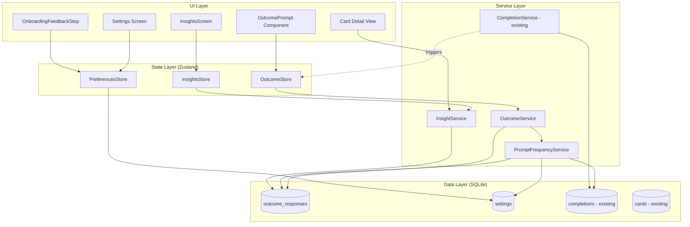
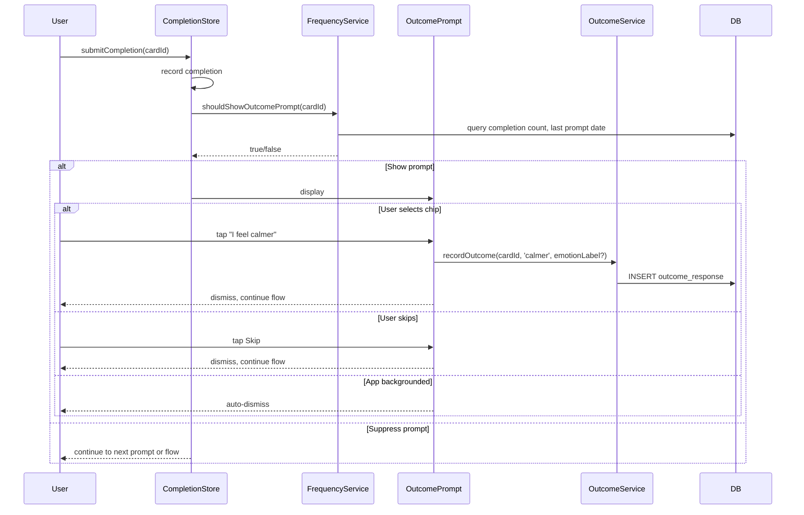

# Design Document: User-Facing Outcomes

## Overview

User-Facing Outcomes introduces a lightweight post-completion feedback system that asks users how they feel after using a tool, then aggregates those responses into per-tool and cross-wallet insights. The system integrates into the existing completion flow, adds a new Insights tab to the bottom navigator, and provides user controls for prompt frequency, data privacy, and preference management.

The design prioritizes:
- **Low friction** — single-tap chip selection, configurable frequency suppression
- **Offline-first** — all data stored locally in SQLite, no network dependency
- **Incremental adoption** — integrates with existing CompletionService without breaking changes
- **Accessibility** — screen reader support, minimum tap targets, non-color-dependent UI

## Architecture

### High-Level System Diagram



### Flow Diagram: Post-Completion Prompt



## Components and Interfaces

### New Service: OutcomeService

Handles persistence of outcome responses with retry logic.

```typescript
// src/types/services.ts (additions)

export type OutcomeCategory = 'calmer' | 'clear' | 'hopeful' | 'same' | 'worse';

export interface OutcomeResponse {
  id: string;
  cardId: string;
  category: OutcomeCategory;
  emotionLabel: string | null;
  createdAt: string; // ISO 8601 UTC
}

export interface OutcomeService {
  /** Record an outcome response with one retry on failure. */
  record(cardId: string, category: OutcomeCategory, emotionLabel: string | null): Promise<OutcomeResponse | null>;

  /** Get outcomes for a specific card, newest first. */
  getByCard(cardId: string): Promise<OutcomeResponse[]>;

  /** Get outcomes filtered by category, newest first. */
  getByCategory(category: OutcomeCategory): Promise<OutcomeResponse[]>;

  /** Get outcomes within a date range (inclusive), newest first. */
  getByDateRange(startDate: string, endDate: string): Promise<OutcomeResponse[]>;

  /** Get outcomes by emotion label (excludes nulls), newest first. */
  getByEmotionLabel(emotionLabel: string): Promise<OutcomeResponse[]>;

  /** Delete all outcome responses (atomic). */
  deleteAll(): Promise<void>;
}
```

### New Service: PromptFrequencyService

Determines whether the outcome prompt should be shown based on configurable rules.

```typescript
export interface PromptFrequencyConfig {
  initialPromptCount: number;  // default: 2
  promptInterval: number;      // default: 5
  dailyPromptLimit: number;    // default: 1
}

export interface PromptFrequencyService {
  /** Determine if the outcome prompt should display for this card now. */
  shouldShowPrompt(cardId: string): Promise<boolean>;

  /** Get current frequency config from settings. */
  getConfig(): Promise<PromptFrequencyConfig>;

  /** Record that a prompt was shown for a card (updates last-shown tracking). */
  recordPromptShown(cardId: string): Promise<void>;
}
```

### New Service: InsightService

Computes aggregated outcome statistics for the Insights screen and card detail views.

```typescript
export interface CardOutcomeSummary {
  cardId: string;
  cardTitle: string;
  totalResponses: number;
  counts: Record<OutcomeCategory, number>;
  dominantCategory: OutcomeCategory;
  positivePercentage: number;   // (calmer+clear+hopeful) / total * 100
  badgeCategory: OutcomeCategory | null; // non-null if a single positive category > 50% with 5+ responses
  badgeLabel: string | null;    // "Often calming", "Often clarifying", "Often hopeful"
}

export interface RankedCard {
  cardId: string;
  cardTitle: string;
  percentage: number;
  totalResponses: number;
}

export interface InsightService {
  /** Get per-card outcome summary (for card detail view). */
  getCardSummary(cardId: string): Promise<CardOutcomeSummary | null>;

  /** Get top cards ranked by a specific outcome category percentage. */
  getTopCardsByCategory(category: OutcomeCategory, limit?: number): Promise<RankedCard[]>;

  /** Get top cards for a specific emotion context. */
  getTopCardsByEmotion(emotionLabel: string, limit?: number): Promise<RankedCard[]>;

  /** Get total outcome response count across all cards. */
  getTotalResponseCount(): Promise<number>;

  /** Check badge eligibility for all cards (returns map of cardId -> badgeLabel). */
  computeBadgeEligibility(): Promise<Map<string, string>>;
}
```

### New Store: OutcomeStore (Zustand)

Manages UI state for the outcome prompt flow.

```typescript
// src/stores/outcomeStore.ts

export interface OutcomeStore {
  /** Whether the outcome prompt is currently visible. */
  isPromptVisible: boolean;

  /** The card ID the current prompt is associated with. */
  activeCardId: string | null;

  /** The emotion label from the current session (null if not emotion-initiated). */
  activeEmotionLabel: string | null;

  /** Show the outcome prompt for a given card. */
  showPrompt: (cardId: string, emotionLabel: string | null) => void;

  /** Record a selection and dismiss. */
  selectCategory: (category: OutcomeCategory) => Promise<void>;

  /** Dismiss without recording (skip or background). */
  dismiss: () => void;
}
```

### New Store: PreferencesStore (Zustand)

Manages user preferences for post-completion prompts and outcome visibility.

```typescript
export type PostCompletionPreference = 'outcome_only' | 'mood_only' | 'both';

export interface PreferencesStore {
  /** Current post-completion prompt preference. */
  postCompletionPreference: PostCompletionPreference;

  /** Whether outcome prompts are enabled globally. */
  outcomePromptEnabled: boolean;

  /** Whether outcome badges are visible on cards. */
  badgesVisible: boolean;

  /** Whether onboarding feedback step has been completed. */
  onboardingFeedbackCompleted: boolean;

  /** Load preferences from settings table on app start. */
  loadPreferences: () => Promise<void>;

  /** Update post-completion preference. */
  setPostCompletionPreference: (pref: PostCompletionPreference) => Promise<void>;

  /** Toggle outcome prompt on/off. */
  setOutcomePromptEnabled: (enabled: boolean) => Promise<void>;

  /** Toggle badge visibility. */
  setBadgesVisible: (visible: boolean) => Promise<void>;

  /** Mark onboarding feedback step as complete. */
  completeOnboardingFeedback: () => Promise<void>;
}
```

### New UI Components

| Component | Location | Purpose |
|-----------|----------|---------|
| `OutcomePrompt` | `src/components/outcome/OutcomePrompt.tsx` | Modal/overlay with 5 category chips + skip |
| `OutcomeChip` | `src/components/outcome/OutcomeChip.tsx` | Individual selectable chip with icon + label |
| `WhyWeAskModal` | `src/components/outcome/WhyWeAskModal.tsx` | Informational modal (≤200 words, ≤8th grade) |
| `OutcomeBadge` | `src/components/outcome/OutcomeBadge.tsx` | Card badge ("Often calming") |
| `CardOutcomeInsight` | `src/components/outcome/CardOutcomeInsight.tsx` | Per-card summary on detail view |
| `InsightsScreen` | `src/screens/InsightsScreen.tsx` | Aggregated patterns screen (new tab) |
| `OnboardingFeedbackStep` | `src/components/onboarding/OnboardingFeedbackStep.tsx` | Preference selection during onboarding |
| `FeedbackPreferenceSelector` | `src/components/settings/FeedbackPreferenceSelector.tsx` | Settings preference picker |

### Navigation Changes

The `MainTabParamList` expands to include the Insights tab:

```typescript
export type MainTabParamList = {
  Wallet: { focusCardId?: string } | undefined;
  Insights: undefined;
};
```

The `MainTabNavigator` will show the bottom tab bar (currently hidden) with two tabs: Wallet and Insights.

## Data Models

### New Table: `outcome_responses`

```sql
CREATE TABLE IF NOT EXISTS outcome_responses (
  id TEXT PRIMARY KEY,
  card_id TEXT NOT NULL REFERENCES cards(id) ON DELETE CASCADE,
  category TEXT NOT NULL CHECK(category IN ('calmer', 'clear', 'hopeful', 'same', 'worse')),
  emotion_label TEXT,
  created_at TEXT NOT NULL DEFAULT (datetime('now'))
);

CREATE INDEX IF NOT EXISTS idx_outcome_responses_card ON outcome_responses(card_id);
CREATE INDEX IF NOT EXISTS idx_outcome_responses_category ON outcome_responses(category);
CREATE INDEX IF NOT EXISTS idx_outcome_responses_date ON outcome_responses(created_at);
CREATE INDEX IF NOT EXISTS idx_outcome_responses_emotion ON outcome_responses(emotion_label)
  WHERE emotion_label IS NOT NULL;
```

### New Table: `outcome_prompt_log`

Tracks when a prompt was last shown per card (for frequency control).

```sql
CREATE TABLE IF NOT EXISTS outcome_prompt_log (
  id TEXT PRIMARY KEY,
  card_id TEXT NOT NULL REFERENCES cards(id) ON DELETE CASCADE,
  shown_at TEXT NOT NULL DEFAULT (datetime('now'))
);

CREATE INDEX IF NOT EXISTS idx_outcome_prompt_log_card ON outcome_prompt_log(card_id);
CREATE INDEX IF NOT EXISTS idx_outcome_prompt_log_date ON outcome_prompt_log(shown_at);
```

### Settings Keys (added to existing `settings` table)

| Key | Default Value | Description |
|-----|---------------|-------------|
| `post_completion_preference` | `"outcome_only"` | Which prompt(s) to show |
| `outcome_prompt_enabled` | `"true"` | Global on/off for outcome prompts |
| `badges_visible` | `"true"` | Show/hide outcome badges on cards |
| `initial_prompt_count` | `"2"` | Show prompt for first N completions |
| `prompt_interval` | `"5"` | Completions between prompts after initial |
| `daily_prompt_limit` | `"1"` | Max prompts per card per day |
| `onboarding_feedback_completed` | `"false"` | Whether user has seen the feedback step |

### Entity Relationship

```mermaid
erDiagram
    cards ||--o{ outcome_responses : "has"
    cards ||--o{ outcome_prompt_log : "tracked by"
    cards ||--o{ completions : "has"
    settings ||--|| preferences : "stores"

    outcome_responses {
        text id PK
        text card_id FK
        text category
        text emotion_label
        text created_at
    }

    outcome_prompt_log {
        text id PK
        text card_id FK
        text shown_at
    }


## Correctness Properties

*A property is a characteristic or behavior that should hold true across all valid executions of a system — essentially, a formal statement about what the system should do. Properties serve as the bridge between human-readable specifications and machine-verifiable correctness guarantees.*

### Property 1: Outcome recording round-trip

*For any* valid card ID, any of the 5 outcome categories, and any emotion label (including null), recording an outcome response must produce a stored record with: a valid UUID `id`, the provided `card_id`, the provided `category`, the provided `emotion_label` (preserved as null when absent), and an ISO 8601 UTC `created_at` timestamp within 1 second of the current time.

**Validates: Requirements 1.3, 3.1, 3.2**

### Property 2: Prompt frequency decision correctness

*For any* card with a known completion count, last-prompt-shown date, and current PromptFrequencyConfig values, the `shouldShowPrompt` function must return:
- `false` when `outcomePromptEnabled` is false (regardless of all other state)
- `true` when the card's total prior completions are fewer than `initialPromptCount` (and prompts are enabled)
- `false` when a prompt was already shown for the card on the current calendar day AND the card has passed the initial threshold
- `false` when completions since the last prompt for that card are fewer than `promptInterval` AND the card has passed the initial threshold
- `true` only when the card has passed the initial threshold AND the interval is satisfied AND no prompt was shown today

The function must use the *current* config values from settings at the time of evaluation (not cached values from a prior read).

**Validates: Requirements 2.1, 2.2, 2.3, 2.4, 2.6, 6.3**

### Property 3: Outcome query filter correctness

*For any* set of outcome response records in the database and any valid query (by card ID, by category, by date range with inclusive boundaries, or by emotion label), the query results must contain exactly the records matching the filter criteria, ordered by `created_at` descending, with records having null `emotion_label` excluded from emotion-label queries.

**Validates: Requirements 3.5**

### Property 4: Prompt selection logic

*For any* Post_Completion_Prompt_Preference value, any card configuration (has mood slider control or not), and any outcomePromptEnabled state, the prompt selection function must return:
- No prompts when `outcomePromptEnabled` is false AND the card has no mood slider
- Mood slider only when `outcomePromptEnabled` is false AND the card has a mood slider
- Outcome only when preference is `outcome_only` AND the card has a mood slider
- Mood only when preference is `mood_only` AND the card has a mood slider
- Outcome then mood (in that order) when preference is `both` AND the card has a mood slider
- Outcome only when the card does not have a mood slider (regardless of preference value, provided prompts are enabled)

**Validates: Requirements 1.5, 9.4, 9.5, 9.6, 9.7, 9.9**

### Property 5: Dominant category computation

*For any* card with 3 or more outcome response records, the computed dominant category must be the category with the highest count. When two or more categories are tied for highest count, the selected category must be the first one in the fixed order: calmer, clear, hopeful, same, worse.

**Validates: Requirements 4.1, 4.2**

### Property 6: Badge eligibility computation

*For any* card with 5 or more outcome response records, a badge is eligible if and only if exactly one of the positive categories (calmer, clear, hopeful) has a count exceeding 50% of total responses. The badge label must be "Often calming" for calmer, "Often clarifying" for clear, "Often hopeful" for hopeful. For cards with fewer than 5 responses, or when no single positive category exceeds 50%, badge eligibility must be null.

**Validates: Requirements 4.5, 4.6**

### Property 7: Category ranking correctness

*For any* outcome category (calmer, clear, hopeful) and any set of cards with outcome data, the ranked list must:
- Include only cards with 3 or more outcome responses
- Be ordered by that category's percentage (count of that category / total responses) descending
- Break ties by total response count descending, then by card title alphabetically ascending
- Contain at most 5 entries

**Validates: Requirements 5.2, 5.3, 5.5**

### Property 8: Emotion-specific ranking correctness

*For any* emotion label that has 3 or more outcome responses across at least one card, the ranked list must:
- Include only cards with 3 or more outcome responses associated with that emotion
- Be ordered by positive outcome rate (calmer + clear + hopeful responses for that emotion / total responses for that emotion on that card) descending
- Break ties by total response count descending, then by card title alphabetically ascending
- Contain at most 5 entries
- Be empty (section hidden) if no individual card meets the 3-response-per-card threshold for that emotion

**Validates: Requirements 5.4, 5.5**

### Property 9: Generated text content constraints

*For any* badge label or insight summary text produced by the system, the text must NOT contain any of the forbidden words: "always", "never", "completely", "dramatically", "transformed", "score", "grade", "pass", "fail", "success", "failure", "performance", "rating". Additionally, badge labels must contain a hedging qualifier (e.g., "Often").

**Validates: Requirements 8.1, 8.3**

## Error Handling

### Outcome Recording Failures

| Scenario | Behavior |
|----------|----------|
| First DB write fails | Retry exactly once |
| Retry succeeds | Outcome preserved as if first write succeeded |
| Retry also fails | Discard silently, no error shown to user, flow continues |
| Invalid category value | Reject at type level (TypeScript enum), never reaches DB |

### Delete All Outcome Data

| Scenario | Behavior |
|----------|----------|
| Deletion succeeds | All `outcome_responses` and `outcome_prompt_log` rows removed atomically |
| Partial failure | Entire transaction rolled back, error message shown to user |
| DB locked | Retry once, then show error |

### Insights Computation

| Scenario | Behavior |
|----------|----------|
| No outcome data | Show empty state message |
| Card deleted (CASCADE) | Outcomes auto-removed by FK constraint |
| Corrupt/null category | Filter out malformed rows from aggregation |

### Frequency Service

| Scenario | Behavior |
|----------|----------|
| Settings read fails | Fall back to default config values |
| Prompt log write fails | Continue without logging (prompt may repeat sooner) |
| Clock manipulation (timezone change) | Use device local date for daily limit; if date goes backward, may show extra prompt (acceptable) |

## Testing Strategy

### Property-Based Tests (fast-check 3)

Each correctness property maps to a dedicated property-based test with minimum 100 iterations.

| Property | Test File | Generator Strategy |
|----------|-----------|-------------------|
| P1: Recording round-trip | `outcomeService.property.test.ts` | Random card IDs (UUID), random category from enum, random nullable emotion strings |
| P2: Frequency decision | `promptFrequencyService.property.test.ts` | Random completion counts (0–100), random dates, random config values (1–20), random enabled/disabled |
| P3: Query filters | `outcomeService.property.test.ts` | Random sets of 0–50 outcome records with varied card IDs, categories, dates, emotions; random query parameters |
| P4: Prompt selection | `promptSelection.property.test.ts` | Random preference values, random card configs (with/without mood slider), random enabled state |
| P5: Dominant category | `insightService.property.test.ts` | Random arrays of 3–100 outcomes with categories drawn from the 5 values |
| P6: Badge eligibility | `insightService.property.test.ts` | Random arrays of 5–100 outcomes, ensuring distributions that cross the 50% threshold and those that don't |
| P7: Category ranking | `insightService.property.test.ts` | Random sets of 2–20 cards each with 0–50 outcomes; verify ranking for each of the 3 positive categories |
| P8: Emotion ranking | `insightService.property.test.ts` | Random sets of cards with emotion-tagged outcomes; verify emotion-specific ranking |
| P9: Text constraints | `insightService.property.test.ts` | Random outcome distributions fed to text generation; verify absence of forbidden words |

### Unit Tests (Jest)

- OutcomePrompt component: renders 5 chips, skip affordance, accessibility labels
- Dismiss behavior: skip tap, app backgrounding, navigation away
- Settings integration: toggle visibility, preference changes
- Onboarding flow: preference selection, skip behavior, re-presentation logic
- Delete all data: atomic removal, rollback on failure
- Empty states: insights screen, card detail with <3 responses

### Integration Tests

- Full completion → prompt → recording flow
- Navigation: Insights tab accessible from bottom navigator
- Settings changes reflect immediately in prompt behavior
- Badge display/hide respects settings toggle

### Test Configuration

```typescript
// Property test tagging convention
// Feature: user-facing-outcomes, Property {N}: {title}

import fc from 'fast-check';

// Example structure for property tests
describe('OutcomeService', () => {
  it('Property 1: Outcome recording round-trip', () => {
    fc.assert(
      fc.property(
        fc.uuid(),                                           // cardId
        fc.constantFrom('calmer', 'clear', 'hopeful', 'same', 'worse'), // category
        fc.option(fc.string({ minLength: 1, maxLength: 50 })),          // emotionLabel
        async (cardId, category, emotionLabel) => {
          // ... test body
        }
      ),
      { numRuns: 100 }
    );
  });
});
```

### What Is NOT Property-Tested

- UI rendering, layout, animations (snapshot tests)
- Accessibility compliance (manual audit + snapshot)
- Performance timing (500ms thresholds) — integration tests
- Copy/tone requirements (manual review + static content checks)
- Navigation flows (integration tests)
- Onboarding sequencing (unit/integration tests)
